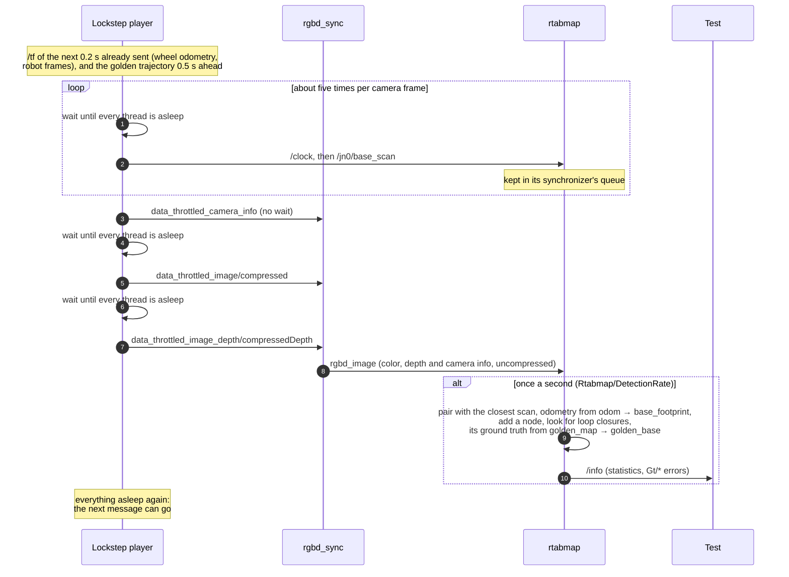
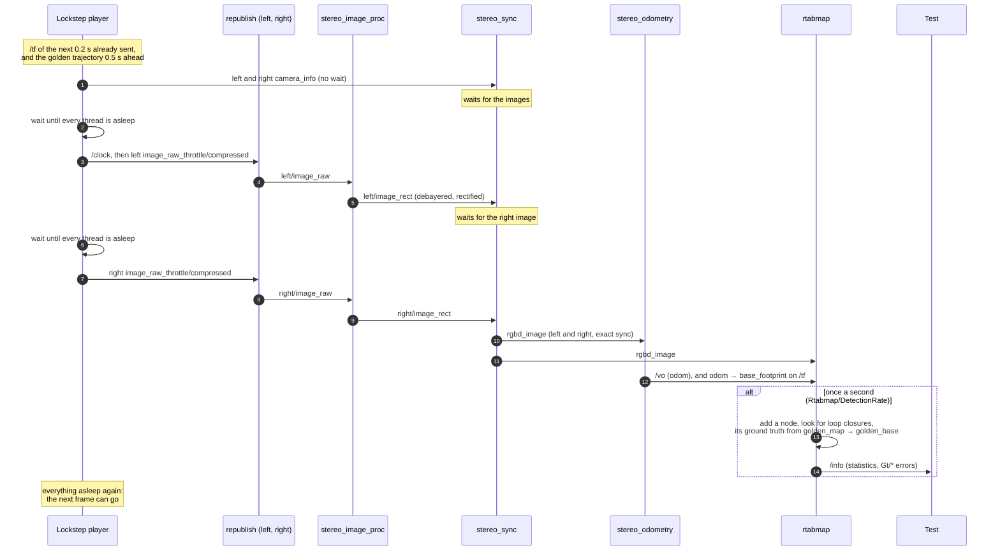
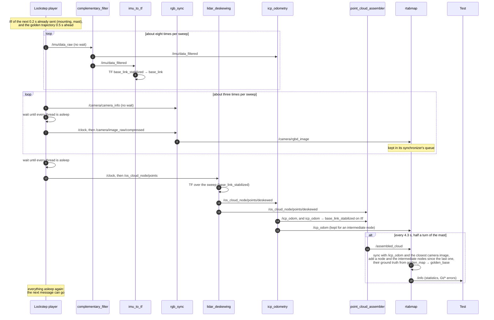

# Demo playback tests

`test_demo_playback.py` replays a demo's bag through the demo's own launch file and compares the graph rtabmap builds with a golden one, saved in [golden/](golden/). It checks that a change anywhere in the pipeline (a node, a launch file, rtabmap itself) still produces the same map.

| Scenario | Launch file | Bag |
|---|---|---|
| `robot_mapping` | `robot_mapping_demo.launch.py` | `demo_mapping_bag` |
| `stereo_outdoor` | `stereo_outdoor_demo.launch.py` | `stereo_outdoorA_bag` then `stereo_outdoorB_bag` |
| `netherdrone_lidar3d` | `netherdrone_lidar3d_demo.launch.py` | `netherdrone_ouster_vertige_bag_0` to `_5`, played one after the other |
| `find_object` | `find_object_demo.launch.py` | `demo_find_object_bag` (skipped without `find_object_2d`, which Lyrical and Rolling do not have) |

## Running

The bags are about 5 GB, so they are not in the repository. Fetch them once, into `test/data` (each bag is listed with its SHA-256 in [data/manifest.txt](data/manifest.txt)):

```bash
bash test/fetch_test_data.sh
```

Without them, the scenarios skip themselves. Then, from the workspace:

```bash
colcon test --packages-select rtabmap_demos --ctest-args -R test_demo_playback
```

Each scenario replays its bag in about real time on a desktop, longer on a slower machine. The test's CMake registration gives it its own DDS domain (`ROS_DOMAIN_ID=110`): when running `pytest` directly instead, set it yourself, or any other ROS node running on the machine will talk to the pipeline and spoil the run.

| Environment variable | Effect |
|---|---|
| `RTABMAP_DEMOS_TEST_DATA` | Where the bags are (default `test/data`). |
| `RTABMAP_DEMOS_TEST_RESULTS` | Where each run's database, graph and launch log are kept (default: a temporary directory). In CI, they are uploaded when the test fails. |
| `RTABMAP_DEMOS_UPDATE_GOLDEN=1` | Write the run's graph as the new golden one instead of comparing with it. |

## How a run works

1. The demo's launch file is started through a small generated launch file (`demo.launch.py` in the results folder), which includes the demo with the scenario's `launch_arguments` after `launch_ros`' `SetParametersFromFile`. Its parameter file (`demo.launch.yaml`) gives the node named `rtabmap` its database path and ground truth frames, and every node the scenario's `parameters`. So the demos need no launch argument for the test, and a node's own value for a parameter, set by its launch file, wins over the file's.
2. The bag is replayed in lockstep with the pipeline (see below), and the golden trajectory is published in TF beside it, as `golden_map` → `golden_base`. rtabmap is given these as its ground truth frames, so it computes the error of its map against the golden trajectory itself (the `Gt/*` statistics of `/info`).
3. Once the bag is done, the launch file is stopped as Ctrl-C would, so rtabmap closes its database. The graph is exported from the database with `rtabmap-export`, every node optimized.
4. The run is compared with the golden graph: node count, loop closures and path length within each scenario's tolerances, and rtabmap's translational and rotational RMSE against the golden trajectory under each scenario's limits.

## The lockstep player

`ros2 bag play` publishes at the bag's pace, whatever the nodes do. On a loaded machine, a node still busy with the previous frame drops the next one, and which frames get dropped changes from run to run. `bag_lockstep.py` instead publishes each sensor message only once the whole pipeline has finished with the previous one, so a slower machine only takes longer.

- **Gated topics:** the large messages something subscribes to, the ones the pipeline takes time to process: images (raw and compressed), point clouds and laser scans (`GATED_TYPES`). The other topics, IMU, camera info, odometry, TF, go out in the bag's order without waiting: before the next large message, the pipeline is idle again, so it has processed them. Topics nobody subscribes to are published in the bag's order as well.
- **Idle:** read from the kernel, not from the nodes. The player reads the state of every thread of every process started by `ros2 launch` (`/proc/<pid>/task/*/stat`): a thread with work to do is runnable, also while it waits for a CPU, and a node waiting for its next message has all its threads asleep. A node passing a message on wakes the next one before going back to sleep, so the pipeline only looks idle once its last stage is done. Idle means no runnable thread in 2 checks in a row, 2 ms apart.
- **Clock:** `/clock` is set to each gated message's stamp before it is published.
- **TF:** not gated, and sent ahead of the large messages: those are held back by 0.2 s, so the transforms a node needs for a frame are in its buffer when the frame arrives. The other ungated topics go out at their own stamps too, so 0.2 s ahead of them as well. The golden trajectory goes out the same way, with poses at most 0.25 s apart and 0.5 s ahead of their stamps.
- **Synchronous publishing:** the test sets `RMW_FASTRTPS_PUBLICATION_MODE=SYNCHRONOUS`, so that `publish()` sends the message before returning. Otherwise right after a `publish()` nothing has woken up yet, and the pipeline looks idle.

A sleeping thread looks idle even when work is still under way: a node waiting for a transform with a timeout, or a message still on its way to a subscriber. A message then goes out early, and waits in its subscriber's queue, so nothing is lost as long as every subscriber keeps what it receives:

- **Reliable subscriptions:** every QoS parameter of rtabmap's nodes is set to reliable (`RELIABLE_QOS` in `test_demo_playback.py`). Their default, the system's, is best effort with Fast DDS (the ROS 2 default), which drops a message arriving while the node is busy: a loaded CI runner lost up to two thirds of the lidar sweeps that way.
- **Every frame processed:** odometry with `always_process_most_recent_frame` on drops a frame arriving while it is busy. The scenarios set it off, and deepen the queues that need it (`parameters`, `node_parameters`).

`RTABMAP_DEMOS_REPLAY=chunked` replays without the idle check instead: at the bag's pace, 10 s at a time, waiting after each until rtabmap's `/info` has caught up (within each scenario's `chunk_slack`). It is as fast, but within a chunk a node slower than real time builds up a backlog: lockstep, the default, waits for it instead.

## Examples

Each diagram follows one frame of a scenario through its pipeline. "Wait until every thread is asleep" is the player's idle check, before each gated message; the other messages go out without it.

### `robot_mapping`: one camera frame

The bag holds a robot's laser scans, its camera's compressed color and depth images and camera info, and TF, which also carries the wheel odometry (`odom` → `base_footprint`). `rgbd_sync` uncompresses the images and pairs them, and `rtabmap` pairs that with the closest laser scan (approximate sync), takes the odometry from TF and maps, one update per second (`Rtabmap/DetectionRate`). The three gated topics are `/jn0/base_scan`, `data_throttled_image/compressed` and `data_throttled_image_depth/compressedDepth`; `data_throttled_camera_info` goes out without waiting. There are about five scans per camera frame:



With `output_queue_size: 10` on `rgbd_sync`, an image it publishes is not replaced before rtabmap has received it.

### `stereo_outdoor`: one stereo frame

Each of the two bags holds the left and right compressed images and camera infos of a stereo camera, and TF. The demo uncompresses the images (`image_transport` `republish`), rectifies them (`stereo_image_proc`), pairs them (`stereo_sync`), computes visual odometry from them (`stereo_odometry`) and maps (`rtabmap`, one update per second, `Rtabmap/DetectionRate`). The two gated topics are the left and right `image_raw_throttle/compressed`; their `camera_info_throttle` go out without waiting. For one stereo frame:



The pipeline is idle only once rtabmap is done with the frame, so the next frame is never published while any node is still working on this one. With `always_process_most_recent_frame: False`, odometry registers each frame in turn rather than skipping to the most recent, and with `output_queue_size: 10` on `stereo_sync`, a frame it publishes is not replaced before odometry and rtabmap have received it.

### `netherdrone_lidar3d`: one lidar sweep

The bag holds a drone's lidar sweeps (Ouster, 10 Hz), an IMU, its camera's compressed images and camera info, and TF (the sensors' mounting, the lidar's rotating mast). The demo includes `lidar3d_assemble.launch.py` from `rtabmap_examples`:

- `complementary_filter_node` filters the IMU into `/imu/data_filtered`, and `imu_to_tf` turns its orientation into TF, `base_link_stabilized` → `base_link`.
- `lidar_deskewing` corrects each sweep for the motion during it, from that TF, into `/os_cloud_node/points/deskewed`.
- `icp_odometry` registers each deskewed sweep (with the filtered IMU, and the stabilized frame as guess) into `/icp_odom`, and TF `icp_odom` → `base_link_stabilized`.
- `point_cloud_assembler` accumulates the deskewed sweeps over 4.3 s (half a turn of the mast) into `/assembled_cloud`.
- `rgb_sync` uncompresses the camera images into `/camera/rgbd_image`.
- `rtabmap` adds a node for each assembled cloud, with the camera image closest to it and a depth made from the lidar, and an intermediate node for each odometry pose in between (`intermediate_nodes:=true`).

The two gated topics are `/os_cloud_node/points` and `/camera/image_raw/compressed`; `/imu/data_raw` and `/camera/camera_info` go out without waiting. Between two sweeps, the bag holds about eight IMU messages and three camera frames:



The idle check before each sweep comes after the IMU messages before it: by then, the filter and `imu_to_tf` have processed them, and the transforms `lidar_deskewing` needs are there. Every sweep reaches odometry with reliable subscriptions throughout (a best-effort `lidar_deskewing` lost up to two thirds of them on CI), and `icp_odometry` registers each in turn (`always_process_most_recent_frame: False`, `topic_queue_size: 10`). The six bags of the flight are played one after the other, about 6 minutes of data.

## Golden graphs

[golden/](golden/) holds each scenario's graph (`.g2o`) and trajectory (`.tum`). The golden graphs are made on a developer's machine, and the rtabmap built there with all its optional dependencies: CI builds rtabmap differently, which changes how many frames rtabmap merges into the previous node, hence each scenario's tolerances. To regenerate one after a deliberate change to the pipeline:

```bash
RTABMAP_DEMOS_UPDATE_GOLDEN=1 ROS_DOMAIN_ID=110 python3 -m pytest -s test/test_demo_playback.py -k stereo
```

Then replay it once more without `RTABMAP_DEMOS_UPDATE_GOLDEN`, to check a run matches it, and commit the two files.
