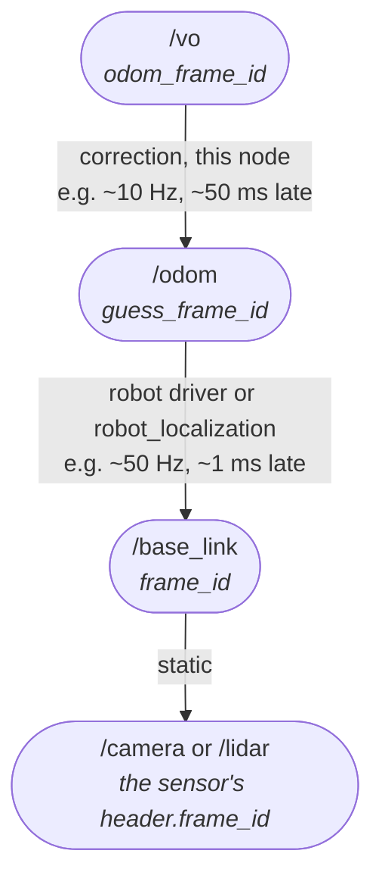

# rtabmap_odom

Odometry for [RTAB-Map](https://github.com/introlab/rtabmap): where the robot is relative to a local fixed frame, estimated from its own sensors — a pose that moves continuously and never jumps, but drifts over time.

SLAM needs a pose for every measurement it maps. These nodes produce one by registering each new frame against the last — visually from an RGB-D or stereo camera, or geometrically from a lidar — and integrating the result into a [`nav_msgs/msg/Odometry`](https://docs.ros.org/en/jazzy/p/nav_msgs/msg/Odometry.html) and a TF.

## Contents

- [Nodes](#nodes)
  - [Choosing a sensor modality for the environment](#choosing-a-sensor-modality-for-the-environment)
- [Library](#library)
- [Conventions](#conventions)
  - [Frames and TF](#frames-and-tf)
  - [RTAB-Map's own parameters](#rtab-maps-own-parameters)
  - [Feeding in an external guess](#feeding-in-an-external-guess)
  - [IMU](#imu)
  - [Update rates and dropped frames](#update-rates-and-dropped-frames)
  - [Lost frames, resets and new maps](#lost-frames-resets-and-new-maps)
- [Services](#services)
- [Published topics](#published-topics)
  - [Outputting filtered scans and features](#outputting-filtered-scans-and-features)
- [Diagnostics](#diagnostics)
- [License](#license)

## Nodes

| Node | Description |
|---|---|
| [rgbd_odometry](doc/rgbd_odometry.md) | Visual odometry from a color image and a depth image registered to it. |
| [stereo_odometry](doc/stereo_odometry.md) | Visual odometry from a stereo pair. |
| [icp_odometry](doc/icp_odometry.md) | Geometric odometry from a 2D or 3D lidar. |

Every node is a [composable node](https://docs.ros.org/en/jazzy/Tutorials/Intermediate/Composition.html) as well as a standalone executable.

### Choosing a sensor modality for the environment

Which to use is a question about the **environment**, not about which sensor is better. A camera tracks visual texture; a lidar tracks geometry. Each fails where its own cue is missing, and the two failures do not overlap much.

| Environment | Use | Why |
|---|---|---|
| Visually textured and well lit — offices, cluttered rooms, daylight outdoors | **Camera** | Plenty of features to match, and appearance gives loop closure for free. |
| Textureless but geometrically rich — bare corridors with doorways and furniture, warehouse aisles | **Lidar** | Blank walls give a camera nothing; the shape of the space still constrains ICP. |
| Dark, or lighting that changes abruptly | **Lidar** | A camera is simply blind. Lidar does not care. |
| Geometrically plain but visually rich — a large open hall with a patterned floor, textured flat walls | **Camera** | [Degenerate geometry](doc/icp_odometry.md#degenerate-geometry) defeats ICP here, while the texture is exactly what a camera needs. |
| Both plain and textureless — an empty warehouse, a long featureless tunnel | **Wheel odometry**, with either as a corrector | Neither cue is present. This is the case where wheel odometry carries the pose. |
| Repetitive and self-similar — tiled floors, rows of racking, a long colonnade | **Wheel odometry as the guess**, with either on top | Both cues are present but *ambiguous*: a camera matches the wrong copy of a feature, a lidar the wrong bay of shelving. See [Repetitive patterns](doc/rgbd_odometry.md#repetitive-patterns). |
| Outdoors at range | **Stereo camera or 3D lidar** | RGB-D depth stops working outdoors; both of these keep going. |

**Do not underestimate wheel odometry.** On a wheeled robot it is locally excellent and only drifts over distance — the opposite failure from both of the above, which are locally noisy but not systematically biased. It is also the only one of the three that keeps working when the environment offers no cue at all — and, because it is indifferent to what the scene *looks* like, the only one that is not fooled when the scene repeats itself.

**Fuse the wheels with an IMU before feeding them in.** [`robot_localization`](https://docs.ros.org/en/jazzy/p/robot_localization/) is the standard way: its EKF combines wheel odometry with IMU orientation and angular rates into one filtered `odom` topic, which is a markedly better guess than the wheels alone. [FusionCore](https://github.com/manankharwar/fusioncore) is another EKF that does the same job. The IMU fixes exactly what encoders are worst at — yaw through a turn, and wheel slip, which encoders report as motion that never happened. Where the camera or lidar fails outright, that filtered estimate is what carries the robot through, and a pipeline built this way degrades instead of breaking.

Which is why the robust arrangement is rarely one of them alone: feed wheel odometry in as `guess_frame_id` and the registration starts near the answer every frame. That covers the camera's fast-motion and blank-wall failures and the lidar's degenerate-corridor failure, while the camera or lidar in turn corrects the wheels' drift. See [Feeding in an external guess](#feeding-in-an-external-guess).

**For 2D indoor odometry a lidar usually costs less computation.** Registering a few hundred scan points is far less CPU than detecting, describing and matching visual features on every frame, and it needs no GPU — which is what decides whether odometry keeps up on the small onboard computers these robots carry.

With both a camera and a lidar, the usual arrangement is `icp_odometry` for the pose and the camera for appearance — see [Combining a camera and a lidar](doc/icp_odometry.md#combining-a-camera-and-a-lidar).

## Library

The package installs a C++ library, documented in the [C++ API reference](https://docs.ros.org/en/jazzy/p/rtabmap_odom/generated/index.html) generated from the headers.

**`OdometryROS`** is the base class all three nodes derive from, and it is where most of this package's behaviour actually lives. It owns the RTAB-Map `Odometry` object, the pose integration, the TF broadcast, the IMU intake, the services and the diagnostics. Each node subclasses it to do one thing: turn its own topics into a `rtabmap::SensorData` and hand it over. That is why the three nodes share nearly all of their parameters and publish exactly the same topics.

It also runs the registration on **its own thread**. A frame arriving while the previous one is still being processed does not block the subscription callback; see [Update rates and dropped frames](#update-rates-and-dropped-frames).

## Conventions

These apply to all three nodes.

### Frames and TF

| Parameter | Type | Default | Description |
|---|---|---|---|
| `frame_id` | `string` | `"base_link"` | The robot frame being tracked. The pose published is this frame's, not the sensor's — the sensor-to-robot transform is read from TF. |
| `odom_frame_id` | `string` | `"odom"` | The fixed frame the pose is expressed in. |
| `publish_tf` | `bool` | `true` | Broadcast the pose on TF. **Turn this off if something else already publishes that transform**, or the two fight and TF alternates between them. What exactly is broadcast depends on `guess_frame_id`: without it, `odom_frame_id` → `frame_id`; with it, a correction `odom_frame_id` → `guess_frame_id` ([why](#it-also-keeps-tf-alive-through-a-failure)). |
| `wait_for_transform` | `double` | `0.1` | Seconds to wait for a needed transform before giving up on the frame. |
| `initial_pose` | `string` | `""` | Starting pose, `"x y z roll pitch yaw"`. Also settable at runtime through `reset_odom_to_pose`. |
| `ground_truth_frame_id` | `string` | `""` | When set, the pose is taken from this TF instead of being computed — for replaying a dataset with a known trajectory. |
| `ground_truth_base_frame_id` | `string` | value of `frame_id` | The robot frame within the ground truth TF tree. |
| `guess_frame_id` | `string` | `""` | A frame carrying another odometry source, used as the initial guess for each registration. Documented with its companions under [Feeding in an external guess](#feeding-in-an-external-guess) -- **the highest-value parameter here for a wheeled robot**. |

The sensor must be connected to `frame_id` in TF **before the first frame arrives**, or that frame is dropped with a warning. A static publisher is the usual answer.

### RTAB-Map's own parameters

Everything in RTAB-Map's odometry parameter set is exposed as a ROS parameter **under its RTAB-Map name**, so tuning is done directly:

```bash
ros2 run rtabmap_odom rgbd_odometry --ros-args \
  -p "Odom/Strategy:='1'" \
  -p "Vis/MinInliers:='15'" \
  -p "Odom/ResetCountdown:='1'"
```

**Note the quoting.** Every RTAB-Map parameter is declared as a **string**, whatever it looks like, because that is how RTAB-Map's own parameter map stores them. Writing `-p Odom/Strategy:=1` makes ROS infer an integer, and the node throws on startup rather than starting with the wrong value:

```
parameter 'Odom/Strategy' has invalid type: Wrong parameter type,
parameter {Odom/Strategy} is of type {string}, setting it to {integer} is not allowed.
```

The inner quotes are what keeps it a string. Shell quotes alone do not help, since the value is parsed as YAML after the shell is done with it. In a launch file the same rule reads naturally: `{'Odom/Strategy': '1'}`.

This applies **only** to RTAB-Map's own parameters. The nodes' ROS parameters -- `frame_id`, `publish_tf`, `scan_voxel_size`, `approx_sync` -- are declared with their real types and take plain values.

Which parameters exist depends on the node: each declares the set matching its sensor, so `Vis/*` appears on the visual nodes and `Icp/*` only on `icp_odometry`. `ros2 param list` on a running node is the authoritative list; the meaning of each is in [RTAB-Map's parameter reference](https://github.com/introlab/rtabmap/blob/master/corelib/include/rtabmap/core/Parameters.h).

The two worth knowing before anything else:

- **`Odom/Strategy`** selects the registration algorithm — `0` frame-to-map (default, more accurate), `1` frame-to-frame (cheaper), and others for the external VO libraries RTAB-Map can be built against.
- **`Odom/ResetCountdown`** automatically resets odometry after this many consecutive lost frames instead of staying lost forever. `0` disables it, which is the default.

`config_path` loads the same parameters from an INI file; only the odometry ones are taken from it.

### Feeding in an external guess

Registration works far better when it starts near the answer. Two ways to supply one:

| Parameter | Type | Default | Description |
|---|---|---|---|
| `guess_frame_id` | `string` | `""` | A TF frame carrying another odometry source — wheels, IMU-integrated, a base driver. Its motion between frames becomes the initial guess. |
| `guess_min_translation` | `double` | `0.0` | Skip frames whose guessed motion is below this, in meters. `0` disables. |
| `guess_min_rotation` | `double` | `0.0` | Same, in radians. |
| `guess_min_time` | `double` | `0.0` | Same, in seconds. |
| `guess_linear_variance` | `double` | `0.001` | Covariance of the published pose when the guess is used directly. |
| `guess_angular_variance` | `double` | `0.001` | Same, rotational. |

**`guess_frame_id` is the single biggest improvement available to a wheeled robot.** Wheel odometry is locally excellent and globally hopeless; visual and ICP registration is the reverse. Giving the registration a wheel-odometry guess makes it converge more often, faster, and survive the frames where the camera sees nothing.

The `guess_min_*` parameters additionally suppress processing while the robot is stationary, which stops a static scene from accumulating drift and saves the CPU.

#### It also keeps TF alive through a failure

Setting `guess_frame_id` also changes *how* the pose is broadcast. This is worth understanding before odometry fails on a real robot, because it decides what the rest of the system sees while it is lost.

With a guess frame configured, the node no longer publishes `odom_frame_id` → `frame_id` directly. It publishes a **correction** instead, `odom_frame_id` → `guess_frame_id`.

So the guess source keeps the conventional `odom` frame -- whatever produces it, the robot's driver or [`robot_localization`](https://docs.ros.org/en/jazzy/p/robot_localization/) -- and **this node takes a different name for its own `odom_frame_id`**. The examples in this repository use `vo` for the visual nodes and `icp_odom` for the lidar one:



*The rates and delays above are examples only — yours depend on the sensor, the base driver and the computer.*

**That chain keeps being published while registration is lost.** The correction freezes at the last successfully computed pose composed with the motion the guess has accumulated since, so `base_link` keeps moving in TF at the guess source's rate, driven entirely by the guess. Nothing downstream stalls or jumps; the pose just accumulates that source's drift until registration recovers. Without `guess_frame_id` there is no correction to publish and **no TF at all is broadcast while lost**, which is what breaks the tree.

Pair it with `Odom/ResetCountdown` and the recovery is complete. Take a robot turning to face a white wall: visual odometry loses tracking, TF keeps flowing from the wheels, and after the configured number of failed frames the odometry resets — not to where it was when it got lost, but to `last computed pose × guess motion`, which is where the wheels say the robot has got to in the meantime. Registration restarts from there and the trajectory carries on with only the drift the wheels accumulated.

What it resets to depends on what is available, in this order:

1. **A guess** — resets to the last pose composed with the guess motion, as above.
2. **No guess, but `odom_frame_id` → `frame_id` exists in TF at the sensor frame's stamp** — resets to that pose. This is the `publish_tf:=false` arrangement: this node publishes only its odometry topic, [`robot_localization`](https://docs.ros.org/en/jazzy/p/robot_localization/) fuses that topic with the wheels and the IMU, and the filter owns the transform. The reset therefore lands on the filter's current estimate — the odometry gets restarted from where the fused solution says the robot is, having contributed to that solution itself while it was working. `publish_tf` has to be off for this to mean anything, and **`publish_null_when_lost` should be off too**: the null pose is a signal for consumers that read it as one, and a filter fusing this topic is not — it would be handed an invalid pose to fuse. With it off the node simply stops publishing while lost, and the filter carries on from its other inputs until registration recovers.
3. **Neither** — resets to the last computed pose, so the robot resumes believing it never moved while lost.

After an automatic reset the countdown is left armed, so if odometry still cannot initialize on the next frames it keeps re-resetting to the latest guess rather than getting stuck.

### IMU

| Parameter | Type | Default | Description |
|---|---|---|---|
| `wait_imu_to_init` | `bool` | `false` | Hold off until an IMU message has arrived, so gravity is known from the first frame. |
| `imu_queue_size` | `int` | `200` | Depth of the IMU buffer. IMUs run far faster than cameras; this is why it is large. |
| `qos_imu` | `int` | value of `qos` | Reliability of the `imu` subscription. |
| `always_check_imu_tf` | `bool` | `false` | Re-read the IMU-to-robot transform every message rather than caching it. |

The `imu` topic is optional on all three nodes. Supplying it lets odometry know which way is down, which constrains roll and pitch — worth doing on any robot that has an IMU, and close to mandatory for a handheld or aerial one.

**With no `guess_frame_id`, the IMU also supplies the rotation half of each frame's guess.** The rotation measured between the previous frame and this one becomes the guess's orientation, leaving the translation to the motion model. That is often the difference between tracking a fast turn and losing it, since rotation is what breaks feature matching first. An external guess takes precedence when there is one: `guess_frame_id` is used whole, and the IMU is not consulted for the guess at all.

### Update rates and dropped frames

Registration runs on its own thread, so a slow frame does not block the subscription. What happens to the frames arriving meanwhile is a choice:

| Parameter | Type | Default | Description |
|---|---|---|---|
| `always_process_most_recent_frame` | `bool` | `true` | Drop frames that arrive while registration is still running and take the newest. `false` registers every frame in order, on the subscription thread. |
| `expected_update_rate` | `double` | `0.0` | The rate frames are expected at, in Hz. Used only when `max_update_rate` is unset, and it is a **ceiling**: a frame arriving sooner than `1/expected_update_rate` after the last one is skipped, with a warning that the input is faster than expected. `0` disables. |
| `max_update_rate` | `double` | `0.0` | Throttle registration to at most this rate, skipping frames silently. Takes precedence over `expected_update_rate`. `0` disables. |
| `min_update_rate` | `double` | `0.0` | Treat odometry as **lost and reset it** when more than `1/min_update_rate` passes between updates — the motion assumption no longer holds across a gap that long. `0` disables. |

**`always_process_most_recent_frame` already bounds the delay.** A frame arriving while registration is still running is dropped on the spot rather than queued, so the worker always picks up the newest frame and the published pose is at most one registration behind the sensor. No backlog ever forms. `/diagnostics` reports how many frames went this way.

That is why **`max_update_rate` is about CPU, not latency**: given the skipping above, the worst-case delay is roughly the same whether it is set or not. What it changes is how many frames get registered at all. Set it to give the rest of the robot its cores back — not to make the pose fresher, which it will not do.

Setting `always_process_most_recent_frame:=false` is the opposite trade: every frame is registered, in order, on the subscription thread. That is what you want when replaying a bag, where dropping frames loses data you meant to process.

### Lost frames, resets and new maps

A frame that cannot be registered is *lost*. By default the node publishes a null odometry message — an all-zero pose, with `9999` written down the diagonal of both covariance matrices to mean "do not use this" or, equivalently, "I am lost" — rather than nothing at all:

| Parameter | Type | Default | Description |
|---|---|---|---|
| `publish_null_when_lost` | `bool` | `true` | Publish a null pose, with `9999` on the covariance diagonals, when a frame cannot be registered. `false` publishes nothing. |

**Leave it on, unless a filter is consuming this topic.** A consumer that sees the null message knows odometry is lost; one that sees nothing cannot tell that apart from a node that died or a topic that was never connected. `rtabmap` itself relies on this to know it should not map the frame.

**With `publish_null_when_lost` on, a reset always starts a new mapping session, and the covariances are how that is signalled.** The first frame after a reset is an *initialization*, not a registration: there is no previous frame to measure against and no velocity to carry over, so it publishes `9999` in the covariance.

`rtabmap` watches for exactly that — an identity pose, or pose **and** twist covariances both `>=9999` — and starts a **new map** rather than linking the new trajectory to the old one:

```
Odometry is reset (identity pose or high variance detected). Increment map id!
```

Every reset looks like this, whether it came from `reset_odom`, from `reset_odom_to_pose`, or automatically from `Odom/ResetCountdown`, and whether or not a guess was used to choose the new pose. That is the point: the pose after a reset cannot be linked to the one before it, so mapping continues in a fresh session instead of deforming the graph across a jump the robot never made.

Turning `publish_null_when_lost` off suppresses that frame as well, so no reset — not even a manual `reset_odom` — ever starts a new map.

For finer control over when a reset should start a new map, put an intermediate node between this one and `rtabmap` and have it set the covariances itself before forwarding the topic. That node then decides what counts as a discontinuity, instead of it being inferred from the reset alone. Two cases where that is worth doing:

- **Not starting a new map on a reset**, when the guess frame is trusted enough that the recovered pose is continuous with what came before. The node forwards the frame with ordinary covariances and mapping carries on in one session.
- **Starting one on an external health check** — the guess frame has not been published for a while, say, so the newly computed pose may be wrong even though registration reported success. The node writes `9999` into both covariance diagonals and `rtabmap` begins a fresh session.

Recovering from lost is what `Odom/ResetCountdown` is for, or the `reset_odom` service. Combined with `guess_frame_id` it also keeps the TF tree intact throughout — see [It also keeps TF alive through a failure](#it-also-keeps-tf-alive-through-a-failure).

## Services

| Service | Type | Description |
|---|---|---|
| `reset_odom` | [`std_srvs/srv/Empty`](https://docs.ros.org/en/jazzy/p/std_srvs/srv/Empty.html) | Reset the pose to the identity and drop the internal local map. |
| `reset_odom_to_pose` | [`rtabmap_msgs/srv/ResetPose`](https://docs.ros.org/en/jazzy/p/rtabmap_msgs/srv/ResetPose.html) | Reset to a given `x y z roll pitch yaw`. |
| `pause_odom` | [`std_srvs/srv/Empty`](https://docs.ros.org/en/jazzy/p/std_srvs/srv/Empty.html) | Stop processing incoming frames. |
| `resume_odom` | [`std_srvs/srv/Empty`](https://docs.ros.org/en/jazzy/p/std_srvs/srv/Empty.html) | Resume. |
| `log_debug`, `log_info`, `log_warning`, `log_error` | [`std_srvs/srv/Empty`](https://docs.ros.org/en/jazzy/p/std_srvs/srv/Empty.html) | Change RTAB-Map's own log level at runtime. |

## Published topics

Common to all three nodes. **Every one of them, `odom` included, is published only when something is subscribed** -- the work of building each message is skipped otherwise. The TF broadcast is not gated this way and happens whenever `publish_tf` is on -- except while registration is lost with no guess frame configured, when there is nothing to broadcast.

| Topic | Type | Description |
|---|---|---|
| `odom` | [`nav_msgs/msg/Odometry`](https://docs.ros.org/en/jazzy/p/nav_msgs/msg/Odometry.html) | The pose and velocity. Covariance is meaningful: it grows with registration uncertainty, and is `9999` on the diagonal when lost. |
| `odom_info` | [`rtabmap_msgs/msg/OdomInfo`](https://docs.ros.org/en/jazzy/p/rtabmap_msgs/msg/OdomInfo.html) | Everything about how the frame was registered — inlier count, matches, features, timings. The first thing to look at when odometry misbehaves. |
| `odom_info_lite` | [`rtabmap_msgs/msg/OdomInfo`](https://docs.ros.org/en/jazzy/p/rtabmap_msgs/msg/OdomInfo.html) | The same without the per-feature arrays, for logging or a slow link. |
| `odom_local_map` | [`sensor_msgs/msg/PointCloud2`](https://docs.ros.org/en/jazzy/p/sensor_msgs/msg/PointCloud2.html) | The feature map the current frame was registered against. |
| `odom_local_scan_map` | [`sensor_msgs/msg/PointCloud2`](https://docs.ros.org/en/jazzy/p/sensor_msgs/msg/PointCloud2.html) | The scan map, for the ICP path. |
| `odom_last_frame` | [`sensor_msgs/msg/PointCloud2`](https://docs.ros.org/en/jazzy/p/sensor_msgs/msg/PointCloud2.html) | The current frame's points. |
| `odom_rgbd_image` | [`rtabmap_msgs/msg/RGBDImage`](https://docs.ros.org/en/jazzy/p/rtabmap_msgs/msg/RGBDImage.html) | The frame **as odometry processed it**, not the input as it arrived. See [Outputting filtered scans and features](#outputting-filtered-scans-and-features). |
| `odom_sensor_data/raw`, `/features`, `/compressed` | [`rtabmap_msgs/msg/SensorData`](https://docs.ros.org/en/jazzy/p/rtabmap_msgs/msg/SensorData.html) | The same frame as `SensorData`. `/features` strips the images and scan and keeps only the extracted features; `/compressed` carries JPEG/PNG images instead of raw. |

### Outputting filtered scans and features

`odom_rgbd_image` and `odom_sensor_data/*` republish the frame **after** odometry has worked on it, which is the point of them — they are what odometry actually registered, not a copy of the input:

- **Features are included.** Registration writes the keypoints, their 3D positions and their descriptors back into the frame, so these topics carry them. `odom_sensor_data/features` is that alone, with the images and scan removed.
- **The scan is the filtered one.** `icp_odometry` builds the frame after deskewing, voxelization, range filtering and normal estimation, so what comes out here is the decimated cloud ICP saw — not the raw sweep the lidar published. Subscribe to the driver's topic if you want the original.
- **Images are converted.** `rgbd_odometry` hands over grayscale unless `keep_color` is set, so that is what these carry too.

## Diagnostics

All three publish to `/diagnostics`: the input rate, the output rate, and how many frames were processed versus dropped. A healthy input rate with a low output rate means frames are arriving but not registering — check `odom_info` before touching anything else.

## License

BSD-3-Clause. See the [repository root](https://github.com/introlab/rtabmap_ros#license).
