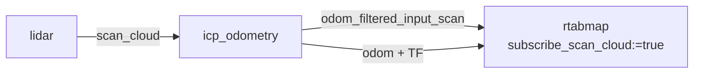
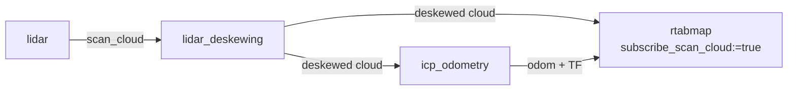
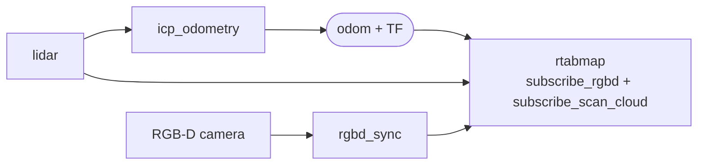

# icp_odometry

Odometry from a 2D or 3D lidar, by registering each scan against the previous one with ICP.

No features and no appearance: the motion is whatever transform best aligns this scan's points with the last. That makes it indifferent to lighting and texture — it works in the dark, and on the blank white corridor where [rgbd_odometry](rgbd_odometry.md) has nothing to track.

What it is sensitive to instead is **geometry**. ICP can only recover motion that the scene's shape constrains, and a scene can fail to constrain it: see [Degenerate geometry](#degenerate-geometry), which is the failure mode worth understanding before deploying this.

The shared parameters — frames, TF, guesses, the IMU, RTAB-Map's own, the services — are in the [package README](../README.md#conventions). This page covers what is specific to this node.

## Contents

- [Usage](#usage)
- [Subscribed Topics](#subscribed-topics)
- [Published Topics](#published-topics)
  - [Reusing the filtered scan downstream](#reusing-the-filtered-scan-downstream)
- [Parameters](#parameters)
  - [Where these defaults come from](#where-these-defaults-come-from)
  - [Making the correspondence ratio mean something](#making-the-correspondence-ratio-mean-something)
- [Preparing the scan](#preparing-the-scan)
- [Deskewing](#deskewing)
- [Degenerate geometry](#degenerate-geometry)
- [Combining a camera and a lidar](#combining-a-camera-and-a-lidar)
- [When it loses track](#when-it-loses-track)

## Usage

2D lidar:

```bash
ros2 run rtabmap_odom icp_odometry --ros-args \
  -r scan:=/scan \
  -p frame_id:=base_link
```

3D lidar:

```bash
ros2 run rtabmap_odom icp_odometry --ros-args \
  -r scan_cloud:=/velodyne_points \
  -p frame_id:=base_link \
  -p "Icp/PointToPlane:='true'" \
  -p scan_normal_k:=10 \
  -p scan_voxel_size:=0.1
```

```python
ComposableNode(
    package='rtabmap_odom',
    plugin='rtabmap_odom::ICPOdometry',
    name='icp_odometry',
    parameters=[{'frame_id': 'base_link',
                 'scan_voxel_size': 0.1,
                 'scan_normal_k': 10,
                 'Icp/PointToPlane': 'true'}],
    remappings=[('scan_cloud', '/velodyne_points')])
```

## Subscribed Topics

One of the two scan topics, not both.

| Topic | Type | Description |
|---|---|---|
| `scan` | [`sensor_msgs/msg/LaserScan`](https://docs.ros.org/en/jazzy/p/sensor_msgs/msg/LaserScan.html) | A 2D lidar. |
| `scan_cloud` | [`sensor_msgs/msg/PointCloud2`](https://docs.ros.org/en/jazzy/p/sensor_msgs/msg/PointCloud2.html) | A 3D lidar, or a 2D one already converted to a cloud. |
| `imu` | [`sensor_msgs/msg/Imu`](https://docs.ros.org/en/jazzy/p/sensor_msgs/msg/Imu.html) | Optional, and more useful here than elsewhere — it pins roll and pitch, which a lidar alone constrains poorly. |

## Published Topics

Most are common to all three nodes; see [the README](../README.md#published-topics). Two belong to this path:

| Topic | Type | Description |
|---|---|---|
| `odom_local_scan_map` | [`sensor_msgs/msg/PointCloud2`](https://docs.ros.org/en/jazzy/p/sensor_msgs/msg/PointCloud2.html) | The accumulated scan map the current scan was registered against. |
| `odom_filtered_input_scan` | [`sensor_msgs/msg/PointCloud2`](https://docs.ros.org/en/jazzy/p/sensor_msgs/msg/PointCloud2.html) | The input scan **after** deskewing, voxelization, range filtering and normal estimation — exactly what ICP registered, carrying the original header. |

### Reusing the filtered scan downstream

Remap `odom_filtered_input_scan` onto `rtabmap`'s `scan_cloud` and the map is built from the scan this node already prepared, rather than from the raw sweep.



That skips the expensive half twice over. Voxelization and normal estimation are not repeated, since the cloud arrives already decimated and carrying `normal_*` fields, and the deskewing this node did is carried along with it.

The alternative for deskewing is to do it **before** odometry, with [`lidar_deskewing`](../../rtabmap_util/doc/lidar_deskewing.md), and fan the corrected cloud out to both nodes:



That is the only way to give `rtabmap` **every point of the sweep**. `odom_filtered_input_scan` carries the decimated cloud ICP registered, so a map built from it inherits whatever voxelization odometry applied — and outdoors that is 30 to 50 cm. Deskewing upstream separates the two: odometry can filter as hard as it likes while the map is built from the full-resolution cloud, at the cost of an extra node and an extra copy of every sweep.

## Parameters

Specific to this node: the scan is filtered **before** ICP sees it, and these control that. The registration itself is tuned through RTAB-Map's `Icp/*` parameters.

These two sets overlap, and the node resolves the overlap for you — see [Where these defaults come from](#where-these-defaults-come-from), because the defaults below are not what the source's initializers suggest.

| Parameter | Type | Default | Description |
|---|---|---|---|
| `scan_voxel_size` | `double` | `0.05` | Downsample to one point per voxel of this size, in meters. From `Icp/VoxelSize`. `0` disables it here. |
| `scan_downsampling_step` | `int` | `1` | Keep every Nth point. From `Icp/DownsamplingStep`. Cheaper than voxelization but density-dependent; prefer `scan_voxel_size`. |
| `scan_range_min` | `double` | `0.0` | Drop points closer than this, in meters. From `Icp/RangeMin`. `0` disables. Useful against the robot's own body. |
| `scan_range_max` | `double` | `0.0` | Drop points farther than this. From `Icp/RangeMax`. `0` disables. |
| `scan_normal_k` | `int` | `5` | Estimate each point's normal from this many neighbours. From `Icp/PointToPlaneK`. **Point-to-plane ICP needs normals**; without them it has nothing to work with. |
| `scan_normal_radius` | `double` | `0.0` | Estimate normals from neighbours within this radius instead. From `Icp/PointToPlaneRadius`. `0` disables. |
| `scan_normal_ground_up` | `double` | `0.0` | Force normals to point upward when within this dot-product threshold of vertical. From `Icp/PointToPlaneGroundNormalsUp`. Helps on ground planes. |
| `scan_cloud_max_points` | `int` | `-1` | How many points a full sweep of the lidar holds. It is the **denominator of the correspondence ratio** — see [Making the correspondence ratio mean something](#making-the-correspondence-ratio-mean-something). `-1` leaves it unset; an organized cloud fills it in automatically. |
| `scan_cloud_is_2d` | `bool` | `false` | Treat `scan_cloud` as a planar scan even though it carries a `z` field, so it is registered as a 2D scan rather than a 3D one. For a 2D lidar already converted to a cloud. |
| `deskewing` | `bool` | `false` | Correct for motion during the sweep. See [Deskewing](#deskewing). |
| `deskewing_slerp` | `bool` | `false` | Interpolate the deskewing transform rather than looking up TF per point. Faster, slightly less accurate. |
| `topic_queue_size` | `int` | `1` | Queue depth of the scan subscription. Deliberately small: a stale scan is worse than a dropped one. |

### Where these defaults come from

Filtering a scan and filtering it again inside ICP would be wasted work, so at startup the node moves each filter from RTAB-Map's parameter to its own:

> `IcpOdometry: Transferring value 5 of "Icp/PointToPlaneK" to ros parameter "scan_normal_k" for convenience.`

That log line is normal, not a warning about your configuration. Each `scan_*` parameter above **takes its default from the matching `Icp/*` parameter**, and the `Icp/*` one is then set to `0` so the filter runs once, here, rather than twice. This is why `scan_voxel_size` is `0.05` and `scan_normal_k` is `5` out of the box rather than disabled.

Setting the ROS parameter explicitly wins: the transfer is skipped and the `Icp/*` value is zeroed instead. Setting **both** is the case to avoid — the node warns that both are set, and the scan is then filtered twice:

```
IcpOdometry: Both parameter "Icp/VoxelSize" and ros parameter "scan_voxel_size" are set.
```

So tune through `scan_*` **or** through `Icp/*`, not both.

### Making the correspondence ratio mean something

`Icp/CorrespondenceRatio` decides whether a registration is trustworthy: the points ICP managed to pair, over the points it could have paired. `scan_cloud_max_points` is what sets that second number. Set it to the theoretical maximum points per sweep. No need to set it explicitly for organized clouds though, `width × height` will be used as maximum points.

Left at `-1`, the denominator becomes the size of the larger of the two scans being matched (for dense clouds). Take two scans that came back with 30 and 50 points — a lidar staring at open space, where most rays returned nothing. Dividing by 50 says "we matched most of what we saw", and the ratio looks healthy. But the sensor emits 10000 rays a sweep, so 50 returns means almost nothing was in range, and the registration is resting on nearly no evidence. Told that a full sweep is 10000 points, ICP divides by that instead and the ratio collapses to what the overlap actually was, so the threshold rejects the frame.

## Preparing the scan

ICP cost grows with the number of points, and a 3D lidar produces far more than registration needs — a 64-beam sensor is a hundred thousand points per sweep, and aligning them all is both slow and *no more accurate* than aligning a well-spread subset. Voxelization is therefore on by default at 5 cm.

What it buys beyond speed is even density, which matters more than the point count: a raw lidar sweep is dense near the sensor and sparse far away, so an unvoxelized ICP is dominated by whatever is closest — often the robot itself or the ground right under it. Size `scan_voxel_size` to the environment: **0.05 to 0.2 m indoors**, and **0.3 to 0.5 m outdoors**, where the scene is far larger and the extra resolution buys nothing but CPU.

**Move `Icp/MaxCorrespondenceDistance` with it — a good rule of thumb is ten times the voxel size.** The two are coupled: voxelizing at 0.3 m leaves neighbouring points that far apart, so a correspondence distance of 0.1 m cannot pair anything and ICP returns nothing at all.

**Point-to-plane ICP converges better than point-to-point** on the flat surfaces that dominate most environments, and it is what the default `scan_normal_k` of 5 is there to support:

```bash
-p "Icp/PointToPlane:='true'" -p scan_normal_k:=10
```

The quoting is not optional: RTAB-Map parameters are strings, and an unquoted `true` makes the node throw on startup ([why](../README.md#rtab-maps-own-parameters)).

Whether it is on by default depends on how RTAB-Map was built — `Icp/PointToPlane` defaults to `true` only with libpointmatcher available, and `false` otherwise — so set it explicitly if you care.

`scan_range_min` is worth setting on any robot whose lidar can see parts of itself. Those points are perfectly self-consistent between scans, so they pull the alignment toward "no motion" — a bias that looks like the robot under-travelling rather than like an error.

## Deskewing

A spinning lidar measures its points over a whole revolution, not at an instant. If the robot moves during that revolution, the scan is a smear — the points are in a frame that no longer exists by the time the sweep ends. At walking pace with a 10 Hz lidar this is centimeters; on a fast vehicle it dominates the error budget.

`deskewing:=true` corrects it. It needs the cloud to carry **per-point timestamps**, in a field named `t`, `time`, `stamps` or `timestamp`; without one the node logs an error and drops the frame rather than guessing.

There are two ways it gets the motion to correct with, and which one is used depends on whether you gave it an external guess:

- **With `guess_frame_id` set** — the motion comes from that TF. This is the accurate route, and the reason to pair deskewing with wheel odometry or an IMU-integrated frame.
- **Without it** — a constant-velocity model from the previous frame's estimate. It cannot deskew the very first frame, and it degrades exactly when velocity changes fastest, which is when deskewing matters most.

`deskewing_slerp` interpolates between the sweep's endpoints rather than looking up a transform per point. Much cheaper, and accurate enough unless the motion within one sweep is strongly non-linear.

## Degenerate geometry

This is the failure that matters, and it is not a bug. ICP recovers only the motion the scene constrains, and some scenes do not constrain all of it:

- **A long featureless corridor** does not constrain motion *along* the corridor. The walls look identical a meter forward, so ICP happily reports no motion while the robot drives. The map then folds the corridor up into a fraction of its length.
- **A large open space** with everything out of range constrains nothing at all.
- **A flat plane** — a warehouse floor to a horizontal 2D lidar — constrains height and tilt but not translation.

RTAB-Map detects this rather than walking into it, but only on the point-to-plane path. The defences, in order of effectiveness:

1. **`guess_frame_id` with wheel odometry.** The guess supplies the motion ICP cannot see, and ICP corrects the part it can. This turns the corridor case from a failure into a non-issue, and it is why lidar odometry on a wheeled robot should essentially always have it.
2. **The structural complexity check**, which is the built-in one. With `Icp/PointToPlane` on, a scan whose normals fail to span the space — the definition of a corridor — scores below `Icp/PointToPlaneMinComplexity` (`0.02`) and is handled by `Icp/PointToPlaneLowComplexityStrategy` instead of being trusted:

   | Value | Behaviour |
   |---|---|
   | `0` | Reject the transform outright: the frame is reported lost. |
   | `1` *(default)* | Recompute with point-to-point and constrain the correction to the axes that *are* observable — in a corridor, y and yaw are kept and **x is taken from the guess**. |
   | `2` | Recompute with point-to-point and accept the result as is. |
   | `3` | Keep the point-to-plane transform, with the same axis-constrained projection as `1`. |

   The default pairs with defence 1: it detects the unobservable axis and hands that axis to the guess. Without a `guess_frame_id` there is nothing to hand it to, which is why the two belong together.
3. **A 3D lidar instead of a 2D one**, which sees ceiling, floor and doorways that a horizontal slice misses.
4. **`Icp/CorrespondenceRatio`** to reject registrations supported by too few correspondences, so a bad frame is reported lost rather than silently accepted.

With `Icp/PointToPlane` off, none of the complexity machinery runs: there are no normals to measure, so a degenerate scan is registered and trusted like any other.

## Combining a camera and a lidar

With both sensors, the usual arrangement is `icp_odometry` for the pose and the camera for appearance:



Lidar geometry is the more reliable pose source, while loop closure detection is appearance-based and wants the images. `rtabmap` then subscribes to the camera, the scan and this node's odometry together.

## When it loses track

`odom_info` carries the ICP result. The numbers to look at are the correspondence count and ratio: too few correspondences means the scans do not overlap enough, whether because the robot moved too far between them, the range filters are too aggressive, or the scene genuinely changed.

- **Scans too far apart** — the lidar rate is too low for the speed, or `max_update_rate` is throttling too hard.
- **`Icp/MaxCorrespondenceDistance` too small** — ICP never associates the points at all. It has to be larger than the motion between scans; too large and it associates the wrong things.
- **Everything filtered away** — check `scan_range_min`/`scan_range_max` and `scan_voxel_size` against the actual scale of the environment.

As everywhere else in this package, `Odom/ResetCountdown` recovers automatically from a lost state instead of staying lost.
