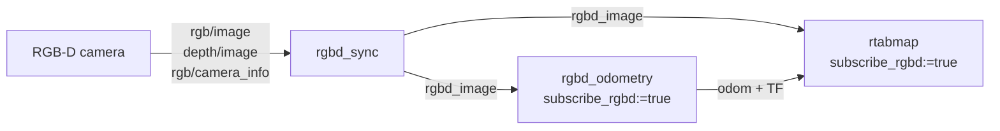
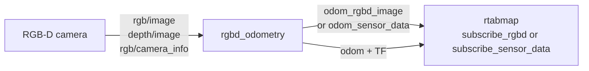

# rgbd_odometry

Visual odometry from a color image, a registered depth image and a calibration.

Each frame's visual features are matched against the previous frame — or against a small local map of recent features — and the camera motion that best explains the matches becomes the pose. Depth turns the 2D feature matches into 3D correspondences, which is what makes the scale real rather than arbitrary.

Use it when an RGB-D camera is the main sensor. For a stereo pair use [stereo_odometry](stereo_odometry.md); for a lidar, [icp_odometry](icp_odometry.md). All three publish the same topics and share the parameters in the [package README](../README.md#conventions), which covers frames, TF, the RTAB-Map parameters, guesses, the IMU and the services. This page covers what is specific to this node.

## Contents

- [Pipeline arrangements](#pipeline-arrangements)
- [Usage](#usage)
- [Subscribed Topics](#subscribed-topics)
- [Published Topics](#published-topics)
- [Parameters](#parameters)
- [Synchronization](#synchronization)
- [Several cameras](#several-cameras)
- [Repetitive patterns](#repetitive-patterns)
- [When it loses track](#when-it-loses-track)

## Pipeline arrangements

A camera-only pipeline, with the camera synchronized once and fanned out -- the arrangement [Synchronization](#synchronization) recommends:



Without `rgbd_sync`, both nodes subscribe to the three raw topics and each synchronizes them independently -- which works, but lets the two settle on different pairings.

Another arrangement drops `rgbd_sync` altogether and feeds `rtabmap` from **this node's own output** instead:



Remap `rtabmap`'s `rgbd_image` to `odom_rgbd_image`, or set `subscribe_sensor_data` and remap to `odom_sensor_data/raw`. Two things come for free:

- **No separate synchronization.** This node already matched the three topics to register the frame, and republishes the result, so there is no `rgbd_sync` to run and no second synchronizer to agree with.
- **The features are reused.** `odom_sensor_data` carries the keypoints, their 3D positions and their descriptors that odometry extracted; they survive the conversion back into RTAB-Map on the other side, so `rtabmap` does not redo feature detection and descriptor extraction.

## Usage

Against a camera's raw topics:

```bash
ros2 run rtabmap_odom rgbd_odometry --ros-args \
  -r rgb/image:=/camera/color/image_raw \
  -r depth/image:=/camera/depth/image_rect_raw \
  -r rgb/camera_info:=/camera/color/camera_info \
  -p frame_id:=base_link
```

Against an [`rgbd_sync`](https://github.com/introlab/rtabmap_ros/tree/ros2/rtabmap_sync) output, which is the better arrangement when anything else consumes the same camera:

```bash
ros2 run rtabmap_odom rgbd_odometry --ros-args \
  -p subscribe_rgbd:=true \
  -r rgbd_image:=/camera/rgbd_image \
  -p frame_id:=base_link
```

```python
ComposableNode(
    package='rtabmap_odom',
    plugin='rtabmap_odom::RGBDOdometry',
    name='rgbd_odometry',
    parameters=[{'frame_id': 'base_link', 'subscribe_rgbd': True}],
    remappings=[('rgbd_image', '/camera/rgbd_image')])
```

## Subscribed Topics

Which topics are used depends on `subscribe_rgbd` and `rgbd_cameras`.

**Default** — `subscribe_rgbd:=false`:

| Topic | Type | Description |
|---|---|---|
| `rgb/image` | [`sensor_msgs/msg/Image`](https://docs.ros.org/en/jazzy/p/sensor_msgs/msg/Image.html) | Color or mono image. Goes through `image_transport`. |
| `depth/image` | [`sensor_msgs/msg/Image`](https://docs.ros.org/en/jazzy/p/sensor_msgs/msg/Image.html) | Depth registered to the color camera. `16UC1` in millimeters or `32FC1` in meters. |
| `rgb/camera_info` | [`sensor_msgs/msg/CameraInfo`](https://docs.ros.org/en/jazzy/p/sensor_msgs/msg/CameraInfo.html) | Calibration of the color camera. |

**With `subscribe_rgbd:=true`**, one pre-synchronized message instead of three topics:

| `rgbd_cameras` | Topic | Type |
|---|---|---|
| `1` (default) | `rgbd_image` | [`rtabmap_msgs/msg/RGBDImage`](https://docs.ros.org/en/jazzy/p/rtabmap_msgs/msg/RGBDImage.html) |
| `2`–`6` | `rgbd_image0` … `rgbd_image5` | [`rtabmap_msgs/msg/RGBDImage`](https://docs.ros.org/en/jazzy/p/rtabmap_msgs/msg/RGBDImage.html) |
| `0` | `rgbd_images` | [`rtabmap_msgs/msg/RGBDImages`](https://docs.ros.org/en/jazzy/p/rtabmap_msgs/msg/RGBDImages.html) |

`rgbd_cameras:=0` takes any number of cameras in a single message, which is what [`rgbdx_sync`](https://github.com/introlab/rtabmap_ros/tree/ros2/rtabmap_sync) produces — the route that needs no rebuild and the only one that goes past six.

| Topic | Type | Description |
|---|---|---|
| `imu` | [`sensor_msgs/msg/Imu`](https://docs.ros.org/en/jazzy/p/sensor_msgs/msg/Imu.html) | Optional. Constrains roll and pitch; see [the README](../README.md#imu). |

## Published Topics

`odom`, `odom_info`, `odom_local_map`, `odom_last_frame`, `odom_rgbd_image` and the rest are common to all three nodes and documented in [the README](../README.md#published-topics).

## Parameters

Specific to this node. The shared ones — `frame_id`, `publish_tf`, `guess_frame_id`, `max_update_rate`, all of RTAB-Map's own — are in [the README](../README.md#conventions).

| Parameter | Type | Default | Description |
|---|---|---|---|
| `subscribe_rgbd` | `bool` | `false` | Take a pre-synchronized `RGBDImage` instead of three raw topics. |
| `rgbd_cameras` | `int` | `1` | Number of `RGBDImage` topics. `0` means one `RGBDImages` topic carrying any number. Only with `subscribe_rgbd:=true`. |
| `approx_sync` | `bool` | `true` | Match the raw topics by nearest stamp. See [Synchronization](#synchronization). |
| `approx_sync_max_interval` | `double` | `0.0` | Reject sets spanning more than this many seconds. `0` disables. |
| `topic_queue_size` | `int` | `10` | Queue depth of each input subscription. |
| `sync_queue_size` | `int` | `5` | Queue depth of the synchronizer. |
| `queue_size` | `int` | — | **Deprecated**, renamed to `sync_queue_size`. Copied to it with a warning. |
| `qos_camera_info` | `int` | value of `qos` | Reliability of the `rgb/camera_info` subscription alone. |
| `keep_color` | `bool` | `false` | Keep the color image in the data handed to the odometry instead of converting to grayscale. Registration is grayscale either way; this only matters for what downstream consumers of `odom_rgbd_image` receive. |
| `image_transport` | `string` | `"raw"` | Transport for `rgb/image`, e.g. `compressed`. |
| `depth_transport` | `string` | `"raw"` | Transport for `depth/image`, e.g. `compressedDepth`. |
| `rgb_transport` | `string` | — | **Deprecated**, renamed to `image_transport`. |

## Synchronization

With `subscribe_rgbd:=false` this node runs its own synchronizer over the three raw topics, and the same trade-off applies as everywhere else in this stack: **exact matching is cheaper and cannot mismatch, but publishes nothing at all if the stamps differ by a nanosecond**. The default here is approximate because many RGB-D cameras do not stamp color and depth identically.

When several nodes consume the same camera — odometry and `rtabmap`, usually — **synchronize once with `rgbd_sync` and set `subscribe_rgbd:=true` on both**. Two independent approximate synchronizers over the same three topics can settle on different pairings, and then `rtabmap` maps a frame at a pose computed from a different one. Feeding both from one `RGBDImage` removes the possibility.

`approx_sync_max_interval` is worth setting whenever approximate matching stays on: without it, a camera that stalls and resumes silently pairs a fresh color frame with a stale depth frame. A tenth of the frame period is a reasonable start.

## Several cameras

More cameras means more of the scene is textured enough to track, which is the usual reason visual odometry fails indoors. Point them in different directions rather than overlapping.

Two routes, both requiring the frames to be synchronized and each camera to be in TF:

- **`rgbd_cameras:=2..6`** subscribes to `rgbd_image0`…`rgbd_imageN` and synchronizes them here.
- **`rgbd_cameras:=0`** takes one `rgbd_images` topic from `rgbdx_sync`, which has no upper limit and needs no rebuild.

**RTAB-Map has to be built with OpenGV for this.** The default motion estimation is PnP (`Vis/EstimationType=1`, 3D→2D), and the multi-camera version of it lives in OpenGV. Without that dependency the registration refuses to run and says so:

```
Multi-camera 2D-3D PnP registration is only available if rtabmap is built with
OpenGV dependency. Use 3D-3D registration approach instead for multi-camera.
```

Check with `rtabmap --version`, which prints a `With OpenGV:` line. If it says `false`, either rebuild RTAB-Map against OpenGV or switch to `Vis/EstimationType:='0'` (3D→3D), which needs no extra dependency but registers point cloud to point cloud rather than reprojecting, and is the weaker estimator when depth is noisy.

**Hardware-synchronize the cameras if you can.** The node treats the set as one rigid observation at one timestamp: features from every camera are registered together, with the extrinsics from TF held fixed. There is no equivalent of lidar deskewing here — it cannot estimate the motion that happened *within* the rig between one camera's exposure and the next. If the cameras fire at different instants while the robot moves, that motion is absorbed as though the rig had flexed, and the registration is pulled off by however far the robot travelled in between.

Synchronizing the topics is not the same thing: `approx_sync` only decides which frames are grouped, it cannot undo an exposure that happened 20 ms later than its neighbour's.

Calibration matters more with several cameras than with one for the same reason: the extrinsics between them come from TF, and an error there shows up as a constant bias in the estimated motion rather than as an obvious failure.

## Features computed elsewhere

`RGBDImage` has fields for local features — `key_points`, `points` and `descriptors` — and when a frame arrives with them filled, this node hands them to the odometry as they are instead of detecting and describing anything. RTAB-Map extracts features only from a frame that brought none, so nothing is recomputed.

This is for a camera, or a driver, that already does the extraction: on a multi-camera rig it is most of the per-frame work, and it can be done once and shared with `rtabmap` rather than repeated in each node.

What a publisher has to get right:

- **One entry per camera**, in the same order as the images, for `rgbd_cameras:=0` as well as the numbered topics.
- **Keypoints in their own camera's image coordinates.** The node stitches the images side by side and shifts each camera's keypoints by the images that precede it.
- **3D points in that camera's optical frame.** They are brought into `frame_id` with the camera's transform from TF, the same one used for the calibration.
- **Descriptors compressed** with `rtabmap::compressData()`, one row per keypoint, the same type for every camera.
- **Equal counts.** `points` and `descriptors` may be left empty, but if they are there, they must have as many entries as there are keypoints. A frame whose three disagree has its features dropped with an error rather than used out of step.

Both images may be left out entirely: the depth image's job was to give the keypoints their depth and they arrive with it, and the color image's was to have features found in it. A frame is then its calibration and its features, which is the whole point — the images are nearly all of the bandwidth. The `camera_info` of each camera has to be there either way, as it is what says how big the image would have been and, through its `frame_id`, where the camera is.

What stops applying, since nothing is extracted: `Vis/MaxFeatures`, `Vis/DepthAsMask`, the detector chosen with `Kp/DetectorStrategy`, and the depth bounds `Vis/MinDepth` and `Vis/MaxDepth`. Whatever is published is what gets registered, so the publisher owns those decisions. `Vis/CorType` must stay at `0` (feature matching); optical flow (`1`) reads the images themselves and has nothing to work with here.

## Repetitive patterns

Not every failure announces itself. A scene full of identical detail — a tiled floor, rows of identical shelving, a patterned carpet, a brick wall — hands the matcher plenty of features and plenty of confident matches, just not always the *right* ones. One tile matched to its neighbour looks like a perfectly good inlier, and the pose comes out shifted by exactly one tile. Inlier counts stay healthy, nothing is reported lost, and the trajectory drifts in steps.

The defence is to constrain **where** a match is allowed to come from:

- **`guess_frame_id`** gives each feature a predicted image position, from wheel odometry or another external source.
- **`Vis/CorGuessWinSize`** bounds the search around that prediction — 40 pixels by default. Reducing it, to 10 or 20, means a feature can only match something close to where the guess says it should be, so the identical neighbour one tile away is never a candidate.

## When it loses track

Visual odometry fails when there is nothing to match: a blank wall, a dark room, motion blur, or a scene where everything moved. The node then publishes a null pose (see [the README](../README.md#lost-frames-resets-and-new-maps)) and `odom_info` says why.

Look at `odom_info` first — `inliers` is the number that matters:

```bash
ros2 topic echo /odom_info --field inliers
```

Inliers falling below `Vis/MinInliers` (default 20) is the definition of a lost frame. Whether the fix is more features, a better guess or a different strategy depends on which part is short:

- **Few features detected at all** — the scene is untextured or too dark. Lowering `Vis/MinInliers` lets frames register on fewer matches, but a pose resting on a handful of inliers is poorly constrained and drifts badly — it buys continuity at the price of accuracy. The real fixes are physical. If it is dark, add a light — a spotlight on the robot restores texture the camera can track, and costs far less than changing sensor. Otherwise it is **more field of view**: a wider lens, or [several cameras](#several-cameras) pointed in different directions. It only takes one textured patch somewhere in view to track, so a blank wall filling a narrow FOV stops being a problem the moment the rig can also see the ceiling or a doorway. Failing that, the camera is the wrong sensor here — a lidar if the scene has geometry, wheel odometry if it has neither. See [Choosing a sensor modality for the environment](../README.md#choosing-a-sensor-modality-for-the-environment).
- **Features detected but few matched** — motion is too fast for the search window, or the frame rate is too low. A `guess_frame_id` from wheel odometry is what helps most here.
- **Matched but rejected as outliers** — usually a moving scene, or depth that does not agree with the color image. Check that depth really is registered to color.

`Odom/ResetCountdown` gets the node out of a lost state automatically instead of leaving it lost until something calls `reset_odom`.

**A camera alone is not a great odometry source on a wheeled robot.** If the base publishes wheel odometry, feeding it in through `guess_frame_id` is worth more than any amount of tuning here.
