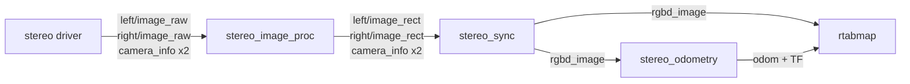
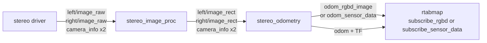

# stereo_odometry

Visual odometry from a stereo pair.

Features are found in the left image and matched into the right one to get their depth by disparity, then matched against the previous frame to get the motion. It is the same registration as [rgbd_odometry](rgbd_odometry.md); only the source of depth differs — computed here from the pair rather than measured by the sensor.

That difference is the reason to choose it. A stereo pair works outdoors and at range, where the projected-pattern depth of an RGB-D camera returns nothing, and its accuracy degrades gracefully with distance instead of cutting off. The cost is that depth is only available where there is texture to match, and that it depends on a good stereo calibration.

The shared parameters — frames, TF, guesses, the IMU, RTAB-Map's own parameters, the services — are in the [package README](../README.md#conventions). This page covers what is specific to this node.

## Contents

- [Pipeline arrangements](#pipeline-arrangements)
- [Usage](#usage)
- [Subscribed Topics](#subscribed-topics)
- [Published Topics](#published-topics)
- [Parameters](#parameters)
- [Synchronization](#synchronization)
- [Getting the scale right](#getting-the-scale-right)
- [Features computed elsewhere](#features-computed-elsewhere)
- [Repetitive patterns](#repetitive-patterns)
- [When it loses track](#when-it-loses-track)

## Pipeline arrangements

A stereo pipeline, including the rectification step this node does **not** do for you:



`stereo_image_proc` is skipped when the driver already publishes rectified images, and [`stereo_sync`](https://github.com/introlab/rtabmap_ros/tree/ros2/rtabmap_sync) is skipped when nothing but odometry consumes the camera -- the node then takes the four rectified topics directly.

The same shortcut as on the RGB-D side is available here: drop `stereo_sync` and feed `rtabmap` from **this node's own output**.



Remap `rtabmap`'s `rgbd_image` to `odom_rgbd_image`, or set `subscribe_sensor_data` and remap to `odom_sensor_data/raw`. The stereo pair survives the trip intact -- the left image, the right image and both calibrations travel in the one message, exactly as `stereo_sync` would have packed them -- and the features this node extracted come with it, so `rtabmap` does not redo feature detection and descriptor extraction.

## Usage

```bash
ros2 run rtabmap_odom stereo_odometry --ros-args \
  -r left/image_rect:=/stereo/left/image_rect \
  -r right/image_rect:=/stereo/right/image_rect \
  -r left/camera_info:=/stereo/left/camera_info \
  -r right/camera_info:=/stereo/right/camera_info \
  -p frame_id:=base_link
```

```python
ComposableNode(
    package='rtabmap_odom',
    plugin='rtabmap_odom::StereoOdometry',
    name='stereo_odometry',
    parameters=[{'frame_id': 'base_link'}],
    remappings=[('left/image_rect', '/stereo/left/image_rect'),
                ('right/image_rect', '/stereo/right/image_rect'),
                ('left/camera_info', '/stereo/left/camera_info'),
                ('right/camera_info', '/stereo/right/camera_info')])
```

**The images are normally rectified**, which is what the `image_rect` topic names assume, and what [`stereo_image_proc`](https://docs.ros.org/en/jazzy/p/stereo_image_proc/) produces when the driver does not.

They do not have to be. RTAB-Map can rectify them itself from the calibration -- set `Rtabmap/ImagesAlreadyRectified:=false` and feed it the raw pair with distortion coefficients in the `camera_info`. What does not work is the silent middle case: **unrectified images with that parameter left at its default of `true`**. Nothing fails loudly; disparity is computed across rows that no longer correspond, giving depths that are wrong in a smoothly varying way and a trajectory that is wrong without looking broken.

## Subscribed Topics

**Default** — `subscribe_rgbd:=false`:

| Topic | Type | Description |
|---|---|---|
| `left/image_rect` | [`sensor_msgs/msg/Image`](https://docs.ros.org/en/jazzy/p/sensor_msgs/msg/Image.html) | Rectified left image, color or mono. |
| `right/image_rect` | [`sensor_msgs/msg/Image`](https://docs.ros.org/en/jazzy/p/sensor_msgs/msg/Image.html) | Rectified right image, color or mono. |
| `left/camera_info` | [`sensor_msgs/msg/CameraInfo`](https://docs.ros.org/en/jazzy/p/sensor_msgs/msg/CameraInfo.html) | Left calibration. |
| `right/camera_info` | [`sensor_msgs/msg/CameraInfo`](https://docs.ros.org/en/jazzy/p/sensor_msgs/msg/CameraInfo.html) | Right calibration. Its `P` matrix carries the baseline, which sets the scale of the whole trajectory. |

**With `subscribe_rgbd:=true`**, one pre-synchronized message from [`stereo_sync`](https://github.com/introlab/rtabmap_ros/tree/ros2/rtabmap_sync):

| `rgbd_cameras` | Topic | Type |
|---|---|---|
| `1` (default) | `rgbd_image` | [`rtabmap_msgs/msg/RGBDImage`](https://docs.ros.org/en/jazzy/p/rtabmap_msgs/msg/RGBDImage.html) |
| `2`–`6` | `rgbd_image0` … `rgbd_image5` | [`rtabmap_msgs/msg/RGBDImage`](https://docs.ros.org/en/jazzy/p/rtabmap_msgs/msg/RGBDImage.html) |
| `0` | `rgbd_images` | [`rtabmap_msgs/msg/RGBDImages`](https://docs.ros.org/en/jazzy/p/rtabmap_msgs/msg/RGBDImages.html) |

| Topic | Type | Description |
|---|---|---|
| `imu` | [`sensor_msgs/msg/Imu`](https://docs.ros.org/en/jazzy/p/sensor_msgs/msg/Imu.html) | Optional. See [the README](../README.md#imu). |

## Published Topics

Common to all three nodes; see [the README](../README.md#published-topics).

## Parameters

| Parameter | Type | Default | Description |
|---|---|---|---|
| `subscribe_rgbd` | `bool` | `false` | Take a pre-synchronized `RGBDImage` from `stereo_sync` instead of four raw topics. |
| `rgbd_cameras` | `int` | `1` | Number of `RGBDImage` topics. `0` means one `RGBDImages` topic. Only with `subscribe_rgbd:=true`. More than one needs RTAB-Map built with OpenGV, and the cameras hardware-synchronized — see [Several cameras](rgbd_odometry.md#several-cameras). |
| `approx_sync` | `bool` | `false` | Match the raw topics by nearest stamp. **Defaults to exact**, unlike `rgbd_odometry` — see [Synchronization](#synchronization). |
| `approx_sync_max_interval` | `double` | `0.0` | Reject sets spanning more than this many seconds. `0` disables. Only used when `approx_sync` is on. |
| `topic_queue_size` | `int` | `10` | Queue depth of each input subscription. |
| `sync_queue_size` | `int` | `5` | Queue depth of the synchronizer. |
| `queue_size` | `int` | — | **Deprecated**, renamed to `sync_queue_size`. |
| `qos_camera_info` | `int` | value of `qos` | Reliability of the two `camera_info` subscriptions. |
| `keep_color` | `bool` | `false` | Keep the left image in color in the data passed on, rather than converting to grayscale. Registration is grayscale either way. |
| `image_transport` | `string` | `"raw"` | Transport for both image topics. |

## Synchronization

**This node defaults to exact matching**, because a stereo pair is normally hardware-triggered and the two images therefore carry identical stamps. That is the right default: exact matching is cheaper and cannot pair the left image with the wrong right one — and a mismatched stereo pair does not produce an error, it produces wrong disparities and a wrong trajectory.

The failure mode to recognize is the other one: if the stamps are *not* identical, **nothing is ever published and nothing says why**. Check before assuming the node is broken:

```bash
ros2 topic echo --once /stereo/left/image_rect --field header.stamp
ros2 topic echo --once /stereo/right/image_rect --field header.stamp
```

If they differ, set `approx_sync:=true` and set `approx_sync_max_interval` to something tight — a stereo pair whose images are more than a fraction of a frame apart is not usable for disparity regardless.

## Getting the scale right

Everything about a stereo trajectory's scale comes from the **baseline**, which this node reads from the right camera's `P` matrix (`P[3] = -fx * baseline`). Two consequences:

- A `right/camera_info` whose `P` matrix is all zeros — which some drivers publish before calibration is loaded — gives a zero baseline and no usable depth at all.
- A calibration whose baseline is off by a few percent produces a trajectory off by the same few percent, consistently, with nothing else looking wrong.

If the map comes out uniformly too large or too small, check the baseline before anything else.

## Features computed elsewhere

`RGBDImage` has fields for local features — `key_points`, `points` and `descriptors` — and when a frame arrives with them filled, this node hands them to the odometry as they are instead of detecting and describing anything. RTAB-Map extracts features only from a frame that brought none, so nothing is recomputed, and neither is the disparity search that would otherwise give each feature its depth.

This is for a camera, or a driver, that already does the extraction: on a multi-camera rig it is most of the per-frame work, and it can be done once and shared with `rtabmap` rather than repeated in each node.

What a publisher has to get right:

- **One entry per camera**, in the same order as the images, for `rgbd_cameras:=0` as well as the numbered topics.
- **Keypoints in their own camera's left image.** The node stitches the left images side by side and shifts each camera's keypoints by the images that precede it. A stereo pair's features belong to the left image; nothing is expected in the right one.
- **3D points in that camera's left optical frame.** They are brought into `frame_id` with the camera's transform from TF, the same one used for the calibration.
- **Descriptors compressed** with `rtabmap::compressData()`, one row per keypoint, the same type for every camera.
- **Equal counts.** `points` and `descriptors` may be left empty, but if they are there, they must have as many entries as there are keypoints. A frame whose three disagree has its features dropped with an error rather than used out of step.

Both images may be left out entirely — the left image's job was to have features found in it, the right one's to give them their disparity, and they arrive with their 3D positions already. A frame is then its two calibrations and its features, which is the whole point: the images are nearly all of the bandwidth. Both `camera_info` still have to be there, the left one saying how big the image would have been and where the camera is, the right one carrying the baseline in `P(0,3)` — without it there is no scale, features or not.

What stops applying, since nothing is extracted: `Vis/MaxFeatures`, the detector chosen with `Kp/DetectorStrategy`, and the depth bounds `Vis/MinDepth` and `Vis/MaxDepth`. Whatever is published is what gets registered, so the publisher owns those decisions. `Vis/CorType` must stay at `0` (feature matching); optical flow (`1`) reads the images themselves and has nothing to work with here.

## Repetitive patterns

Identical detail repeated across the scene — a tiled floor, rows of shelving, a brick wall — lets the matcher pair a feature with the wrong copy of itself, which drifts the trajectory by exactly one repeat while the inlier count stays healthy and nothing is reported lost. It bites stereo twice over, since the same ambiguity also misplaces the left/right match that sets the depth.

The fix is the same as for [rgbd_odometry](rgbd_odometry.md#repetitive-patterns): an external guess through `guess_frame_id`, with `Vis/CorGuessWinSize` reduced so a match has to come from close to where the guess predicts. `Stereo/WinWidth` and `Stereo/WinHeight` matter here too — a correlation window smaller than the repeating pattern has nothing unique to lock onto.

## When it loses track

The same diagnosis as [rgbd_odometry](rgbd_odometry.md#when-it-loses-track) — `odom_info`'s `inliers` is the number to watch — with two failure modes specific to stereo:

- **Poor rectification.** Matched features should lie on the same image row. If they do not, either the pair is unrectified while `Rtabmap/ImagesAlreadyRectified` is `true`, or the calibration itself is off.
- **Untextured scene.** With no texture there is nothing to match *between* left and right either, so there is no depth at all — worse than the RGB-D case, where the sensor still measures wrong depth on a blank wall.

`Stereo/*` parameters tune the disparity matching itself: `Stereo/MaxDisparity` bounds how close a point can be, `Stereo/WinWidth` and `Stereo/WinHeight` the correlation window. They are listed by `ros2 param list` like every other RTAB-Map parameter.
