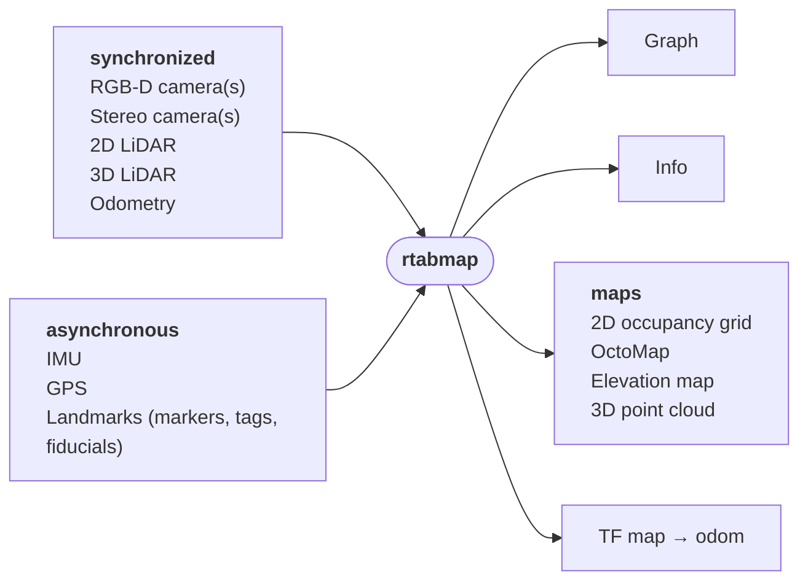
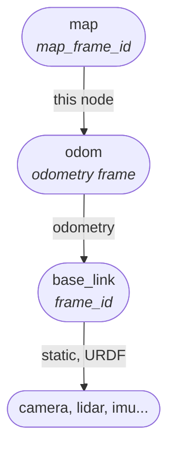

# rtabmap_slam

The SLAM node of [RTAB-Map](https://github.com/introlab/rtabmap): it takes a pose from odometry and data from the sensors, builds a graph of where the robot has been, and corrects that graph whenever it recognizes a place it has seen before — in the current run or in a previous one, so a map can be extended over [several sessions](#the-database).

## Contents

- [Nodes](#nodes)
- [Conventions](#conventions)
  - [Frames and TF](#frames-and-tf)
  - [The database](#the-database)
  - [Update rate and dropped updates](#update-rate-and-dropped-updates)
  - [Odometry, covariance and new maps](#odometry-covariance-and-new-maps)
  - [Mapping and localization](#mapping-and-localization)
- [License](#license)

## Nodes

| Node | Description |
|---|---|
| [rtabmap](doc/rtabmap.md) | Graph SLAM with appearance- and proximity-based loop closure detection, memory management, map assembly and planning on the graph. |



## Conventions

### Frames and TF

The node publishes `map` → `odom`, the correction from the optimized graph; odometry publishes `odom` → `base_link`, and the sensors are attached to `base_link`. See [Frames and TF](doc/rtabmap.md#frames-and-tf) for the parameters.



### The database

**The map is stored in `database_path`**, `~/.ros/rtabmap.db` by default (under `$ROS_HOME` if that is set). Set `delete_db_on_start`, or pass `-d` as an argument, to start from an empty one. Otherwise restarting on an existing database continues it: the map is reloaded, the next update starts a **new session**, and a loop closure between the new session and an old one merges the two. That is how a map is extended over several runs.

**The database is saved on shutdown**. A node that is killed rather than shut down loses whatever had not been written yet.

**The database also remembers the parameters it was built with**, and reopening it without setting them again brings them back. For example, a map made with ICP registration keeps using ICP, which is what makes the new session compatible with the old ones. Anything set explicitly still wins, and `delete_db_on_start` forgets them along with the map.

### Update rate and dropped updates

`Rtabmap/DetectionRate` is how many updates per second are processed. It is 1 Hz by default because SLAM does not need more: odometry carries the pose between nodes, and each node costs memory, loop closure detection and optimization time for as long as the map exists.

> **Warning: `Rtabmap/DetectionRate` at `0` with sensor updates faster than about 2 Hz makes loop closure detection, graph optimization and map generation intractable fast.** Every update then becomes a node, and each node is compared against all the nodes in working memory, adds a pose to optimize and data to assemble into the maps, so the map, and the time each update takes, grow at the sensors' rate until the node cannot keep up. Keep a detection rate of 1 to 2 Hz, or bound working memory with `Rtabmap/TimeThr` or `Rtabmap/MemoryThr`.

**A robot standing still does not grow the map.** An update that moved less than both `RGBD/LinearUpdate` and `RGBD/AngularUpdate` since the last node is still used to detect loop closures, and then dropped. Set both to `0` to add a node every time.

**An update arriving while the previous one is still being processed is dropped**, not queued. SLAM time grows with the map, so a queue would only fall further behind; dropping keeps the node on the newest data. `info` shows how long each update took (`RtabmapROS/TimeTotal/ms`), and `/diagnostics` how many arrived versus how many were processed.

### Odometry, covariance and new maps

The link between two consecutive nodes is the odometry between them, weighted by its covariance — its inverse becomes the link's information matrix, so the optimizer knows how far to trust each one.

Which covariance is used:

- **The twist covariance, if it is set.** It is the uncertainty of the motion since the previous message, which is what a link between two nodes is.
- **Otherwise half the pose covariance**, for odometry sources that only fill that one. This assumes it is the error of the motion since the previous message, as visual odometry often publishes it, not the unbounded uncertainty of the pose estimated by a filtered odometry.
- **Otherwise `odom_tf_linear_variance` and `odom_tf_angular_variance`** (`0.001` by default), for a covariance that is zero, not finite, or exactly `1` — which is what several drivers publish to mean "not set". Many do publish zeros, and taking those at face value would make each link infinitely confident.

Between two nodes, the largest covariance seen is kept, so updates dropped by the rate do not make the link look more certain than any of the motions that made it up.

**An odometry reset starts a new map**, in the same database, rather than deforming the graph across a jump the robot never made:

```
Odometry is reset (identity pose or high variance detected). Increment map id!
```

A reset is an identity pose after a non-identity one, or `9999` on both the pose and the twist covariance diagonals — which is what the [odometry nodes publish](../rtabmap_odom/README.md#lost-frames-resets-and-new-maps) when they lose track or restart. Odometry read from TF has no covariance, so only the identity pose counts there. The new map is merged back into the old one on the first loop closure between them.

A consequence worth knowing: an odometry that returns to *exactly* the identity is taken for a reset. Real odometry never does, but a simulator or a test that drives back to the origin will.

**`staleness_factor`** treats a long silence the same way. With `Rtabmap/DetectionRate` at 1 Hz and a factor of 2, an update more than 2 seconds after the previous one starts a new map. It is for odometry sources that go quiet instead of reporting a reset — a gap that long means the motion across it is not known, even if the next pose looks plausible.

### Mapping and localization

`Mem/IncrementalMemory` chooses between the two:

- **`true`, mapping (SLAM)**, the default. Updates become nodes and the map grows. This is the mode to create a map of the environment.
- **`false`, localization.** The map is loaded and not extended: each update is compared against it, localizes the robot if it matches, and is not added to the database. This is the mode to localize in a map already recorded, without increasing CPU and RAM usage, since the map is kept fixed.

`set_mode_localization` and `set_mode_mapping` switch at runtime. Going back to mapping starts a new session, since nothing links where the robot is now to where it left the map — until a loop closure does.

See [Localization](doc/rtabmap.md#localization) for where the robot starts on the map in localization mode.

## License

BSD-3-Clause. See the [repository root](https://github.com/introlab/rtabmap_ros#license).
