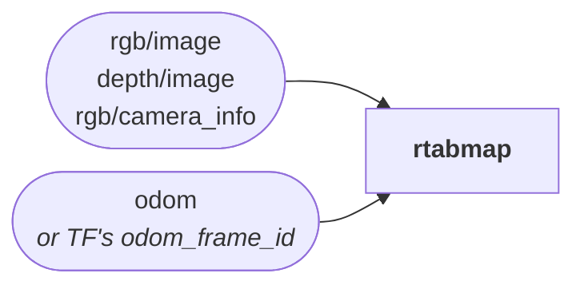
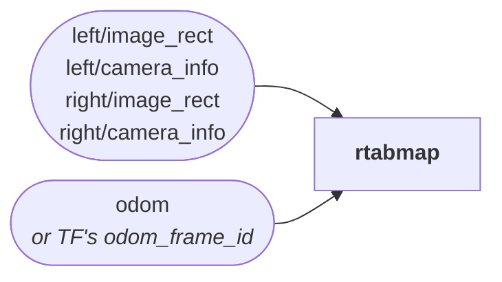
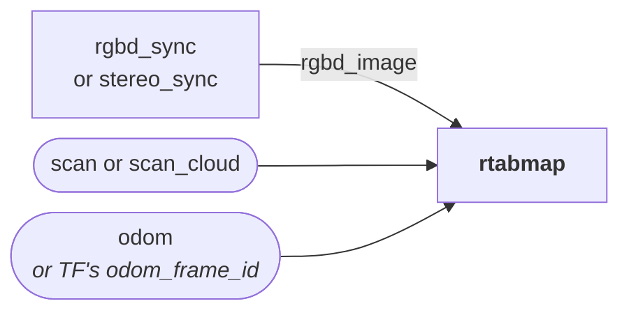
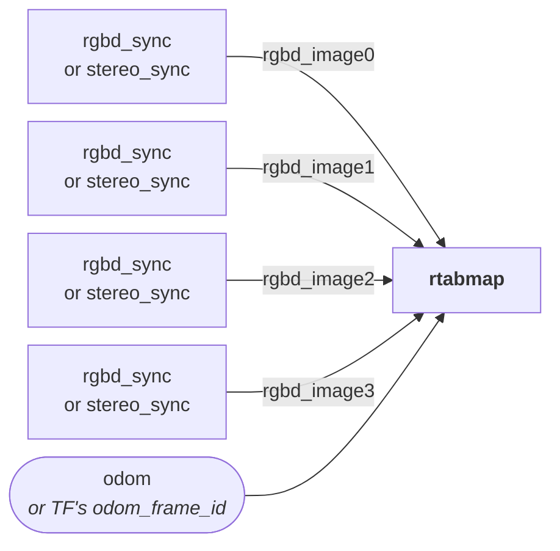
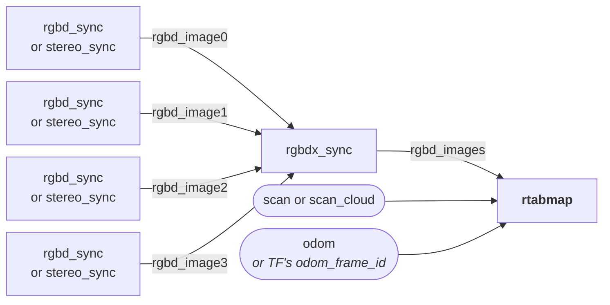
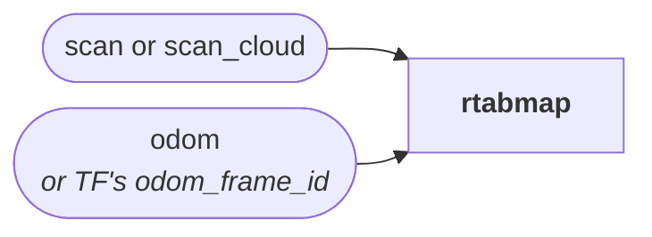
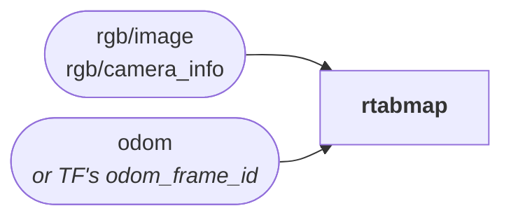
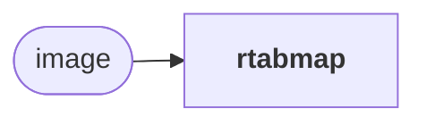
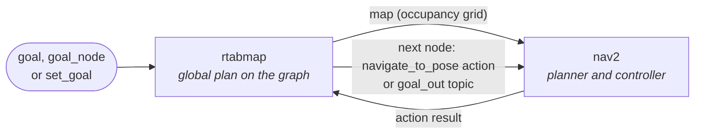

# rtabmap

Graph SLAM: each update that moved far enough becomes a node, linked to the previous one by odometry and to earlier ones by the loop closures found, and the graph is optimized every time a loop closure is added.

Loop closures are found two ways:

- **Appearance-based**: the node's visual words are compared against every node in working memory with an incremental bag-of-words (BoW) approach, which is independent of the odometry pose, and so of its drift.
- **Proximity-based**: the node is registered against the nodes the graph says are nearby, based on the previous localization and the current odometry pose. This is what a lidar-only setup relies on.

**Memory management**: working memory can be bounded, by update time (`Rtabmap/TimeThr`, in ms) or by node count (`Rtabmap/MemoryThr`): older nodes are then moved to the database and brought back when the robot returns near them, so the update time stays flat on large maps. Both are `0` by default, which leaves working memory unbounded: every node stays in it, and the update time grows with the map. Before enabling memory management, we strongly recommend reading [Long-Term Online Multi-Session Graph-Based SPLAM with Memory Management](https://arxiv.org/abs/2301.00050), which explains how it works and what it implies for mapping, localization and planning.

## Contents

- [Usage](#usage)
- [Choosing the inputs](#choosing-the-inputs)
  - [RGB-D camera (RGB-D visual SLAM)](#rgb-d-camera-rgb-d-visual-slam)
  - [Stereo camera (stereo visual SLAM)](#stereo-camera-stereo-visual-slam)
  - [RGB-D or stereo camera and lidar](#rgb-d-or-stereo-camera-and-lidar)
  - [Several RGB-D or stereo cameras](#several-rgb-d-or-stereo-cameras)
  - [Several RGB-D or stereo cameras and lidar](#several-rgb-d-or-stereo-cameras-and-lidar)
  - [Lidar alone](#lidar-alone)
  - [RGB camera with odometry](#rgb-camera-with-odometry)
  - [RGB camera alone (appearance-based loop closure detection)](#rgb-camera-alone-appearance-based-loop-closure-detection)
- [Odometry from TF](#odometry-from-tf)
- [Automatic adjustments](#automatic-adjustments)
- [Sensors not stamped together](#sensors-not-stamped-together)
- [Subscribed Topics](#subscribed-topics)
- [Published Topics](#published-topics)
- [Services](#services)
- [Parameters](#parameters)
  - [RTAB-Map's own parameters](#rtab-maps-own-parameters)
- [Frames and TF](#frames-and-tf)
- [Asynchronous inputs](#asynchronous-inputs)
  - [Landmarks](#landmarks)
  - [GPS and global pose](#gps-and-global-pose)
  - [IMU](#imu)
  - [User data and environment sensors](#user-data-and-environment-sensors)
  - [Intermediate odometry](#intermediate-odometry)
- [Deriving missing data](#deriving-missing-data)
- [Localization](#localization)
- [Planning](#planning)
- [Diagnostics](#diagnostics)

## Usage

RGB-D camera, with odometry from [rgbd_odometry](../../rtabmap_odom/doc/rgbd_odometry.md) or any other source on `odom`, and the camera synchronized by [rgbd_sync](../../rtabmap_sync/doc/rgbd_sync.md):

```bash
ros2 run rtabmap_slam rtabmap --ros-args \
  -p subscribe_depth:=false -p subscribe_rgb:=false -p subscribe_rgbd:=true \
  -p frame_id:=base_link \
  -r rgbd_image:=/camera/rgbd_image \
  -r odom:=/odom
```

2D lidar, with odometry from TF:

```bash
ros2 run rtabmap_slam rtabmap --ros-args \
  -p subscribe_depth:=false -p subscribe_rgb:=false -p subscribe_scan:=true \
  -p frame_id:=base_link \
  -p odom_frame_id:=odom \
  -p "Reg/Force3DoF:='true'" \
  -r scan:=/scan
```

```python
ComposableNode(
    package='rtabmap_slam',
    plugin='rtabmap_slam::CoreWrapper',
    name='rtabmap',
    parameters=[{'frame_id': 'base_link',
                 'subscribe_depth': False,
                 'subscribe_rgb': False,
                 'subscribe_rgbd': True,
                 'subscribe_scan': True,
                 'approx_sync': True,
                 'RGBD/LinearUpdate': '0.1',
                 'Reg/Force3DoF': 'true'}],
    remappings=[('rgbd_image', '/camera/rgbd_image'),
                ('scan', '/scan'),
                ('odom', '/odom')])
```

The executable runs the node on a **multi-threaded** executor, and the node relies on it. SLAM runs in its own callback group, so the synchronized inputs keep arriving while an update is being processed; the asynchronous inputs (GPS, IMU, landmarks, user data...) have groups of their own, so they are buffered rather than blocked. Loaded into a single-threaded component container, it still works, but everything is serialized behind the SLAM update.

[`rtabmap_launch`](https://github.com/introlab/rtabmap_ros/tree/ros2/rtabmap_launch) wraps all of this, together with odometry and `rtabmap_viz`, and is where most setups should start.

## Choosing the inputs

The common setups are below. How the input topics are synchronized — `approx_sync`, `topic_queue_size`, `sync_queue_size` and the `qos*` parameters — is documented in [rtabmap_sync](../../rtabmap_sync/README.md#conventions).

### RGB-D camera (RGB-D visual SLAM)

```yaml
subscribe_depth: true   # default
subscribe_rgb: true   # default
```

This is the legacy default. The recommended way is instead to synchronize the camera topics together with [rgbd_sync](../../rtabmap_sync/doc/rgbd_sync.md), and subscribe to its `rgbd_image`, as in [RGB-D or stereo camera and lidar](#rgb-d-or-stereo-camera-and-lidar) without the lidar.



### Stereo camera (stereo visual SLAM)

```yaml
subscribe_stereo: true
subscribe_depth: false
subscribe_rgb: false
```

`approx_sync` defaults to `false` here: the left and right images, and the odometry, are expected with exactly the same stamp, as when the odometry comes from [stereo_odometry](../../rtabmap_odom/doc/stereo_odometry.md) on the same camera. The images are assumed to be already rectified; if they are not, set `Rtabmap/ImagesAlreadyRectified` to `false` to rectify them here, at rtabmap's update rate.



### RGB-D or stereo camera and lidar

```yaml
subscribe_rgbd: true
subscribe_scan: true   # for a 2D lidar
#subscribe_scan_cloud: true   # for a 3D lidar
subscribe_depth: false
subscribe_rgb: false
```

The camera comes as one `rgbd_image`, from [rgbd_sync](../../rtabmap_sync/doc/rgbd_sync.md) for an RGB-D camera or [stereo_sync](../../rtabmap_sync/doc/stereo_sync.md) for a stereo camera. Loop closures are still detected visually; with `Reg/Strategy` set to `1`, they are then refined with the lidar (ICP). `RGBD/NeighborLinkRefining` set to `true` also refines, with that registration, the link between each new node and the previous one, which corrects the odometry.



### Several RGB-D or stereo cameras

```yaml
subscribe_rgbd: true
rgbd_cameras: 4
subscribe_depth: false
subscribe_rgb: false
```

Each camera is synchronized by its own [rgbd_sync](../../rtabmap_sync/doc/rgbd_sync.md) or [stereo_sync](../../rtabmap_sync/doc/stereo_sync.md), and rtabmap subscribes to their `rgbd_image0`, `rgbd_image1`... directly. This requires `rtabmap_sync` built with [`RTABMAP_SYNC_MULTI_RGBD`](../../rtabmap_sync/README.md#build-options), which is off by default; otherwise, see [Several RGB-D or stereo cameras and lidar](#several-rgb-d-or-stereo-cameras-and-lidar).



### Several RGB-D or stereo cameras and lidar

```yaml
subscribe_rgbd: true
rgbd_cameras: 0
subscribe_scan: true   # optional, for a 2D lidar
#subscribe_scan_cloud: true   # optional, for a 3D lidar
subscribe_depth: false
subscribe_rgb: false
```

[rgbdx_sync](../../rtabmap_sync/doc/rgbdx_sync.md) combines the cameras' `rgbd_image` into one `rgbd_images`. This works without any build option.



### Lidar alone

```yaml
subscribe_scan: true   # for a 2D lidar
#subscribe_scan_cloud: true   # for a 3D lidar
subscribe_depth: false
subscribe_rgb: false
```

There are no images: bag-of-words is disabled, and loop closures are found by proximity alone.



### RGB camera with odometry

```yaml
subscribe_depth: false
subscribe_rgb: true   # default
```

Without depth, the images cannot build a metric map, so this is mainly useful in localization mode, to localize a single camera on a map built with a depth camera. [rgb_sync](../../rtabmap_sync/doc/rgb_sync.md) can also be used to synchronize the image with its camera_info, and rtabmap then subscribes to its `rgbd_image` with `subscribe_rgbd:=true` and `subscribe_rgb:=false`.



### RGB camera alone (appearance-based loop closure detection)

```yaml
subscribe_depth: false
subscribe_rgb: false
subscribe_odom: false
RGBD/Enabled: "false"
```

The node then subscribes to `image` and only detects loop closures between images: no odometry, no graph optimization, no metric map.



## Odometry from TF

Setting `odom_frame_id` reads odometry from TF instead: `odom_frame_id` → `frame_id` is looked up at the stamp of each sensor message, and `subscribe_odom` is turned off. This is the natural arrangement when the odometry source publishes only TF, and it saves synchronizing one more topic.

The trade-off is covariance: TF has none, so every link gets `odom_tf_linear_variance` and `odom_tf_angular_variance`, and an odometry reset can only be recognized by an identity pose — not by the `9999` covariance the [odometry nodes](../../rtabmap_odom/README.md#lost-frames-resets-and-new-maps) publish when they lose track. Prefer the topic when the source provides a meaningful covariance.

A sensor message whose stamp cannot be found in TF within `wait_for_transform` is dropped. The same goes for a sensor frame that is not connected to `frame_id`.

## Automatic adjustments

Some RTAB-Map defaults only make sense for a camera. With a lidar, or without a camera, the node adjusts them — for example, the occupancy grid built from the scan, and loop closures registered with ICP — unless they were set explicitly, and the log says what it changed.

## Sensors not stamped together

On a real robot the sensors are rarely stamped together: odometry, a lidar and cameras run at their own rates and are triggered independently. The synchronizer (`approx_sync`) groups the closest messages into one update, and the node then makes them consistent in time:

- **The node's stamp is the lidar's**, when there is one, or else the first camera's.
- **The odometry is taken at that stamp**, interpolated in TF between odometry samples. Without odometry in TF, the synchronized odometry message is used as it is, pose and stamp: the node then takes the odometry's stamp rather than the lidar's.
- **The link's covariance is the synchronized odometry message's**, not the last one received: the largest among the updates merged into the node.

`odom_sensor_sync`, on by default, uses the odometry in TF to correct each sensor for the robot's motion:

- **Each camera** is moved by the motion between its own stamp and the node's: an image taken 15 ms after the lidar is placed where the robot was 15 ms later. With several cameras triggered one after the other -- in one `rgbd_images` message or on separate topics -- each keeps its own stamp and is placed separately.
- **A 3D cloud** (`scan_cloud`) is assumed already deskewed, and is moved as a whole, the same way. Deskew it upstream, with [`lidar_deskewing`](../../rtabmap_util/doc/lidar_deskewing.md) or [`icp_odometry`'s deskewing](../../rtabmap_odom/doc/icp_odometry.md#deskewing).
- **A 2D scan** (`scan`) is deskewed ray by ray, when its `time_increment` is set: each ray is placed where the robot was when it was measured. That needs the odometry in TF across the whole sweep, within `wait_for_transform`.

**Without odometry in TF** -- odometry published as a topic only -- none of this is possible, and the sensors are used as they are: cameras at their mount with a warning, 2D scans without deskewing with a warning shown once. Nothing is dropped.

With `odom_sensor_sync` off, every sensor is placed at its mount, as if it had been stamped with the lidar, and 2D scans are not deskewed. On a moving robot, that costs centimeters: a camera triggered 15 ms late on a robot turning at 0.5 rad/s misplaces what it sees 3 m away by 2 cm, and a 0.1 s lidar sweep at 1 m/s bends the scan by 10 cm.

## Subscribed Topics

**Synchronized** — see [Choosing the inputs](#choosing-the-inputs).

| Topic | Type | Description |
|---|---|---|
| `rgb/image`, `depth/image`, `rgb/camera_info` | [`sensor_msgs/msg/Image`](https://docs.ros.org/en/jazzy/p/sensor_msgs/msg/Image.html), [`sensor_msgs/msg/CameraInfo`](https://docs.ros.org/en/jazzy/p/sensor_msgs/msg/CameraInfo.html) | RGB-D camera, depth registered to color. |
| `left/image_rect`, `right/image_rect`, `left/camera_info`, `right/camera_info` | [`sensor_msgs/msg/Image`](https://docs.ros.org/en/jazzy/p/sensor_msgs/msg/Image.html), [`sensor_msgs/msg/CameraInfo`](https://docs.ros.org/en/jazzy/p/sensor_msgs/msg/CameraInfo.html) | Stereo camera. |
| `rgbd_image` | [`rtabmap_msgs/msg/RGBDImage`](https://docs.ros.org/en/jazzy/p/rtabmap_msgs/msg/RGBDImage.html) | One camera, from [rgbd_sync](../../rtabmap_sync/doc/rgbd_sync.md), [stereo_sync](../../rtabmap_sync/doc/stereo_sync.md) or [rgb_sync](../../rtabmap_sync/doc/rgb_sync.md). |
| `rgbd_images` | [`rtabmap_msgs/msg/RGBDImages`](https://docs.ros.org/en/jazzy/p/rtabmap_msgs/msg/RGBDImages.html) | Several cameras, from [rgbdx_sync](../../rtabmap_sync/doc/rgbdx_sync.md). |
| `scan` | [`sensor_msgs/msg/LaserScan`](https://docs.ros.org/en/jazzy/p/sensor_msgs/msg/LaserScan.html) | 2D lidar. |
| `scan_cloud` | [`sensor_msgs/msg/PointCloud2`](https://docs.ros.org/en/jazzy/p/sensor_msgs/msg/PointCloud2.html) | 3D lidar, or [`icp_odometry`](../../rtabmap_odom/doc/icp_odometry.md)'s [filtered scan](../../rtabmap_odom/doc/icp_odometry.md#reusing-the-filtered-scan-downstream). |
| `scan_descriptor` | [`rtabmap_msgs/msg/ScanDescriptor`](https://docs.ros.org/en/jazzy/p/rtabmap_msgs/msg/ScanDescriptor.html) | A scan with a global descriptor for loop closure detection. |
| `sensor_data` | [`rtabmap_msgs/msg/SensorData`](https://docs.ros.org/en/jazzy/p/rtabmap_msgs/msg/SensorData.html) | Everything a node holds in one message, as the odometry nodes republish it on `odom_sensor_data/*`. |
| `odom` | [`nav_msgs/msg/Odometry`](https://docs.ros.org/en/jazzy/p/nav_msgs/msg/Odometry.html) | Odometry. Mainly used for its covariance, which weights the link between consecutive nodes in the graph (see [Odometry, covariance and new maps](../README.md#odometry-covariance-and-new-maps)). The pose is taken from TF at the sensors' stamp when available; the message's pose is used otherwise. |
| `odom_info` | [`rtabmap_msgs/msg/OdomInfo`](https://docs.ros.org/en/jazzy/p/rtabmap_msgs/msg/OdomInfo.html) | From an `rtabmap_odom` node: its statistics are stored with the node, and its measured motion gives the velocity. |
| `user_data` | [`rtabmap_msgs/msg/UserData`](https://docs.ros.org/en/jazzy/p/rtabmap_msgs/msg/UserData.html) | Arbitrary data stored with the node. |

**Asynchronous** — buffered, and attached to the next node. See [Asynchronous inputs](#asynchronous-inputs).

| Topic | Type | Description |
|---|---|---|
| `user_data_async` | [`rtabmap_msgs/msg/UserData`](https://docs.ros.org/en/jazzy/p/rtabmap_msgs/msg/UserData.html) | Arbitrary data for the next node. See [User data and environment sensors](#user-data-and-environment-sensors). |
| `gps/fix` | [`sensor_msgs/msg/NavSatFix`](https://docs.ros.org/en/jazzy/p/sensor_msgs/msg/NavSatFix.html) | GPS. See [GPS and global pose](#gps-and-global-pose). |
| `global_pose` | [`geometry_msgs/msg/PoseWithCovarianceStamped`](https://docs.ros.org/en/jazzy/p/geometry_msgs/msg/PoseWithCovarianceStamped.html) | An absolute pose from outside, added as a prior. See [GPS and global pose](#gps-and-global-pose). |
| `imu` | [`sensor_msgs/msg/Imu`](https://docs.ros.org/en/jazzy/p/sensor_msgs/msg/Imu.html) | Only the orientation is used, for gravity constraints: it must already be estimated, by [`imu_filter_madgwick` or `imu_complementary_filter`](https://github.com/CCNYRoboticsLab/imu_tools) for example. See [IMU](#imu). |
| `landmark_detection`, `landmark_detections` | [`rtabmap_msgs/msg/LandmarkDetection`](https://docs.ros.org/en/jazzy/p/rtabmap_msgs/msg/LandmarkDetection.html), [`rtabmap_msgs/msg/LandmarkDetections`](https://docs.ros.org/en/jazzy/p/rtabmap_msgs/msg/LandmarkDetections.html) | Fiducials or any other identified landmark. See [Landmarks](#landmarks). |
| `apriltag/detections` | [`apriltag_msgs/msg/AprilTagDetectionArray`](https://github.com/christianrauch/apriltag_msgs/blob/master/msg/AprilTagDetectionArray.msg) | Landmarks straight from [apriltag_ros](https://github.com/christianrauch/apriltag_ros). `tag_detections` is its deprecated name. |
| `aruco/detections` | [`aruco_msgs/msg/MarkerArray`](https://docs.ros.org/en/jazzy/p/aruco_msgs/msg/MarkerArray.html) | Landmarks straight from [aruco_ros](https://github.com/pal-robotics/aruco_ros). |
| `aruco_opencv/detections` | [`aruco_opencv_msgs/msg/ArucoDetection`](https://docs.ros.org/en/jazzy/p/aruco_opencv_msgs/msg/ArucoDetection.html) | Landmarks straight from [ros_aruco_opencv](https://github.com/fictionlab/ros_aruco_opencv). |
| `aruco_markers/detections` | [`aruco_markers_msgs/msg/MarkerArray`](https://docs.ros.org/en/jazzy/p/aruco_markers_msgs/msg/MarkerArray.html) | Landmarks straight from [aruco_markers](https://github.com/namo-robotics/aruco_markers). |
| `aruco_interfaces/detections` | [`ros2_aruco_interfaces/msg/ArucoMarkers`](https://github.com/JMU-ROBOTICS-VIVA/ros2_aruco/blob/main/ros2_aruco_interfaces/msg/ArucoMarkers.msg) | Landmarks straight from [ros2_aruco](https://github.com/JMU-ROBOTICS-VIVA/ros2_aruco). |
| `env_sensor` | [`rtabmap_msgs/msg/EnvSensor`](https://docs.ros.org/en/jazzy/p/rtabmap_msgs/msg/EnvSensor.html) | A scalar reading stored with the next node: WiFi signal strength, or one of the [environment sensors Android devices have](https://developer.android.com/develop/sensors-and-location/sensors/sensors_environment). See [User data and environment sensors](#user-data-and-environment-sensors). |
| `inter_odom` | [`nav_msgs/msg/Odometry`](https://docs.ros.org/en/jazzy/p/nav_msgs/msg/Odometry.html) | A faster odometry, to fill the gaps between nodes with intermediate nodes. See [Intermediate odometry](#intermediate-odometry). |
| `inter_odom_info` | [`rtabmap_msgs/msg/OdomInfo`](https://docs.ros.org/en/jazzy/p/rtabmap_msgs/msg/OdomInfo.html) | Its statistics, with `subscribe_inter_odom_info`. See [Intermediate odometry](#intermediate-odometry). |

Each detector topic (`apriltag/detections` to `aruco_interfaces/detections`) exists only when this package was built with that detector's messages package. They all feed the same landmarks as `landmark_detection`; see [Landmarks](#landmarks).

**Commands**

| Topic | Type | Description |
|---|---|---|
| `initialpose` | [`geometry_msgs/msg/PoseWithCovarianceStamped`](https://docs.ros.org/en/jazzy/p/geometry_msgs/msg/PoseWithCovarianceStamped.html) | Where the robot is, in localization mode. |
| `goal` | [`geometry_msgs/msg/PoseStamped`](https://docs.ros.org/en/jazzy/p/geometry_msgs/msg/PoseStamped.html) | A goal pose to plan to. |
| `goal_node` | [`rtabmap_msgs/msg/Goal`](https://docs.ros.org/en/jazzy/p/rtabmap_msgs/msg/Goal.html) | A goal node, by id or label. |
| `~/republish_node_data` | [`std_msgs/msg/Int32MultiArray`](https://docs.ros.org/en/jazzy/p/std_msgs/msg/Int32MultiArray.html) | Node ids whose data to include in the next `mapData`, for a visualizer catching up on a map it joined late. |

## Published Topics

**Every topic is published only when something is subscribed** — the work of building each message is skipped otherwise. The TF broadcast is not gated this way.

| Topic | Type | Description |
|---|---|---|
| `info` | [`rtabmap_msgs/msg/Info`](https://docs.ros.org/en/jazzy/p/rtabmap_msgs/msg/Info.html) | Everything about the last update: the node id, loop closure and proximity detection results, and all of RTAB-Map's statistics with their timings. One per processed update — intermediate nodes excepted. The first thing to look at when the map misbehaves. |
| `mapData` | [`rtabmap_msgs/msg/MapData`](https://docs.ros.org/en/jazzy/p/rtabmap_msgs/msg/MapData.html) | The optimized graph, plus the data of the node just added. What `rtabmap_viz` and [map_assembler](../../rtabmap_util/doc/map_assembler.md) consume. |
| `mapGraph` | [`rtabmap_msgs/msg/MapGraph`](https://docs.ros.org/en/jazzy/p/rtabmap_msgs/msg/MapGraph.html) | The optimized graph alone: poses, links and the map → odom correction. Latched when `latch` is on. |
| `mapPath` | [`nav_msgs/msg/Path`](https://docs.ros.org/en/jazzy/p/nav_msgs/msg/Path.html) | The optimized trajectory, for display. |
| `mapOdomCache` | [`rtabmap_msgs/msg/MapGraph`](https://docs.ros.org/en/jazzy/p/rtabmap_msgs/msg/MapGraph.html) | In localization mode, the recent odometry poses kept to localize against, with their links to the map. |
| `localization_pose` | [`geometry_msgs/msg/PoseWithCovarianceStamped`](https://docs.ros.org/en/jazzy/p/geometry_msgs/msg/PoseWithCovarianceStamped.html) | The robot in the map frame after each update, with RTAB-Map's covariance — in mapping mode, the odometry's accumulated along the graph. See [Localization](#localization). |
| `landmarks` | [`geometry_msgs/msg/PoseArray`](https://docs.ros.org/en/jazzy/p/geometry_msgs/msg/PoseArray.html) | The optimized landmark poses. |
| `labels` | [`visualization_msgs/msg/MarkerArray`](https://docs.ros.org/en/jazzy/p/visualization_msgs/msg/MarkerArray.html) | Node ids, labels and landmark ids as text, for RViz. |
| `local_grid_obstacle`, `local_grid_empty`, `local_grid_ground` | [`sensor_msgs/msg/PointCloud2`](https://docs.ros.org/en/jazzy/p/sensor_msgs/msg/PointCloud2.html) | The local occupancy grid of the node just added, in `frame_id`. |
| `map`, `grid_prob_map`, `cloud_map`, `cloud_obstacles`, `cloud_ground`, `octomap_*`, `elevation_map` | [`nav_msgs/msg/OccupancyGrid`](https://docs.ros.org/en/jazzy/p/nav_msgs/msg/OccupancyGrid.html), [`sensor_msgs/msg/PointCloud2`](https://docs.ros.org/en/jazzy/p/sensor_msgs/msg/PointCloud2.html), [`octomap_msgs/msg/Octomap`](https://docs.ros.org/en/jazzy/p/octomap_msgs/msg/Octomap.html), [`grid_map_msgs/msg/GridMap`](https://github.com/ANYbotics/grid_map/blob/master/grid_map_msgs/msg/GridMap.msg) | The assembled maps, from [`MapsManager`](../../rtabmap_util/README.md#mapsmanager), which lists them. |
| `goal_out`, `goal_reached`, `global_path`, `local_path`, `global_path_nodes`, `local_path_nodes` | [`geometry_msgs/msg/PoseStamped`](https://docs.ros.org/en/jazzy/p/geometry_msgs/msg/PoseStamped.html), [`std_msgs/msg/Bool`](https://docs.ros.org/en/jazzy/p/std_msgs/msg/Bool.html), [`nav_msgs/msg/Path`](https://docs.ros.org/en/jazzy/p/nav_msgs/msg/Path.html), [`rtabmap_msgs/msg/Path`](https://docs.ros.org/en/jazzy/p/rtabmap_msgs/msg/Path.html) | Planning. See [Planning](#planning). |

## Services

All under the node's name: `/rtabmap/reset`, not `/reset`. They run in the same callback group as SLAM, so a call waits for the current update to finish, and no update runs while a service does.

| Service | Type | Description |
|---|---|---|
| `reset` | [`std_srvs/srv/Empty`](https://docs.ros.org/en/jazzy/p/std_srvs/srv/Empty.html) | **Erase the map**, in memory and in the database. Node ids start over from 1. |
| `trigger_new_map` | [`std_srvs/srv/Empty`](https://docs.ros.org/en/jazzy/p/std_srvs/srv/Empty.html) | Start a new session in the same database; the old one is kept. |
| `pause`, `resume` | [`std_srvs/srv/Empty`](https://docs.ros.org/en/jazzy/p/std_srvs/srv/Empty.html) | Stop taking input, and start again. Input received while paused is dropped, not queued. Mirrored in the `is_rtabmap_paused` parameter, which can also start the node paused. |
| `set_mode_localization`, `set_mode_mapping` | [`std_srvs/srv/Empty`](https://docs.ros.org/en/jazzy/p/std_srvs/srv/Empty.html) | See [Mapping and localization](../README.md#mapping-and-localization). |
| `backup` | [`std_srvs/srv/Empty`](https://docs.ros.org/en/jazzy/p/std_srvs/srv/Empty.html) | Save the database now, copy it to `<database_path>.back`, and carry on in a new session. |
| `load_database` | [`rtabmap_msgs/srv/LoadDatabase`](https://docs.ros.org/en/jazzy/p/rtabmap_msgs/srv/LoadDatabase.html) | Save the current map and switch to another database; `clear` empties the target first. The current parameters are kept — a warning lists those the target database was built with differently. |
| `update_parameters` | [`std_srvs/srv/Empty`](https://docs.ros.org/en/jazzy/p/std_srvs/srv/Empty.html) | Re-read every RTAB-Map ROS parameter and apply it. |
| `get_map_data` | [`rtabmap_msgs/srv/GetMap`](https://docs.ros.org/en/jazzy/p/rtabmap_msgs/srv/GetMap.html) | The graph and its nodes. `graph_only` leaves out their images, scans and user data, which are most of the size; `global_map` includes the nodes not in working memory; `optimized` returns optimized poses rather than odometry ones. |
| `get_map_data2` | [`rtabmap_msgs/srv/GetMap2`](https://docs.ros.org/en/jazzy/p/rtabmap_msgs/srv/GetMap2.html) | The same, choosing each kind of node data separately. |
| `get_node_data` | [`rtabmap_msgs/srv/GetNodeData`](https://docs.ros.org/en/jazzy/p/rtabmap_msgs/srv/GetNodeData.html) | Given nodes, with the data asked for. No id means the latest node. |
| `get_map`, `get_prob_map` | [`nav_msgs/srv/GetMap`](https://docs.ros.org/en/jazzy/p/nav_msgs/srv/GetMap.html) | The occupancy grid, as trinary or as probabilities. Empty if the map has no grid. |
| `publish_map` | [`rtabmap_msgs/srv/PublishMap`](https://docs.ros.org/en/jazzy/p/rtabmap_msgs/srv/PublishMap.html) | Republish the map on the topics that have subscribers, with the same `global_map`, `optimized` and `graph_only` options. |
| `get_nodes_in_radius` | [`rtabmap_msgs/srv/GetNodesInRadius`](https://docs.ros.org/en/jazzy/p/rtabmap_msgs/srv/GetNodesInRadius.html) | Nodes within a radius of a node (not counting it) or of a position, which is used when `node_id` is 0 and it is not the origin. |
| `set_label`, `list_labels`, `remove_label` | [`rtabmap_msgs/srv/SetLabel`](https://docs.ros.org/en/jazzy/p/rtabmap_msgs/srv/SetLabel.html), [`rtabmap_msgs/srv/ListLabels`](https://docs.ros.org/en/jazzy/p/rtabmap_msgs/srv/ListLabels.html), [`rtabmap_msgs/srv/RemoveLabel`](https://docs.ros.org/en/jazzy/p/rtabmap_msgs/srv/RemoveLabel.html) | Name nodes, so a goal can be `"kitchen"` rather than an id. Node 0 means the latest node. A label is unique in the map. |
| `add_link` | [`rtabmap_msgs/srv/AddLink`](https://docs.ros.org/en/jazzy/p/rtabmap_msgs/srv/AddLink.html) | Add a constraint found outside the node — a loop closure from another process, for instance. |
| `detect_more_loop_closures` | [`rtabmap_msgs/srv/DetectMoreLoopClosures`](https://docs.ros.org/en/jazzy/p/rtabmap_msgs/srv/DetectMoreLoopClosures.html) | Post-processing: look for loop closures between nodes close to each other in the optimized graph. |
| `global_bundle_adjustment` | [`rtabmap_msgs/srv/GlobalBundleAdjustment`](https://docs.ros.org/en/jazzy/p/rtabmap_msgs/srv/GlobalBundleAdjustment.html) | Post-processing: refine the graph with bundle adjustment on the visual features. |
| `cleanup_local_grids` | [`rtabmap_msgs/srv/CleanupLocalGrids`](https://docs.ros.org/en/jazzy/p/rtabmap_msgs/srv/CleanupLocalGrids.html) | Post-processing: remove from each node's local grid the obstacles the global map says are free — people who walked through, for instance. |
| `set_goal`, `cancel_goal`, `get_plan`, `get_plan_nodes` | [`rtabmap_msgs/srv/SetGoal`](https://docs.ros.org/en/jazzy/p/rtabmap_msgs/srv/SetGoal.html), [`std_srvs/srv/Empty`](https://docs.ros.org/en/jazzy/p/std_srvs/srv/Empty.html), [`nav_msgs/srv/GetPlan`](https://docs.ros.org/en/jazzy/p/nav_msgs/srv/GetPlan.html), [`rtabmap_msgs/srv/GetPlan`](https://docs.ros.org/en/jazzy/p/rtabmap_msgs/srv/GetPlan.html) | Planning. See [Planning](#planning). |
| `octomap_binary`, `octomap_full` | [`octomap_msgs/srv/GetOctomap`](https://docs.ros.org/en/jazzy/p/octomap_msgs/srv/GetOctomap.html) | The octomap. Only with RTAB-Map built with OctoMap and this package built with `octomap_msgs`. |
| `log_debug`, `log_info`, `log_warning`, `log_error` | [`std_srvs/srv/Empty`](https://docs.ros.org/en/jazzy/p/std_srvs/srv/Empty.html) | Set RTAB-Map's own log level, independently from ROS's. |

## Parameters

The node's own ROS parameters, with their real types. The ones about frames are in [Frames and TF](#frames-and-tf); the input ones in [Choosing the inputs](#choosing-the-inputs); map assembly (`map_*`, `cloud_*`, `octomap_*`, `latch`) with [`MapsManager`](../../rtabmap_util/README.md#mapsmanager).

| Parameter | Type | Default | Description |
|---|---|---|---|
| `database_path` | `string` | `"~/.ros/rtabmap.db"` | The map. `~` is expanded, and a relative path is taken from the working directory of the process. Under `$ROS_HOME` if that is set. |
| `delete_db_on_start` | `bool` | `false` | Start from an empty map. `-d` or `--delete_db_on_start` as an argument does the same. |
| `use_saved_map` | `bool` | `true` | Load the occupancy grid saved in the database at startup, instead of reassembling it from the nodes. |
| `config_path` | `string` | `""` | INI file of RTAB-Map parameters, read at startup and written on shutdown. |
| `is_rtabmap_paused` | `bool` | `false` | Start paused, waiting for the `resume` service. |
| `initial_pose` | `string` | `""` | `"x y z roll pitch yaw"` to start from in localization mode. See [Localization](#localization). |
| `pub_loc_pose_only_when_localizing` | `bool` | `false` | Publish `localization_pose` only on updates that found a loop closure, a proximity detection or a landmark. |
| `loc_thr` | `double` | `0.0` | Localization error, in meters, above which diagnostics report an error. Localization mode only; `0` disables. |
| `odom_tf_linear_variance` | `double` | `0.001` | Translational variance used when the odometry carries no usable covariance. See [Odometry, covariance and new maps](../README.md#odometry-covariance-and-new-maps). |
| `odom_tf_angular_variance` | `double` | `0.001` | Rotational variance used when the odometry carries no usable covariance. |
| `staleness_factor` | `double` | `0.0` | Start a new map after a gap longer than this many detection periods. `0` disables; values under `1` are refused and disable it too. See [Odometry, covariance and new maps](../README.md#odometry-covariance-and-new-maps). |
| `landmark_linear_variance` | `double` | `0.001` | Translational variance of a landmark detection that carries no covariance. |
| `landmark_angular_variance` | `double` | `0.001` | Rotational variance of a landmark detection that carries no covariance. |
| `use_action_for_goal` | `bool` | `false` | Send goals to nav2's `navigate_to_pose` action instead of publishing them on `goal_out`. Requires the package built with `nav2_msgs`. |
| `gen_scan` | `bool` | `false` | Derive a 2D scan from the depth image(s) when no scan is subscribed. See [Deriving missing data](#deriving-missing-data). |
| `gen_scan_max_depth` | `double` | `4.0` | Farthest depth used for it, in meters. |
| `gen_scan_min_depth` | `double` | `0.0` | Nearest. |
| `gen_depth` | `bool` | `false` | Project `scan_cloud` into the camera to make a depth image, for an RGB camera with a lidar. |
| `gen_depth_decimation` | `int` | `1` | Resolution divider for it; must divide the image size. |
| `gen_depth_fill_holes_size` | `int` | `0` | Fill holes up to this many pixels. `0` disables. |
| `gen_depth_fill_iterations` | `int` | `1` | Hole-filling passes. |
| `gen_depth_fill_holes_error` | `double` | `0.1` | Maximum depth difference, in meters, across a hole for it to be filled. |
| `stereo_to_depth` | `bool` | `false` | Compute a depth image from the stereo pair (with the `StereoBM/*` parameters) and map it as RGB-D. |
| `scan_cloud_max_points` | `int` | `0` | Points in a full `scan_cloud` sweep, for an organized or fixed-size cloud; used by ICP as the reference for its correspondence ratio. `0` takes each cloud's own size. |
| `scan_cloud_is_2d` | `bool` | `false` | `scan_cloud` is a 2D lidar published as a cloud. |
| `odom_sensor_sync` | `bool` | `true` | Place each sensor where the robot was at that sensor's stamp, and deskew 2D scans ray by ray, using the odometry in TF. See [Sensors not stamped together](#sensors-not-stamped-together). |
| `subscribe_inter_odom_info` | `bool` | `false` | Synchronize `inter_odom` with `inter_odom_info`. See [Intermediate odometry](#intermediate-odometry). |
| `log_to_rosout_level` | `int` | `4` | RTAB-Map's own log messages at or above this level (`0` debug to `4` fatal) are forwarded to `/rosout`. |
| `qos_gps`, `qos_imu`, `qos_env_sensor` | `int` | `0` | Reliability of those subscriptions: `0` system default, `1` reliable, `2` best effort. |

And every RTAB-Map parameter, as strings, as described below.

### RTAB-Map's own parameters

Everything in RTAB-Map's parameter set is exposed as a ROS parameter **under its RTAB-Map name**, except the odometry ones (`Odom/*`, `OdomF2M/*`...), which belong to the [odometry nodes](../../rtabmap_odom/README.md):

```bash
ros2 run rtabmap_slam rtabmap --ros-args \
  -p "Rtabmap/DetectionRate:='2'" \
  -p "RGBD/LinearUpdate:='0.2'" \
  -p "Mem/IncrementalMemory:='false'"
```

**Every RTAB-Map parameter is declared as a string**, whatever it looks like, because that is how RTAB-Map's own parameter map stores them. `-p RGBD/LinearUpdate:=0.2` makes ROS infer a double, and the node throws on startup. The inner quotes are what keep it a string; in a launch file, `{'RGBD/LinearUpdate': '0.2'}`. The node's own ROS parameters — `frame_id`, `publish_tf`, `subscribe_scan` — have their real types and take plain values.

`rtabmap --params` prints them all with their defaults and descriptions, and so does [RTAB-Map's parameter reference](https://introlab.github.io/rtabmap/api/latest/parameters.html). Two defaults differ from RTAB-Map's own: **`RGBD/CreateOccupancyGrid` is `true`**, since a robot's map is usually meant for navigation, and **`Rtabmap/WorkingDirectory` is `$ROS_HOME`**, or `~/.ros`.

A value can come from several places. From the highest priority to the lowest:

1. **Arguments**, `--Param/Name value` after the executable name, or in a launch file's `arguments=[...]`.
2. **ROS parameters.**
3. **`config_path`**, an INI file of RTAB-Map parameters. The node writes its parameters back to it on shutdown.
4. **The node's own adjustments to its inputs** — ICP registration for a lidar with no camera, for example. See [Automatic adjustments](#automatic-adjustments).
5. **The database**, which remembers the parameters it was built with. See [The database](../README.md#the-database).
6. The defaults.

A parameter changed while the node runs, with `ros2 param set`, is applied straight away. `update_parameters` re-reads them all, for a change the node might have missed.

Parameters RTAB-Map has renamed are still accepted under their old name, with a warning naming the new one — worth heeding, since the old names are not declared and so do not show up in `ros2 param list`.

The ones that set how often a node is added, explained in [Update rate and dropped updates](../README.md#update-rate-and-dropped-updates):

| Parameter | Type | Default | Description |
|---|---|---|---|
| `Rtabmap/DetectionRate` | `string` | `"1"` | Updates per second, in Hz. `0` processes every one; see the [warning](../README.md#update-rate-and-dropped-updates). |
| `Rtabmap/CreateIntermediateNodes` | `string` | `"false"` | Keep the updates that `Rtabmap/DetectionRate` would skip, as intermediate nodes instead. |
| `RGBD/LinearUpdate` | `string` | `"0.1"` | Minimum distance, in meters, the robot must have moved for an update to add a node. |
| `RGBD/AngularUpdate` | `string` | `"0.1"` | Minimum rotation, in radians, the robot must have made for an update to add a node. |

## Frames and TF

| Parameter | Type | Default | Description |
|---|---|---|---|
| `frame_id` | `string` | `"base_link"` | The robot frame. Every sensor is placed relative to it through TF. |
| `odom_frame_id` | `string` | `""` | Read odometry from TF, as `odom_frame_id` → `frame_id` at each sensor stamp, instead of from the `odom` topic. Setting it forces `subscribe_odom` off. See [Odometry from TF](#odometry-from-tf). |
| `odom_frame_id_init` | `string` | `""` | The odometry frame to publish `map` → it from the start, before any odometry has been received. Ignored when `odom_frame_id` is set. |
| `map_frame_id` | `string` | `"map"` | The map frame, on TF and in the header of everything published in it. |
| `publish_tf` | `bool` | `true` | Publish `map_frame_id` → odometry frame. |
| `tf_delay` | `double` | `0.05` | Period of that publication, in seconds (20 Hz). `0` disables it. |
| `tf_tolerance` | `double` | `0.1` | How far in the future the transform is stamped, in seconds, so that lookups at the latest sensor stamp do not have to wait for it. |
| `wait_for_transform` | `double` | `0.2` | Seconds to wait for a TF lookup before giving up on it. |
| `ground_truth_frame_id` | `string` | `""` | The fixed frame of a ground truth system, for example `world` published by an external localization system like Vicon or OptiTrack. `ground_truth_frame_id` → `ground_truth_base_frame_id` is looked up and stored with each node, for evaluating a trajectory afterwards. |
| `ground_truth_base_frame_id` | `string` | value of `frame_id` | The robot frame in the ground truth tree, for example `base_link_gt`. To avoid breaking the TF tree, it represents the same frame as `frame_id`, but in a parallel TF tree, so that the robot frame does not get two parents. |

**This node publishes exactly one transform: `map` → `odom`.** It is the correction that puts the odometry frame where the optimized graph says it belongs — the identity until a loop closure moves it. Odometry keeps publishing `odom` → `base_link`, and the sensors must be attached to `base_link` in TF, as in the [TF tree](../README.md#frames-and-tf).

The odometry frame is taken from the odometry messages themselves, so the transform only starts once the first update has been processed — unless `odom_frame_id` or `odom_frame_id_init` says what it will be. It is published from a thread of its own at a fixed rate, independently from how fast SLAM runs.

**With `Optimizer/Iterations` set to `0`, the `map` → `odom` transform is not published at all**, even with `publish_tf` on: with graph optimization disabled there is no correction to publish. That is the arrangement where another node optimizes the graph and publishes the transform instead.

## Asynchronous inputs

These are not synchronized with the sensors. Each is buffered as it arrives and attached to the next update, then cleared, so each value is stored with one node only. They are received on callback groups of their own, and keep being buffered while an update is processed.

### Landmarks

A landmark is anything recognized with an identity and a pose relative to the robot — typically a fiducial marker. It becomes a node of the graph under the **negative** of its id, linked to each node that saw it, so seeing the same marker again is a loop closure however far the odometry has drifted.

- **Ids must be positive.** A detection with id 0 or less is refused.
- The detection's frame must be in TF, connected to `frame_id`. Its pose is also corrected for the motion between its stamp and the node's, with the odometry in TF.
- Without a covariance in the message, `landmark_linear_variance` and `landmark_angular_variance` are used. Their default of `0.001` is a standard deviation of about 3 cm, fitting a marker seen close; raise them for markers seen far away.
- Between two updates, only the latest detection of each id is kept.

`apriltag/detections` expects the apriltag_ros convention, where each detection is also published on TF as `family:id` from the camera frame; the pose is taken from there.

The optimized landmarks are published on `landmarks`, and their ids on `labels`.

**Landmarks can place the map in the world.** `Marker/Priors` gives some of them known world poses, `"id x y z roll pitch yaw"` with angles in radians, several separated by `|`: `"1 0 0 1 0 0 0|2 1 0 1 0 0 1.57"` puts marker 2 one meter in front of marker 1, turned 90 degrees. As soon as one of them is seen, the map is transformed into that world frame: the robot's poses, and `map`, are then world coordinates. The priors are weighted by `Marker/PriorsVarianceLinear` and `Marker/PriorsVarianceAngular` (`0.001` by default). **They only apply with `Optimizer/PriorsIgnored` set to `false`**; at its default, `true`, they are ignored without a warning, like the GPS and global pose priors.

### GPS and global pose

**`gps/fix`** stores a GPS fix with the node closest in time to it, provided it is within one detection period of it (any, with `Rtabmap/DetectionRate` at `0`). Its error is the square root of the largest position variance, or 10 m when the covariance type is unknown. The fixes are stored for export and for georeferencing the map; `Rtabmap/LoopGPS` also uses them to discard loop closure candidates that are too far apart.

**`global_pose`** is an absolute pose from outside — a motion capture system, a localization against another map. It is added to the node as a **pose prior**: a link from the node to itself, weighted by the message's covariance. The same time window applies. The message's frame is taken as the sensor frame, and it is transformed to `frame_id` with TF.

**Priors are stored, but ignored by the optimizer by default.** GPS and global poses only pull the graph once `Optimizer/PriorsIgnored` is `false`, with an optimizer that supports them (g2o, GTSAM).

### IMU

The orientation from `imu`, interpolated at the node's stamp, is transformed to `frame_id` and turned into a **gravity constraint**: a link from the node to itself that holds its roll and pitch, used by the optimizer when `Optimizer/GravitySigma` is above `0` and the optimizer supports it (g2o, GTSAM). It keeps a long 3D map level where odometry alone would let it bend.

- **Only the orientation is used**; the angular velocity and linear acceleration are ignored. Most IMU drivers publish raw rates and accelerations only: estimate the orientation first with a filter such as [`imu_filter_madgwick` or `imu_complementary_filter`](https://github.com/CCNYRoboticsLab/imu_tools), and feed its output here.
- An IMU message with no orientation (all zeros) is ignored.
- The node's stamp must match an IMU message or lie between two, or the IMU is not used for that node.
- The IMU frame must not change: a message from another frame clears the buffer, since it means two sources are publishing on the same topic.

### User data and environment sensors

**`user_data_async`** is arbitrary data — a matrix, or bytes — stored with the next node only. It cannot be combined with the synchronized `user_data`: when both are present, the asynchronous one is dropped with a warning. The same goes for `sensor_data`, whose message has a user data field of its own: the async user data is attached when that field is empty, and dropped with a warning when it is set, never carried over to a later node.

**`env_sensor`** readings are stored with the next node, the latest value of each type. The types mirror the [environment sensors Android devices have](https://developer.android.com/develop/sensors-and-location/sensors/sensors_environment), plus WiFi and custom values:

| `type` | Reading | Unit |
|---|---|---|
| `TYPE_WIFI_SIGNAL_STRENGTH` | WiFi signal strength | dBm |
| `TYPE_AMBIENT_TEMPERATURE` | Ambient temperature | °C |
| `TYPE_AMBIENT_AIR_PRESSURE` | Air pressure | hPa |
| `TYPE_AMBIENT_LIGHT` | Illuminance | lx |
| `TYPE_AMBIENT_RELATIVE_HUMIDITY` | Relative humidity | % |
| `TYPE_CUSTOM1` to `TYPE_CUSTOM9` | Anything else | yours |

### Intermediate odometry

**Intermediate nodes** record the trajectory between two nodes, with no loop closure detection on them. `Rtabmap/CreateIntermediateNodes` makes them two ways:

- **With `Rtabmap/DetectionRate` above `0`**, the updates that arrive too soon after the last processed one, and would be skipped, become intermediate nodes instead (see [Update rate and dropped updates](../README.md#update-rate-and-dropped-updates)). They can only come as fast as the synchronized sensor updates, since they are those updates, and keep their sensor data only with `Mem/IntermediateNodeDataKept`, which helps for building a map from every scan, at the price of a larger database.
- **With `Rtabmap/DetectionRate` at `0`**, every update is already a full node -- which is only tractable with slow sensor updates, see the [warning](../README.md#update-rate-and-dropped-updates) -- and `inter_odom` adds poses between them: a faster odometry, whose messages between two updates become intermediate nodes without sensor data. That is for when the sensor updates are slow (2 Hz or less) while the odometry is fast (10 Hz or more): the trajectory is then as dense as the odometry rather than as the sensors.

`inter_odom` is only subscribed when the node starts with `Rtabmap/CreateIntermediateNodes` on and `Rtabmap/DetectionRate` at `0` (every update processed); changing either later has no effect on it. Intermediate poses are only added once the map has a node.

With `subscribe_inter_odom_info`, `inter_odom` is synchronized by exact stamp with `inter_odom_info`, the `OdomInfo` of an `rtabmap_odom` node: each intermediate node then also stores that odometry's statistics, and its velocity is taken from the measured motion. A message on one topic without its match on the other is not used.

## Deriving missing data

**`gen_scan`** makes a 2D scan out of the depth image: its middle row, between `gen_scan_min_depth` and `gen_scan_max_depth`, as a lidar at the camera's height would see it. With a depth camera and no lidar, this lets the occupancy grid be built the way it would be from a lidar — it also triggers the scan [adjustments](#automatic-adjustments) — and lets proximity detection register scans. **The cameras must be level**, looking parallel to the ground, as for [depthimage_to_laserscan](https://github.com/ros-perception/depthimage_to_laserscan): the middle row of a tilted camera sees the floor or the ceiling, not the walls around the robot.

**`gen_depth`** goes the other way: with an RGB camera (`subscribe_rgb`) and a lidar (`subscribe_scan_cloud`), the cloud is projected into the camera to give a sparse depth image, filled by `gen_depth_fill_*`, so visual loop closures get 3D features.

**`stereo_to_depth`** computes a dense depth image from a stereo pair, so a stereo camera is mapped like an RGB-D one — denser grids and clouds, at the cost of the disparity computation.

## Localization

`localization_pose` is the robot's pose in the map frame — `map` → `odom` composed with the odometry — after each update, with RTAB-Map's covariance. While mapping, that is the odometry covariance accumulated along the graph, growing with distance until a loop closure brings it down. In localization mode before the first loop closure, it is `9999`: the robot is not localized yet.

In localization mode (`Mem/IncrementalMemory` at `false`, see the [README](../README.md#mapping-and-localization)), the robot is placed on the map by the first loop closure. Until then:

- **The `initial_pose` parameter**, `"x y z roll pitch yaw"`, read at startup, says where the robot starts, and the odometry is added to it.
- **The `initialpose` topic** ([`geometry_msgs/msg/PoseWithCovarianceStamped`](https://docs.ros.org/en/jazzy/p/geometry_msgs/msg/PoseWithCovarianceStamped.html)), as RViz's *2D Pose Estimate* publishes it, does the same at any time. A pose in another frame is transformed to the map frame with TF; one without a frame is taken as being in the map frame.
- **Without either**, the robot is assumed to restart at the last localization pose saved in the database, where it was when the node last shut down. With **`RGBD/StartAtOrigin`** set to `true`, it is assumed to start at the map's origin instead.

All three are ignored in mapping mode, `initial_pose` and `initialpose` with a warning.

`pub_loc_pose_only_when_localizing` restricts `localization_pose` to the updates that actually localized — found a loop closure, a proximity detection or a landmark — for a consumer that should only hear about corrections.

## Planning

The node plans on its own graph: a goal is a node, the plan is the chain of nodes leading to it, and a local planner is handed the next one to reach. That gives global planning across a map the local planner cannot see all of — through areas the robot has mapped, and only those.

**It does not replace nav2's planner: it is a layer over it, there for memory management.** With working memory bounded (`Rtabmap/TimeThr` or `Rtabmap/MemoryThr`), the nodes moved to long-term memory stop contributing to the occupancy grid, so parts of the map published on `map` disappear over time, and nav2 alone cannot plan to them. RTAB-Map's graph still holds them: it can plan to a node in long-term memory, and as the robot moves toward it, it brings back the areas ahead of the robot, so the robot stays localized and the map around it is there for nav2 again. The plan and the retrieval are described in [Long-Term Online Multi-Session Graph-Based SPLAM with Memory Management](https://arxiv.org/abs/2301.00050) (Labbé and Michaud, *Autonomous Robots*).



**Setting a goal:**

| How | Goal |
|---|---|
| `set_goal` service | A node id, or a label. Returns the planned path and the planning time. |
| `goal_node` topic | A node id, or a label. A message with neither is refused. |
| `goal` topic | A pose, in the map frame or any frame TF can transform to it. A pose in a frame it cannot is refused. |

**A pose goal within `RGBD/LocalRadius` (10 m by default) of the robot is not planned through the graph**: the plan is the node the robot is at, followed by the pose itself, and it is up to the local planner to get there. Further away, the plan goes through the graph to the node nearest the pose, and the pose is appended after it.

**Following it:**

- `goal_out` is the next node to reach, as a pose in the map frame, sent again whenever it changes. Point a local planner at it — or set `use_action_for_goal` to send it to nav2's `navigate_to_pose` action instead. nav2 listens for goals on `goal_pose`, so to use the topic with nav2, remap `goal_out` to `goal_pose`.
- `global_path` and `global_path_nodes` are the whole plan, as poses and as node ids; a pose goal appears at the end with node id `0`. `local_path` and `local_path_nodes` are the part of it within the local radius.
- `goal_reached` says `true` once the robot is within `RGBD/GoalReachedRadius` (0.5 m by default) of the goal — straight away if it already is — and `false` when planning fails, the goal cannot be found or transformed, the plan is cancelled, or the robot strays too far from the path.

`cancel_goal` abandons the plan (and cancels the nav2 goal, if any).

**`get_plan`** (`nav_msgs/srv/GetPlan`) and **`get_plan_nodes`** compute a plan and return it, without following it or publishing anything. `get_plan` answers in the goal's frame; `get_plan_nodes` also takes a node id and returns the node ids along the plan.

Labels, set with `set_label`, are what make goals readable: `set_goal` with `node_label: "kitchen"` rather than an id that changes from one map to the next.

## Diagnostics

`/diagnostics` carries the input and output rates of the synchronizer, as for every [`rtabmap_sync`](../../rtabmap_sync/README.md#library) consumer: a healthy input rate with a low output rate means updates arrive but are dropped — by the rate, or because SLAM takes longer than the period.

In localization mode with `loc_thr` set, a *Localization status* entry says whether the robot is localized: an error with `Not localized!` until a loop closure has placed it, an error with `Localization error is high!` while the localization error — the square root of the largest translational variance — is over `loc_thr` meters, and OK under it. It is only set up when the node **starts** in localization mode.
