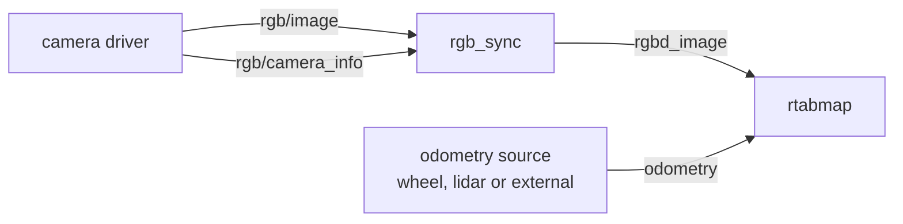

# rgb_sync

Groups a camera's color image and calibration into a single [`rtabmap_msgs/msg/RGBDImage`](https://docs.ros.org/en/jazzy/p/rtabmap_msgs/msg/RGBDImage.html), with no depth.

The monocular counterpart of [rgbd_sync](rgbd_sync.md). It exists for pipelines that have no depth to offer: a single camera doing appearance-based loop closure detection and relocalization against a map built earlier, where images are used to recognize places rather than to reconstruct them.

Without depth, RTAB-Map cannot build a metric map from these frames alone. It can still detect that a place has been seen before, which is enough for relocalization in an existing map and for adding loop closure constraints to a graph whose geometry comes from odometry or a lidar.

The camera cannot supply a pose here — visual odometry needs depth or a stereo baseline — so the pose has to come from somewhere else:



## Usage

```bash
ros2 run rtabmap_sync rgb_sync --ros-args \
  -r rgb/image:=/camera/image_raw \
  -r rgb/camera_info:=/camera/camera_info
```

```python
ComposableNode(
    package='rtabmap_sync',
    plugin='rtabmap_sync::RGBSync',
    name='rgb_sync',
    remappings=[('rgb/image', '/camera/image_raw'),
                ('rgb/camera_info', '/camera/camera_info')])
```

## Subscribed Topics

| Topic | Type | Description |
|---|---|---|
| `rgb/image` | [`sensor_msgs/msg/Image`](https://docs.ros.org/en/jazzy/p/sensor_msgs/msg/Image.html) | Color image. Goes through `image_transport`. |
| `rgb/camera_info` | [`sensor_msgs/msg/CameraInfo`](https://docs.ros.org/en/jazzy/p/sensor_msgs/msg/CameraInfo.html) | Calibration of the camera. |

## Published Topics

| Topic | Type | Description |
|---|---|---|
| `rgbd_image` | [`rtabmap_msgs/msg/RGBDImage`](https://docs.ros.org/en/jazzy/p/rtabmap_msgs/msg/RGBDImage.html) | The image and its calibration. The depth slot is left empty unless `fill_empty_depth`. Published only when someone is subscribed. |
| `rgbd_image/compressed` | [`rtabmap_msgs/msg/RGBDImage`](https://docs.ros.org/en/jazzy/p/rtabmap_msgs/msg/RGBDImage.html) | The same frame with the image as JPEG. Published only when someone is subscribed. |

The output's `header.frame_id` comes from the camera_info; its `header.stamp` is the image's.

## Parameters

| Parameter | Type | Default | Description |
|---|---|---|---|
| `approx_sync` | `bool` | `false` | Match the image and its calibration by nearest stamp. Defaults to **exact**; see [Synchronization](#synchronization). |
| `approx_sync_max_interval` | `double` | `0.0` | Reject pairs spanning more than this many seconds. `0` disables. |
| `topic_queue_size` | `int` | `10` | Queue depth of each input subscription. |
| `sync_queue_size` | `int` | `10` | Queue depth of the synchronizer. |
| `queue_size` | `int` | — | **Deprecated**, renamed to `sync_queue_size`. |
| `qos` | `int` | `0` | Reliability of the subscription and the publishers: `0` system default, `1` reliable, `2` best effort. |
| `qos_camera_info` | `int` | value of `qos` | Reliability of the `rgb/camera_info` subscription alone. |
| `fill_empty_depth` | `bool` | `false` | Add an all-zero depth image the size of the color one. See below. |
| `compressed_rate` | `double` | `0.0` | Maximum rate, in Hz, of `rgbd_image/compressed`. `0` means every frame. |
| `image_transport` | `string` | `"raw"` | Transport for `rgb/image`, e.g. `compressed`. |

## fill_empty_depth

By default the output carries no depth image and no depth calibration, which is how a consumer tells "this camera has no depth" from "this frame's depth happens to be all zeros".

Some consumers refuse a message without one. `fill_empty_depth` gives them a depth image of the right size and encoding (`16UC1`) filled with zeros, registered to the color camera and sharing its calibration. Zero in a depth image means *no reading*, so the frame still carries no geometry — the flag changes the shape of the message, not its content. Leave it off unless something downstream requires it.

## Synchronization

`approx_sync` defaults to **false** here. A driver built on `image_transport`'s camera publisher sends the image and its `camera_info` as a pair carrying the same stamp, so there is nothing to approximate: the exact policy is cheaper and cannot mismatch.

Set `approx_sync:=true` when the two do not share a stamp — a `camera_info` republished on its own timer, or read from a YAML file and stamped with the current time. That is the case to watch for if the node is silent: the calibration values are constant and look fine, but their stamps never match an image.

```bash
ros2 topic echo --once /camera/image_raw --field header.stamp
ros2 topic echo --once /camera/camera_info --field header.stamp
```

## Diagnostics

The node publishes to `/diagnostics` — input rate, output rate, and a warning in the log every 5 seconds while nothing is arriving.
