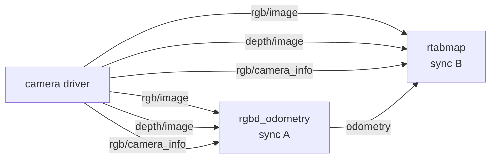
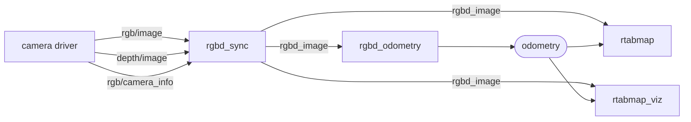
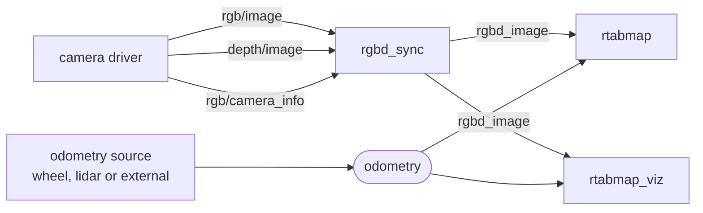

# rgbd_sync

Groups an RGB-D camera's color image, depth image and calibration into a single [`rtabmap_msgs/msg/RGBDImage`](https://docs.ros.org/en/jazzy/p/rtabmap_msgs/msg/RGBDImage.html).

A camera driver publishes three topics that only mean anything together. Keeping them together as one message is worth doing for its own sake — one topic to remap, one topic to record, and no chance of a bag holding a depth frame whose color frame was dropped — but the reason this node exists is that the synchronization has to happen *somewhere*, and doing it once here is cheaper than doing it again in every consumer.

Doing it once also keeps the consumers *consistent*. A pipeline usually runs [`rgbd_odometry`](https://github.com/introlab/rtabmap_ros/tree/ros2/rtabmap_odom) and `rtabmap` — often `rtabmap_viz` too — over the same camera. Given the three raw topics, each of those nodes synchronizes them independently, and with approximate matching they can settle on different pairings. `rtabmap` then maps a color/depth pair that odometry never saw, at a pose computed from a different one.

**Without `rgbd_sync`** — each consumer matches the three topics for itself, with its own synchronizer:



**With `rgbd_sync`** — matched once, then fanned out:



The same holds when the pose comes from elsewhere — a wheel encoder, a lidar, or an external VIO. The camera then feeds only the mapping side, but every node on it still sees the identical frame:



Subscribe them all to one `RGBDImage` and the question does not arise: every node processes the identical message.

It also gives a pipeline one place to synchronize. A consumer that has to match a camera against something on a different rate — a lidar, an IMU, odometry — matches one `RGBDImage` against them rather than three topics plus the others all at once. Synchronizing a large set in one go is the harder problem: the policy has to find a window that satisfies every input, and the more inputs with different rates and delays, the more often it settles for a poor match or none at all. Resolving the camera first, where the three topics are tightly correlated, leaves the downstream synchronizer a much easier job.

It can also decimate the images, rescale depth into the unit RTAB-Map expects, and publish a compressed copy for a slow link. See [Compressing for a slow link](#compressing-for-a-slow-link).

For a monocular camera use [rgb_sync](rgb_sync.md); for a stereo pair, [stereo_sync](stereo_sync.md); for several RGB-D cameras, one of these per camera feeding [rgbdx_sync](rgbdx_sync.md).

## Usage

```bash
ros2 run rtabmap_sync rgbd_sync --ros-args \
  -r rgb/image:=/camera/color/image_raw \
  -r depth/image:=/camera/depth/image_rect_raw \
  -r rgb/camera_info:=/camera/color/camera_info \
  -p approx_sync:=true
```

```python
ComposableNode(
    package='rtabmap_sync',
    plugin='rtabmap_sync::RGBDSync',
    name='rgbd_sync',
    parameters=[{'approx_sync': True}],
    remappings=[('rgb/image', '/camera/color/image_raw'),
                ('depth/image', '/camera/depth/image_rect_raw'),
                ('rgb/camera_info', '/camera/color/camera_info')])
```

**Compose it into the driver's process.** This node copies every pixel of every frame; across a process boundary that copy is a serialization and a memcpy per image, which on a 720p RGB-D stream is real CPU. In the same process with an intra-process-capable driver it is a pointer.

## Subscribed Topics

| Topic | Type | Description |
|---|---|---|
| `rgb/image` | [`sensor_msgs/msg/Image`](https://docs.ros.org/en/jazzy/p/sensor_msgs/msg/Image.html) | Color image. Goes through `image_transport`, so `rgb/image/compressed` is used instead when `image_transport` is set. |
| `depth/image` | [`sensor_msgs/msg/Image`](https://docs.ros.org/en/jazzy/p/sensor_msgs/msg/Image.html) | Depth image, registered to the color camera. `16UC1` in millimeters or `32FC1` in meters. Goes through `image_transport` under `depth_transport`. |
| `rgb/camera_info` | [`sensor_msgs/msg/CameraInfo`](https://docs.ros.org/en/jazzy/p/sensor_msgs/msg/CameraInfo.html) | Calibration of the color camera. Copied into both calibration slots of the output — depth is assumed registered. |

## Published Topics

| Topic | Type | Description |
|---|---|---|
| `rgbd_image` | [`rtabmap_msgs/msg/RGBDImage`](https://docs.ros.org/en/jazzy/p/rtabmap_msgs/msg/RGBDImage.html) | The three inputs, raw. Published only when someone is subscribed. |
| `rgbd_image/compressed` | [`rtabmap_msgs/msg/RGBDImage`](https://docs.ros.org/en/jazzy/p/rtabmap_msgs/msg/RGBDImage.html) | The same frame with JPEG color and PNG depth instead of raw images. Published only when someone is subscribed. |

The output's `header.frame_id` is taken from the **camera_info**, which is the frame the calibration is expressed in — so make sure the images and the `camera_info` carry the same `frame_id`. If they disagree, the output is labelled with the calibration's frame while the pixels were measured in another, and every point projected out of them lands somewhere else.

The output's `header.stamp` is the **later** of the color and depth stamps, so the message is never stamped before data it contains.

## Parameters

| Parameter | Type | Default | Description |
|---|---|---|---|
| `approx_sync` | `bool` | `true` | Match the inputs by nearest stamp. **Set `false` if your camera allows it** — see [Synchronization](#synchronization). |
| `approx_sync_max_interval` | `double` | `0.0` | Reject sets spanning more than this many seconds. `0` disables. Worth setting; see [Synchronization](#synchronization). |
| `topic_queue_size` | `int` | `10` | Queue depth of each input subscription. |
| `sync_queue_size` | `int` | `10` | Queue depth of the synchronizer. |
| `queue_size` | `int` | — | **Deprecated**, renamed to `sync_queue_size`. Still copied to it, with a warning. |
| `qos` | `int` | `0` | Reliability of the subscriptions and the publishers: `0` system default, `1` reliable, `2` best effort. |
| `qos_camera_info` | `int` | value of `qos` | Reliability of the `rgb/camera_info` subscription alone. Drivers often publish images best effort and `camera_info` reliable. |
| `depth_scale` | `double` | `1.0` | Multiplies every depth pixel. See [Depth units](#depth-units). |
| `decimation` | `int` | `1` | Downsample both images by this factor, scaling the calibration to match. Must divide the depth image size exactly, or it is ignored. |
| `compressed_rate` | `double` | `0.0` | Maximum rate, in Hz, of `rgbd_image/compressed`. `0` means every frame. Does not affect `rgbd_image`. |
| `image_transport` | `string` | `"raw"` | Transport for `rgb/image`, e.g. `compressed`. |
| `depth_transport` | `string` | `"raw"` | Transport for `depth/image`, e.g. `compressedDepth`. |
| `rgb_image_transport` | `string` | — | **Deprecated**, renamed to `image_transport`. |
| `depth_image_transport` | `string` | — | **Deprecated**, renamed to `depth_transport`. |

## Synchronization

**Use `approx_sync:=false` when your camera allows it.** The exact policy is cheaper and cannot mismatch a color frame with the wrong depth frame. The catch is that it is all-or-nothing: if the stamps differ by even a nanosecond, **nothing is ever published**, with no error. That is the single most common reason a pipeline built on this node is silent, so check before switching:

```bash
ros2 topic echo --once /camera/color/image_raw --field header.stamp
ros2 topic echo --once /camera/depth/image_rect_raw --field header.stamp
```

The default is nevertheless approximate, for backward compatibility: many RGB-D cameras do not stamp color and depth identically, the two sensors being read at slightly different instants. A stereo pair is normally hardware-triggered instead, which is why [stereo_sync](stereo_sync.md) defaults the other way.

When you do stay on approximate matching, note that it pairs *whatever it has* if that is the best available. A camera that stalls for a second and resumes produces one pairing of a fresh frame with a second-old one, and nothing says so. `approx_sync_max_interval` is the guard: a set spanning more than that many seconds is dropped instead. **Set it.** A tenth of the frame period is a reasonable starting point — `0.003` for a 30 Hz camera.

Leaving it at `0` is also what enables the warning about a large stamp difference in the log; setting it suppresses that warning.

## Depth units

RTAB-Map reads `16UC1` depth as millimeters and `32FC1` as meters. A driver that publishes `16UC1` in some other unit — centimeters, or a raw disparity count — produces a map at the wrong scale, and nothing about it looks broken until you measure something.

`depth_scale` multiplies every depth pixel on the way through, so a camera publishing centimeters is fixed with `depth_scale:=10.0`. It is applied after decimation and before compression, so both outputs carry the corrected values.

## Compressing for a slow link

`rgbd_image/compressed` carries the same frame with the color image as **JPEG** and the depth image as **PNG**. Depth stays lossless deliberately: JPEG artifacts in a depth image are not blur, they are invented geometry.

Neither output is produced unless it has a subscriber, so the compression costs nothing until something subscribes.

`compressed_rate` caps the compressed topic's rate without touching the raw one — for a robot that maps locally at full rate while sending a few frames a second to an operator.

## Decimation

`decimation` halves (or thirds, …) both images and scales the calibration with them, which is the part that is easy to get wrong by hand: an image downsampled without its focal length being scaled produces a point cloud with the wrong field of view.

The factor must divide the **depth** image size exactly. If it does not, the node logs a warning and stops decimating rather than resampling depth in a way that would misalign it against color. A value below 1 is treated as 1.

## Diagnostics

The node publishes to `/diagnostics`: the rate of the incoming color frames, the rate of the published messages, and a warning in the log every 5 seconds while nothing is arriving at all. If the input rate is healthy and the output rate is not, the inputs are arriving but not pairing — look at `approx_sync` and the stamps first.
