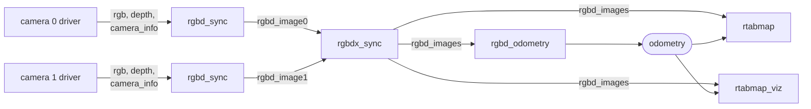
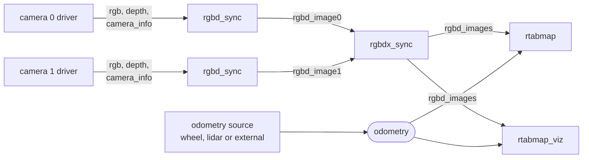

# rgbdx_sync

Groups the [`rtabmap_msgs/msg/RGBDImage`](https://docs.ros.org/en/jazzy/p/rtabmap_msgs/msg/RGBDImage.html) topics of 2 to 8 cameras into a single [`rtabmap_msgs/msg/RGBDImages`](https://docs.ros.org/en/jazzy/p/rtabmap_msgs/msg/RGBDImages.html).

For a robot carrying several RGB-D cameras. Each camera gets its own [rgbd_sync](rgbd_sync.md) (or [stereo_sync](stereo_sync.md)), and this node synchronizes those outputs into one message so that the SLAM node sees all of them as one measurement.

**Consider the alternative first.** Rebuilt with `RTABMAP_SYNC_MULTI_RGBD=ON`, the SLAM node subscribes to each camera's `RGBDImage` and synchronizes them itself, with no node in between — one process and one full-frame copy per camera per frame less than passing through here. This node exists for the cases that rule that out: running against binary packages, or more than the 6 cameras the build option supports. See [Feeding it to rtabmap](#feeding-it-to-rtabmap).

The reason it is a build option at all is that each supported camera count is a separate synchronizer template, and instantiating them all costs build time and binary size.

This node only groups: it never touches the images, the calibrations or the individual stamps.

Each camera is packed by its own [rgbd_sync](rgbd_sync.md) first, and this node groups those into the one message the consumers subscribe to:



**With odometry from elsewhere** — a wheel encoder, a lidar, or an external VIO — the cameras feed only the mapping side:



## Usage

```bash
ros2 run rtabmap_sync rgbdx_sync --ros-args \
  -p rgbd_cameras:=3 \
  -r rgbd_image0:=/camera_front/rgbd_image \
  -r rgbd_image1:=/camera_left/rgbd_image \
  -r rgbd_image2:=/camera_right/rgbd_image
```

```python
ComposableNode(
    package='rtabmap_sync',
    plugin='rtabmap_sync::RGBDXSync',
    name='rgbdx_sync',
    parameters=[{'rgbd_cameras': 3}],
    remappings=[('rgbd_image0', '/camera_front/rgbd_image'),
                ('rgbd_image1', '/camera_left/rgbd_image'),
                ('rgbd_image2', '/camera_right/rgbd_image')])
```

The topics are numbered from **0**, and only the first `rgbd_cameras` of them are subscribed.

## Subscribed Topics

| Topic | Type | Description |
|---|---|---|
| `rgbd_image0` … `rgbd_image7` | [`rtabmap_msgs/msg/RGBDImage`](https://docs.ros.org/en/jazzy/p/rtabmap_msgs/msg/RGBDImage.html) | One per camera. Only the first `rgbd_cameras` are subscribed. |

## Published Topics

| Topic | Type | Description |
|---|---|---|
| `rgbd_images` | [`rtabmap_msgs/msg/RGBDImages`](https://docs.ros.org/en/jazzy/p/rtabmap_msgs/msg/RGBDImages.html) | The set, in topic order. Stamped and framed with `rgbd_image0`'s header; each camera keeps its own header inside the array. |

Unlike the other nodes in this package, this one publishes whether or not anyone is subscribed — it does no per-frame work worth skipping.

## Parameters

| Parameter | Type | Default | Description |
|---|---|---|---|
| `rgbd_cameras` | `int` | `2` | How many cameras to group, 2 to 8. Anything outside that range aborts at start-up. |
| `approx_sync` | `bool` | `true` | Match the cameras by nearest stamp. Set `false` only for hardware-triggered cameras. |
| `approx_sync_max_interval` | `double` | `0.0` | Reject sets spanning more than this many seconds. `0` disables. Worth setting; see below. |
| `topic_queue_size` | `int` | `10` | Queue depth of each input subscription. |
| `sync_queue_size` | `int` | `10` | Queue depth of the synchronizer. |
| `queue_size` | `int` | — | **Deprecated**, renamed to `sync_queue_size`. |
| `qos` | `int` | `0` | Reliability of the subscriptions and the publisher: `0` system default, `1` reliable, `2` best effort. |

`rgbd_cameras` outside 2–8 is a hard error rather than a clamp: one camera needs no grouping at all, and nine cannot be synchronized by any of the templates the node holds. For one camera, subscribe to its `RGBDImage` topic directly.

## Order matters

The array is published in topic order — `rgbd_image0` first — and consumers index into it. RTAB-Map matches each image against the calibration and the TF frame it saw at that index, so swapping two remappings places a camera's images at another camera's extrinsics, and the map comes out with the world duplicated at an angle.

The order is a naming convention, not something the node can check. Keep the numbering consistent with whatever else refers to those cameras.

## Synchronization

Separate cameras are rarely triggered together, so `approx_sync` defaults to true. Nothing is published until **every** camera has contributed: a partial set would silently drop one camera's field of view from the map, which is worse than a dropped frame.

That also makes one silent camera stop the whole node. If `rgbd_images` goes quiet, check each input in turn:

```bash
ros2 topic hz /camera_front/rgbd_image
```

Set `approx_sync_max_interval` here as well. With several free-running cameras the synchronizer has more opportunities to pair a fresh frame with a stale one, and each camera's images are placed in the map using the robot's pose at the *set's* stamp — so a camera whose frame is 200 ms old is placed wherever the robot was not.

## Feeding it to rtabmap

Set `rgbd_cameras` to **0** on the consumer, and remap its `rgbd_images` input to this node's output:

```python
Node(
    package='rtabmap_slam', executable='rtabmap',
    parameters=[{'subscribe_rgbd': True, 'rgbd_cameras': 0}],
    remappings=[('rgbd_images', '/rgbd_images')])
```

`rgbd_cameras:=0` is what selects the `RGBDImages` interface: the count then comes from each message rather than from a parameter, so the same consumer handles any number of cameras without a rebuild.

With `RTABMAP_SYNC_MULTI_RGBD=ON` instead, drop this node and point the consumer straight at the cameras — `rgbd_cameras:=3` and one remapping per `rgbd_image0`…`rgbd_image2`. Same topics, same order, one hop fewer.

Either way, every camera needs its extrinsics in TF — a transform from the robot's base frame to each camera's frame, at each frame's stamp.

## Diagnostics

The node publishes to `/diagnostics`: the rate of `rgbd_image0`, the rate of published sets, and a warning in the log every 5 seconds while nothing is arriving. Since a set needs every camera, a healthy input rate with no output points at one of the *other* cameras.
