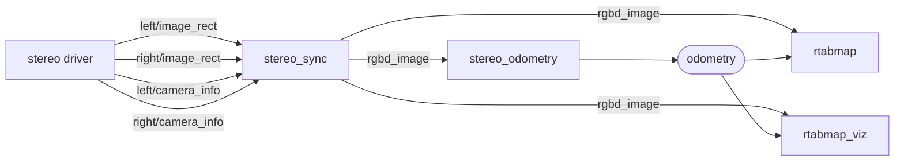
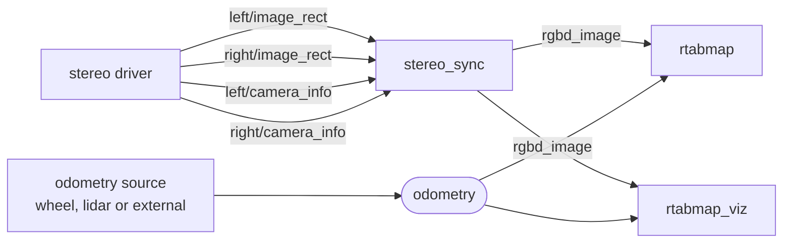

# stereo_sync

Groups a stereo pair's four topics — left image, right image and their two calibrations — into a single [`rtabmap_msgs/msg/RGBDImage`](https://docs.ros.org/en/jazzy/p/rtabmap_msgs/msg/RGBDImage.html).

The same idea as [rgbd_sync](rgbd_sync.md), for a stereo camera: four topics that only mean anything together become one message, synchronized once instead of in every consumer.

The default topic names say `image_rect` because rectified images are what a stereo pipeline normally carries, and what RTAB-Map assumes by default — but this node does not require it and does not rectify anything itself. Feeding it unrectified images is fine as long as you tell the consumer: set `Rtabmap/ImagesAlreadyRectified` to `false` on the `stereo_odometry` and `rtabmap` nodes, and they rectify from the calibration themselves. Otherwise run [`stereo_image_proc`](https://docs.ros.org/en/jazzy/p/stereo_image_proc/) upstream.

In a pipeline, the one `RGBDImage` feeds everything downstream — odometry included, so every node works from the same pair:



**With odometry from elsewhere** — a wheel encoder, a lidar, or an external VIO — the stereo pair feeds only the mapping side:



## Usage

```bash
ros2 run rtabmap_sync stereo_sync --ros-args \
  -r left/image_rect:=/stereo/left/image_rect \
  -r right/image_rect:=/stereo/right/image_rect \
  -r left/camera_info:=/stereo/left/camera_info \
  -r right/camera_info:=/stereo/right/camera_info
```

```python
ComposableNode(
    package='rtabmap_sync',
    plugin='rtabmap_sync::StereoSync',
    name='stereo_sync',
    remappings=[('left/image_rect', '/stereo/left/image_rect'),
                ('right/image_rect', '/stereo/right/image_rect'),
                ('left/camera_info', '/stereo/left/camera_info'),
                ('right/camera_info', '/stereo/right/camera_info')])
```

As with `rgbd_sync`, compose it into the driver's process where you can: this node copies both images of every pair.

## Subscribed Topics

| Topic | Type | Description |
|---|---|---|
| `left/image_rect` | [`sensor_msgs/msg/Image`](https://docs.ros.org/en/jazzy/p/sensor_msgs/msg/Image.html) | Rectified left image, mono or color. Goes through `image_transport`. |
| `right/image_rect` | [`sensor_msgs/msg/Image`](https://docs.ros.org/en/jazzy/p/sensor_msgs/msg/Image.html) | Rectified right image, same size and encoding. |
| `left/camera_info` | [`sensor_msgs/msg/CameraInfo`](https://docs.ros.org/en/jazzy/p/sensor_msgs/msg/CameraInfo.html) | Calibration of the left camera. |
| `right/camera_info` | [`sensor_msgs/msg/CameraInfo`](https://docs.ros.org/en/jazzy/p/sensor_msgs/msg/CameraInfo.html) | Calibration of the right camera. **Its `P[3]` must carry the baseline**; see below. |

## Published Topics

| Topic | Type | Description |
|---|---|---|
| `rgbd_image` | [`rtabmap_msgs/msg/RGBDImage`](https://docs.ros.org/en/jazzy/p/rtabmap_msgs/msg/RGBDImage.html) | Left image in the color slot, right image in the depth slot. Published only when someone is subscribed. |
| `rgbd_image/compressed` | [`rtabmap_msgs/msg/RGBDImage`](https://docs.ros.org/en/jazzy/p/rtabmap_msgs/msg/RGBDImage.html) | The same pair, both images JPEG. Published only when someone is subscribed. |

The output's `header.frame_id` comes from the **left** camera_info, and its `header.stamp` is the later of the two image stamps.

## Parameters

| Parameter | Type | Default | Description |
|---|---|---|---|
| `approx_sync` | `bool` | `false` | Match the inputs by nearest stamp. Defaults to **exact** here; see [Synchronization](#synchronization). |
| `approx_sync_max_interval` | `double` | `0.0` | Reject sets spanning more than this many seconds. `0` disables. Only meaningful with `approx_sync`. |
| `topic_queue_size` | `int` | `10` | Queue depth of each input subscription. |
| `sync_queue_size` | `int` | `10` | Queue depth of the synchronizer. |
| `queue_size` | `int` | — | **Deprecated**, renamed to `sync_queue_size`. |
| `qos` | `int` | `0` | Reliability of the subscriptions and the publishers: `0` system default, `1` reliable, `2` best effort. |
| `qos_camera_info` | `int` | value of `qos` | Reliability of the two `camera_info` subscriptions alone. |
| `compressed_rate` | `double` | `0.0` | Maximum rate, in Hz, of `rgbd_image/compressed`. `0` means every frame. |
| `image_transport` | `string` | `"raw"` | Transport for both images, e.g. `compressed`. |

## How a stereo pair travels in an RGBDImage

There is no separate stereo message: the left image goes where color goes and the right image goes where depth goes. What tells a consumer to read it as a stereo pair rather than as color plus depth is the **baseline** in the second calibration — `P[3]` of the right `camera_info`, which by the ROS convention is `-fx * baseline`.

So a right `camera_info` with `P[3] == 0` describes a camera sitting exactly on top of the left one. Nothing downstream can triangulate from that, and the failure is silent: the pair is forwarded, RTAB-Map reads a zero baseline and produces no depth. If a stereo pipeline comes out with no 3D points at all, check `P[3]` of the right camera first:

```bash
ros2 topic echo --once /stereo/right/camera_info --field p
```

## Synchronization

`approx_sync` defaults to **false** here, unlike the other nodes in this package. A stereo pair is normally hardware-triggered, so the two frames carry the same stamp, and the exact policy is both cheaper and impossible to mismatch. Mismatching a stereo pair is worse than mismatching color and depth: the disparity between two frames taken at different instants is a measurement of the camera's own motion, read as scene geometry.

Set `approx_sync:=true` only for two free-running cameras that are not triggered together — and then set `approx_sync_max_interval` alongside it. The node warns whenever a pair's stamps differ by more than 10 ms regardless of the setting, because at that point the pair is unlikely to be worth anything.

If the pipeline is silent with the default, the stamps are not identical. Check with:

```bash
ros2 topic echo --once /stereo/left/image_rect --field header.stamp
ros2 topic echo --once /stereo/right/image_rect --field header.stamp
```

## Compressing for a slow link

`rgbd_image/compressed` carries both images as **JPEG**. Unlike [rgbd_sync](rgbd_sync.md), there is no lossless path: both halves of a stereo pair are ordinary camera images, and neither is depth.

JPEG artifacts do affect stereo matching, so a pipeline that computes odometry from the compressed stream will match slightly fewer features than one on the raw images. For sending frames to an operator, that does not matter; for running odometry at the far end of a link, prefer a higher JPEG quality over a lower frame rate.

`compressed_rate` caps the compressed topic without touching `rgbd_image`.

## Diagnostics

The node publishes to `/diagnostics`: the rate of incoming left frames, the rate of published pairs, and a warning in the log every 5 seconds while nothing is arriving. A healthy input rate with no output means the pairs are not matching — the stamps and `approx_sync` are what to look at.
