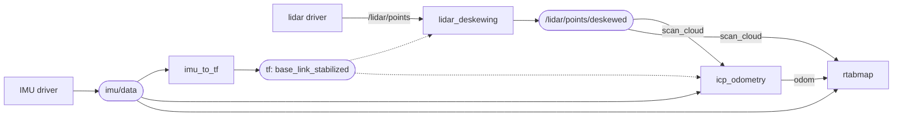
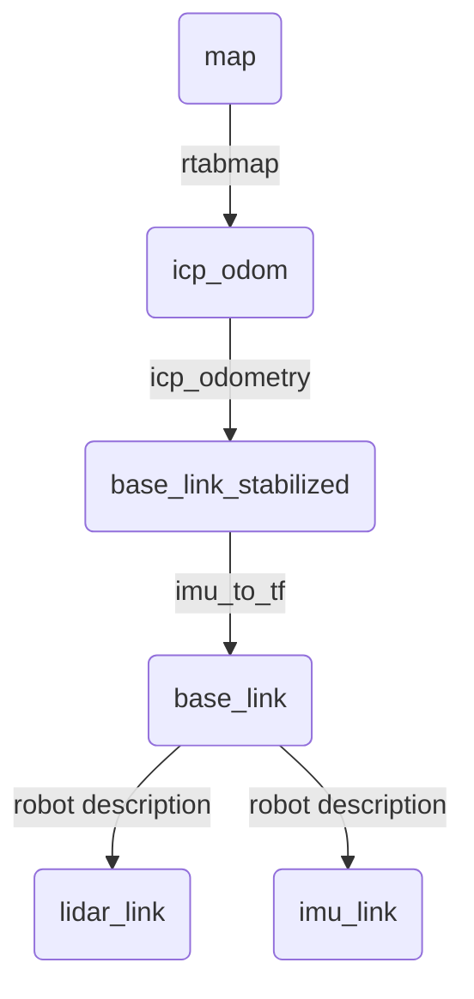

# imu_to_tf

Broadcasts the orientation of an IMU as a TF transform.

The node subscribes to a `sensor_msgs/msg/Imu` topic, takes the `orientation` field and broadcasts it on `/tf` as the rotation of `fixed_frame_id` → the IMU frame. Set `base_frame_id` and that frame becomes the child instead, with the orientation re-expressed in it from the IMU's mounting, so the transform says how the *robot* is oriented rather than how the sensor is. Either way `fixed_frame_id` is the parent, and nothing else of the message is used: the transform's translation is always zero, and the angular velocity and linear acceleration are ignored.

It exists so that a consumer that needs an oriented frame — a lidar deskewing node, a point cloud assembler, RViz — can get one from an IMU alone, without running odometry.

## Usage

As a standalone node:

```bash
ros2 run rtabmap_util imu_to_tf --ros-args \
  -r imu/data:=/imu \
  -p fixed_frame_id:=odom
```

As a composable node, in the same process as its producer or consumer:

```python
ComposableNode(
    package='rtabmap_util',
    plugin='rtabmap_util::ImuToTF',
    name='imu_to_tf',
    parameters=[{'fixed_frame_id': 'odom'}],
    remappings=[('imu/data', '/imu')])
```

### When the IMU has no orientation

The node reads `orientation` and nothing else, and many IMUs do not fill it in — they publish only angular velocity and linear acceleration. Fuse them into an orientation first, with a filter such as [`imu_filter_madgwick`](https://github.com/CCNYRoboticsLab/imu_tools), and point this node at the filter's output:

```python
Node(
    package='imu_filter_madgwick', executable='imu_filter_madgwick_node',
    parameters=[{'use_mag': False, 'world_frame': 'enu', 'publish_tf': False}],
    remappings=[('imu/data_raw', '/camera/imu')]),   # publishes /imu/data

Node(
    package='rtabmap_util', executable='imu_to_tf',
    parameters=[{'fixed_frame_id': 'odom'}],
    remappings=[('imu/data', '/imu/data')]),
```

Set `publish_tf: False` on the filter. It can broadcast a transform of its own, and two nodes publishing orientation for the same frame is exactly the conflict described in [Notes](#notes). `use_mag: False` keeps it off the magnetometer, which is rarely trustworthy indoors or near motors.

A quick way to tell whether you need the filter at all:

```bash
ros2 topic echo /camera/imu --field orientation --once
```

All zeros, or an `orientation_covariance` whose first element is `-1`, means the driver is not estimating orientation and this node has nothing to publish.

### A stabilized frame for lidar deskewing and odometry

The way it is used in [`rtabmap_examples/launch/lidar3d.launch.py`](https://github.com/introlab/rtabmap_ros/blob/ros2/rtabmap_examples/launch/lidar3d.launch.py). A 3D lidar needs a fixed frame to deskew against and ICP odometry benefits from a motion guess, but before odometry is running there is no `odom` frame to use. An IMU can supply one — for rotation.

Point `fixed_frame_id` at a frame that does not exist anywhere else, named after the base frame:

```python
Node(
    package='rtabmap_util', executable='imu_to_tf',
    parameters=[{'fixed_frame_id': 'base_link_stabilized',
                 'base_frame_id': 'base_link',
                 'wait_for_transform_duration': 0.001}],
    remappings=[('imu/data', '/imu/data')])
```

This publishes `base_link_stabilized` → `base_link` carrying the robot's orientation and nothing else. Because the node never publishes a translation, `base_link_stabilized` stays glued to the robot and only its *orientation* is meaningful over time: it is a gravity-leveled version of the base frame rather than a world frame. That is exactly what the two consumers need.

[lidar_deskewing](lidar_deskewing.md) then corrects the rotation of each sweep:

```python
Node(
    package='rtabmap_util', executable='lidar_deskewing',
    parameters=[{'fixed_frame_id': 'base_link_stabilized'}],
    remappings=[('input_cloud', '/lidar/points')])
```

and ICP odometry takes the same frame as its motion guess, with its own deskewing turned off since it is already done:

```python
Node(
    package='rtabmap_odom', executable='icp_odometry',
    parameters=[{'frame_id': 'base_link',
                 'odom_frame_id': 'icp_odom',
                 'guess_frame_id': 'base_link_stabilized',
                 'deskewing': False}],
    remappings=[('scan_cloud', '/lidar/points/deskewed')])
```

The three nodes chain into a single TF tree. In terms of data, this node's job is to turn the IMU's orientation into a *frame* that `lidar_deskewing` and `icp_odometry` can look up — while the IMU topic itself still goes straight to the SLAM nodes, which use it for their own purposes:



And the frames themselves:



| Edge | Published by |
|---|---|
| `map` → `icp_odom` | `rtabmap` |
| `icp_odom` → `base_link_stabilized` | `icp_odometry` |
| `base_link_stabilized` → `base_link` | **this node**, from the IMU orientation |
| `base_link` → `lidar_link`, `imu_link` | your robot description, static |

Note what `icp_odometry` publishes: because `guess_frame_id` is set it broadcasts the *correction* `icp_odom` → `base_link_stabilized` rather than `icp_odom` → `base_link`. That is what makes the two nodes compose — the stabilized frame slots into the chain and every frame keeps exactly one parent. Without `guess_frame_id` the odometry would publish straight to `base_link` and fight this node over it.

Only rotation is compensated, and the two errors behave differently over a sweep:

| Error | How it scales | Worst when |
|---|---|---|
| Rotation, corrected here | grows with range | turning fast, looking far |
| Translation, left over | same at every range, grows with speed | driving fast, looking close |

Moving slowly, or looking far, the leftover translation stays under the lidar's own range noise and can be ignored. Fast and close it is the bigger of the two, and it shifts the cloud rather than blurring it, so it turns into odometry drift.

Once something publishes a real `odom` → `base_link` — wheel or visual odometry, or an EKF such as [`robot_localization`](https://github.com/cra-ros-pkg/robot_localization) fusing that same IMU with wheel odometry — point both `fixed_frame_id` and `guess_frame_id` at `odom` instead and drop this node. Translation then gets compensated too.

### A rotation guess for visual odometry

The same stabilized frame is useful to a camera, for a different reason. Visual odometry predicts where each feature from the previous frame should land in the current one and searches around that prediction; on a fast rotation the prediction is far off, matches are lost and odometry breaks exactly when the motion is hardest.

An IMU fixes the prediction. Run this node as above to publish `base_link_stabilized` → `base_link`, then hand that frame to the odometry as its guess:

```python
Node(
    package='rtabmap_odom', executable='rgbd_odometry',
    parameters=[{'frame_id': 'base_link',
                 'guess_frame_id': 'base_link_stabilized'}],
    remappings=[('rgb/image', '/camera/color/image_raw'),
                ('depth/image', '/camera/depth/image_rect_raw'),
                ('rgb/camera_info', '/camera/color/camera_info')])
```

With [`rtabmap_launch`](https://github.com/introlab/rtabmap_ros/tree/ros2/rtabmap_launch) the same thing is one argument:

```bash
ros2 launch rtabmap_launch rtabmap.launch.py odom_guess_frame_id:=base_link_stabilized
```

The TF chain is the one from the previous section with `rgbd_odometry` in place of `icp_odometry`; it publishes the same `odom` → `base_link_stabilized` correction, so the frames still form one tree.

A rotation-only guess is enough here, because feature matching cares about where things appear, not where they are. Turning the camera slides every feature across the image by the same amount, near or far. Moving it slides them too, but far less, and less the further away they are — generally little enough to stay inside the window the matcher searches. So rotation is the part a guess has to get right, and that is exactly what the IMU supplies. It is also why an IMU far too drifty to give you a *pose* still makes a good guess: only the rotation over a single frame interval is being used, long before drift has time to accumulate.

## Subscribed Topics

| Topic | Type | Description |
|---|---|---|
| `imu/data` | [`sensor_msgs/msg/Imu`](https://docs.ros.org/en/jazzy/p/sensor_msgs/msg/Imu.html) | Only `orientation` and `header` are read. The subscription has a queue depth of 1; its reliability comes from the `qos` parameter. |

## Published Topics

None. The node only broadcasts transforms.

## Published Transforms

| Transform | Description |
|---|---|
| `fixed_frame_id` → IMU frame | Broadcast when `base_frame_id` is empty. The child frame is the `header.frame_id` of the incoming message. |
| `fixed_frame_id` → `base_frame_id` | Broadcast when `base_frame_id` is set. The orientation is re-expressed in the base frame first, see [Mounting offset](#mounting-offset). |

The transform carries a rotation only; its translation is always zero. It is stamped with the IMU message's stamp, not the current time.

## Required Transforms

| Transform | Description |
|---|---|
| `base_frame_id` → IMU frame | Only when `base_frame_id` is set and differs from the IMU's `header.frame_id`. This is the fixed mounting of the IMU on the robot, normally published by your robot description. |

## Parameters

| Parameter | Type | Default | Description |
|---|---|---|---|
| `fixed_frame_id` | `string` | `"odom"` | Parent frame of the broadcast transform. |
| `base_frame_id` | `string` | `""` | Frame to report the orientation in. Empty broadcasts the IMU frame itself, which is the cheapest option when nothing else needs the base frame oriented. |
| `qos` | `int` | `0` | Reliability of the `imu/data` subscription: `0` system default, `1` reliable, `2` best effort. Must match the publisher, or no message arrives. |
| `wait_for_transform_duration` | `double` | `0.1` | Seconds to wait for the `base_frame_id` → IMU transform before giving up on a message. Only used when `base_frame_id` is set. |

## Mounting offset

When `base_frame_id` is set, the node looks up the mounting transform `base_frame_id` → IMU frame and re-expresses the orientation in the base frame. The **yaw of the mounting is deliberately discarded**: only its roll and pitch are applied.

That is what you want from an absolute orientation source. An IMU bolted on facing sideways still measures the same absolute heading as one facing forward, so its yaw must reach the base frame untouched; its roll and pitch, on the other hand, do have to be rotated into the base frame to be meaningful.

A message is **dropped** — logged as an error, nothing broadcast — if that mounting transform is not available within `wait_for_transform_duration`.

## Notes

Only one node may publish a given TF edge. If odometry is already publishing `odom` → `base_link`, do not point this node at the same pair — give it a frame of its own, as in [the stabilized frame above](#a-stabilized-frame-for-lidar-deskewing-and-odometry), or leave `base_frame_id` empty. Two publishers on one edge make the transform flicker between them.

The node does not integrate or filter anything — whatever orientation the message carries is what gets broadcast. See [When the IMU has no orientation](#when-the-imu-has-no-orientation) if your driver does not estimate one.
