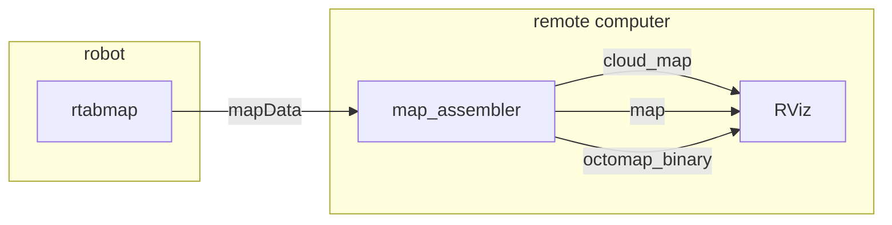

# map_assembler

Rebuilds the global maps from RTAB-Map's graph, in a separate process.

RTAB-Map publishes its graph and the per-node sensor data on `mapData`; turning that into a point cloud, an occupancy grid or an octomap costs real CPU. This node does that work, so the SLAM node does not have to and the mapping loop stays responsive.

It also lets you produce maps RTAB-Map is not currently configured to publish, or several differently-configured maps at once, without restarting SLAM.

The assembling itself is done by `MapsManager`, which is shared with `rtabmap_slam` — the outputs and every `Grid/*` parameter behave identically in both.

## Usage

```bash
ros2 run rtabmap_util map_assembler --ros-args \
  -p Grid/CellSize:=0.05 -p Grid/RangeMax:=8.0 -p cloud_output_voxelized:=true
```

```python
ComposableNode(
    package='rtabmap_util',
    plugin='rtabmap_util::MapAssembler',
    name='map_assembler',
    parameters=[{'Grid/CellSize': '0.05', 'Grid/RangeMax': '8.0',
                 'cloud_output_voxelized': True}])
```

The graph comes from the SLAM node; the maps are built here, off its critical path. Nothing forces the split across machines — a second process on the robot works too — but only `mapData` crosses the boundary, so putting the assembling on a workstation keeps the heavy topics off the link as well as off the robot's CPU:



## Subscribed Topics

| Topic | Type | Description |
|---|---|---|
| `mapData` | [`rtabmap_msgs/msg/MapData`](https://docs.ros.org/en/jazzy/p/rtabmap_msgs/msg/MapData.html) | The graph, plus the sensor data of any newly added node. Published by `rtabmap`. |

## Published Topics

Everything is published only when subscribed, and — by default — **latched**, so a subscriber joining late immediately receives the current map.

| Topic | Type | Description |
|---|---|---|
| `cloud_map` | [`PointCloud2`](https://docs.ros.org/en/jazzy/p/sensor_msgs/msg/PointCloud2.html) | Ground and obstacles together. |
| `cloud_ground` | `PointCloud2` | Ground only, colored green. |
| `cloud_obstacles` | `PointCloud2` | Obstacles only, colored red. |
| `map` | [`OccupancyGrid`](https://docs.ros.org/en/jazzy/p/nav_msgs/msg/OccupancyGrid.html) | The 2D occupancy grid, the one navigation wants. |
| `grid_prob_map` | `OccupancyGrid` | The same grid as occupancy probabilities rather than free/occupied/unknown. |
| `octomap_occupied_space`, `octomap_obstacles`, `octomap_ground`, `octomap_empty_space`, `octomap_global_frontier_space` | `PointCloud2` | Octomap contents, one cloud per category. Requires RTAB-Map built with OctoMap. |
| `octomap_grid` | `OccupancyGrid` | The octomap projected to 2D. |
| `octomap_binary`, `octomap_full` | [`Octomap`](https://docs.ros.org/en/jazzy/p/octomap_msgs/msg/Octomap.html) | The tree itself, for `octovis` or other octomap consumers. Serialized as a **`ColorOcTree`**, see [Octomap tree type](#octomap-tree-type). |
| `elevation_map` | [`GridMap`](https://github.com/ANYbotics/grid_map/blob/master/grid_map_msgs/msg/GridMap.msg) | Elevation map. Requires RTAB-Map built with `grid_map`. |

## Services

| Service | Type | Description |
|---|---|---|
| `~/reset` | [`std_srvs/srv/Empty`](https://docs.ros.org/en/jazzy/p/std_srvs/srv/Empty.html) | Drop the cached nodes and every assembled map. |
| `~/octomap_binary` | [`octomap_msgs/srv/GetOctomap`](https://docs.ros.org/en/jazzy/p/octomap_msgs/srv/GetOctomap.html) | Build and return the octomap on demand. |
| `~/octomap_full` | `octomap_msgs/srv/GetOctomap` | The same, with occupancy probabilities. |

## Parameters

| Parameter | Type | Default | Description |
|---|---|---|---|
| `initialize_from_rtabmap_timeout` | `double` | `5.0` | Seconds to wait for rtabmap's `get_map_data` service on start-up, which is how the node catches up on a map that already exists. Set to `0` to skip the call and subscribe immediately, which is what you want when `map_assembler` starts *before* rtabmap. |
| `rtabmap` | `string` | `"rtabmap"` | Name of the rtabmap node whose `get_map_data` service to call. |
| `regenerate_local_grids` | `bool` | `false` | Discard the occupancy grids stored with each node and rebuild them from the raw sensor data. Use it to change `Grid/*` parameters on an existing map without re-running SLAM. Costs CPU per node. |
| `config_path` | `string` | `""` | An RTAB-Map `.ini` file to load parameters from, instead of listing them individually. |

**Map assembly**, from `MapsManager`

| Parameter | Type | Default | Description |
|---|---|---|---|
| `latch` | `bool` | `true` | Publish with transient-local durability so late subscribers get the current map. |
| `map_filter_radius` | `double` | `0.0` | Skip nodes closer together than this, in meters. A cheap way to thin a dense graph. `0` disables. |
| `map_filter_angle` | `double` | `30.0` | With `map_filter_radius`, nodes are only merged if they also differ by less than this angle, in degrees. |
| `map_always_update` | `bool` | `false` | **No effect here**, see below. |
| `map_empty_ray_tracing` | `bool` | `true` | **No effect here**, see below. |
| `map_cleanup` | `bool` | `true` | Free the cached clouds when nobody is subscribed. |
| `cloud_output_voxelized` | `bool` | `true` | Voxelize the assembled clouds at `Grid/CellSize`. |
| `cloud_subtract_filtering` | `bool` | `false` | Drop points that duplicate ones already in the map. Slower, smaller output. |
| `cloud_subtract_filtering_min_neighbors` | `int` | `2` | Neighbors needed for a point to count as a duplicate. |
| `octomap_tree_depth` | `int` | `16` | Depth the octomap clouds are generated at. Lower means coarser and faster. Maximum 16. |

`map_always_update` and `map_empty_ray_tracing` are declared because they come with `MapsManager`, but neither does anything in this node. Both only apply to the *current*, not-yet-committed node, which `MapsManager` identifies by the pose id `0`. That node is assembled inside `rtabmap_slam`'s `rtabmap` node from its live sensor data and is never published on `mapData`, so the graph reaching `map_assembler` only ever contains committed nodes. Set them on the `rtabmap` node instead, where they do apply.

Every RTAB-Map **`Grid/*`**, **`GridGlobal/*`**, **`StereoBM/*`** and **`StereoSGBM/*`** parameter is also exposed, all documented in RTAB-Map's [parameter reference](https://introlab.github.io/rtabmap/api/latest/parameters.html). The split between the first two is worth knowing: **`Grid/*`** decides how each node's local grid is built from its sensor data — the same segmentation [obstacles_detection](obstacles_detection.md#parameters) does, and the parameters listed there apply here too — while **`GridGlobal/*`** decides how those local grids are merged into the global map, so it covers the map's minimum size, its occupancy threshold, and how far the graph must move before the whole map is rebuilt.

## Octomap tree type

RTAB-Map keeps a color per voxel, so the tree it publishes on `octomap_binary` and `octomap_full` reports its `id` as **`ColorOcTree`**, not the plain `OcTree` many examples assume.

That is deliberate and interoperable: `octomap_msgs::binaryMsgToMap()` and `fullMsgToMap()` branch on that `id` and hand you back an `octomap::ColorOcTree`, and `octovis` opens it without complaint. What does break is code that assumes the other branch:

```cpp
octomap::AbstractOcTree * tree = octomap_msgs::binaryMsgToMap(msg);
octomap::OcTree * octree = dynamic_cast<octomap::OcTree *>(tree);   // null
octomap::ColorOcTree * octree = dynamic_cast<octomap::ColorOcTree *>(tree);   // ok
```

`ColorOcTree` does not derive from `OcTree` — both derive from `OccupancyOcTreeBase` — so cast to `ColorOcTree`, or to `octomap::OccupancyOcTreeBase<...>` if you only need occupancy and want to accept either.

## Start-up

`map_assembler` normally starts alongside rtabmap and builds its maps from the `mapData` messages that follow. If it starts **after** rtabmap it would miss everything already mapped, so on start-up it calls rtabmap's `get_map_data` service once to fetch the existing map.

That call blocks the subscription to `mapData` until it returns or times out, which is wasted time when rtabmap is not running yet. Set `initialize_from_rtabmap_timeout` to `0` in that case.

If rtabmap is started later in localization mode, call its `publish_maps` service with `graph_only=false` so `map_assembler` receives the data it missed.

## Notes

`regenerate_local_grids` is the parameter to reach for when a recorded map's grids were built with settings you now want to change. Without it, `Grid/*` changes only affect nodes added from then on, because each node's grid is stored with it.
