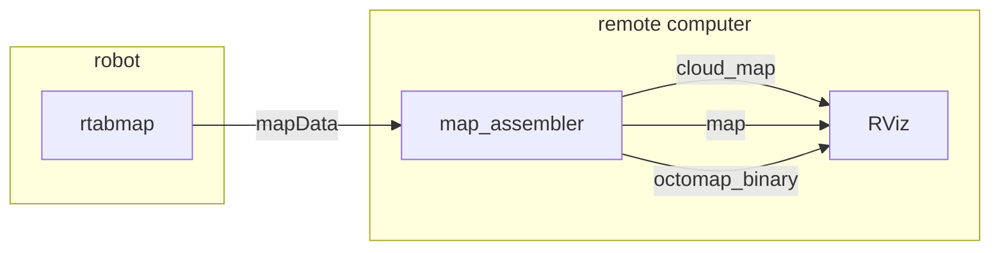

# map_assembler

Rebuilds the global maps from RTAB-Map's graph, in a separate process.

RTAB-Map publishes its graph and the per-node sensor data on `mapData`; turning that into a point cloud, an occupancy grid or an octomap costs real CPU. This node does that work, so the SLAM node does not have to and the mapping loop stays responsive.

It also lets you produce maps RTAB-Map is not currently configured to publish, or several differently-configured maps at once, without restarting SLAM.

The assembling itself is done by [`MapsManager`](../README.md#mapsmanager), which is shared with `rtabmap_slam` — the outputs and every `Grid/*` parameter behave identically in both.

## Contents

- [Usage](#usage)
- [Subscribed Topics](#subscribed-topics)
- [Published Topics](#published-topics)
- [Services](#services)
- [Parameters](#parameters)
- [Start-up](#start-up)
- [Notes](#notes)

## Usage

```bash
ros2 run rtabmap_util map_assembler --ros-args \
  -p Grid/CellSize:=0.05 -p Grid/RangeMax:=8.0 -p cloud_output_voxelized:=true
```

```python
ComposableNode(
    package='rtabmap_util',
    plugin='rtabmap_util::MapAssembler',
    name='map_assembler',
    parameters=[{'Grid/CellSize': '0.05', 'Grid/RangeMax': '8.0',
                 'cloud_output_voxelized': True}])
```

In a component container with intra-process communication enabled (`use_intra_process_comms`), the map publishers automatically opt out of it when `latch` is on (the default), since intra-process communication does not support transient local durability. With `latch` off, they keep the container's setting. See [`MapsManager`](../README.md#mapsmanager).

The graph comes from the SLAM node; the maps are built here, off its critical path. Nothing forces the split across machines — a second process on the robot works too — but only `mapData` crosses the boundary, so putting the assembling on a workstation keeps the heavy topics off the link as well as off the robot's CPU:


```mermaid
flowchart LR
    subgraph ROBOT["robot"]
        SLAM["rtabmap"]
    end
    subgraph REMOTE["remote computer"]
        ASM["map_assembler"]
        RVIZ["RViz"]
    end
    SLAM -->|mapData| ASM
    ASM -->|cloud_map| RVIZ
    ASM -->|map| RVIZ
    ASM -->|octomap_binary| RVIZ
```

## Subscribed Topics

| Topic | Type | Description |
|---|---|---|
| `mapData` | [`rtabmap_msgs/msg/MapData`](https://docs.ros.org/en/jazzy/p/rtabmap_msgs/msg/MapData.html) | The graph, plus the sensor data of any newly added node. Published by `rtabmap`. |

## Published Topics

The maps assembled by [`MapsManager`](../README.md#mapsmanager): point clouds, occupancy grids, octomap and elevation map, published only when subscribed and latched by default. The topics are listed [there](../README.md#mapsmanager).

## Services

| Service | Type | Description |
|---|---|---|
| `~/reset` | [`std_srvs/srv/Empty`](https://docs.ros.org/en/jazzy/p/std_srvs/srv/Empty.html) | Drop the cached nodes and every assembled map. |
| `~/octomap_binary` | [`octomap_msgs/srv/GetOctomap`](https://docs.ros.org/en/jazzy/p/octomap_msgs/srv/GetOctomap.html) | Build and return the octomap on demand. |
| `~/octomap_full` | `octomap_msgs/srv/GetOctomap` | The same, with occupancy probabilities. |

## Parameters

| Parameter | Type | Default | Description |
|---|---|---|---|
| `initialize_from_rtabmap_timeout` | `double` | `5.0` | Seconds to wait for rtabmap's `get_map_data` service on start-up, which is how the node catches up on a map that already exists. Set to `0` to skip the call and subscribe immediately, which is what you want when `map_assembler` starts *before* rtabmap. |
| `rtabmap` | `string` | `"rtabmap"` | Name of the rtabmap node whose `get_map_data` service to call. |
| `regenerate_local_grids` | `bool` | `false` | Discard the occupancy grids stored with each node and rebuild them from the raw sensor data. Use it to change `Grid/*` parameters on an existing map without re-running SLAM. Costs CPU per node. |
| `config_path` | `string` | `""` | An RTAB-Map `.ini` file to load parameters from, instead of listing them individually. |

**Map assembly**: the parameters of [`MapsManager`](../README.md#mapsmanager), and every RTAB-Map `Grid/*`, `GridGlobal/*`, `StereoBM/*` and `StereoSGBM/*` parameter, as described there. Two of them do nothing here: `map_always_update` and `map_empty_ray_tracing`.

## Start-up

`map_assembler` normally starts alongside rtabmap and builds its maps from the `mapData` messages that follow. If it starts **after** rtabmap it would miss everything already mapped, so on start-up it calls rtabmap's `get_map_data` service once to fetch the existing map.

That call blocks the subscription to `mapData` until it returns or times out, which is wasted time when rtabmap is not running yet. Set `initialize_from_rtabmap_timeout` to `0` in that case.

If rtabmap is started later in localization mode, call its `publish_maps` service with `graph_only=false` so `map_assembler` receives the data it missed.

## Notes

`regenerate_local_grids` is the parameter to reach for when a recorded map's grids were built with settings you now want to change. Without it, `Grid/*` changes only affect nodes added from then on, because each node's grid is stored with it.
