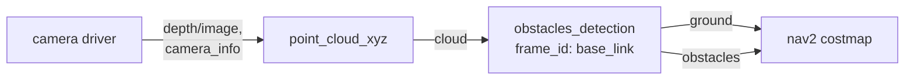

# obstacles_detection

Segments a point cloud into ground and obstacles.

The node takes a cloud, works out which points belong to the floor and which stick up from it, and publishes the two apart. Downstream that feeds navigation: obstacles into a costmap, ground into a traversability check.

The segmentation is RTAB-Map's own [`LocalGridMaker`](https://introlab.github.io/rtabmap/api/latest/classrtabmap_1_1LocalGridMaker.html), so it is configured through the same `Grid/*` parameters as RTAB-Map itself and produces the same result the SLAM node would.

## Usage

```bash
ros2 run rtabmap_util obstacles_detection --ros-args \
  -r cloud:=/camera/cloud \
  -p frame_id:=base_link \
  -p Grid/MaxObstacleHeight:=2.0
```

```python
ComposableNode(
    package='rtabmap_util',
    plugin='rtabmap_util::ObstaclesDetection',
    name='obstacles_detection',
    parameters=[{'frame_id': 'base_link', 'Grid/MaxObstacleHeight': '2.0'}],
    remappings=[('cloud', '/camera/cloud')])
```

### Feeding a nav2 costmap

The usual reason to run this node: nav2's costmap wants to be told separately what is floor and what is in the way. A depth camera gives neither directly, so the chain is depth image → cloud → segmented cloud → costmap.

[point_cloud_xyz](point_cloud_xyz.md) projects the depth image, with `decimation` and `voxel_size` set to keep the cost down, and this node splits the result:

```python
Node(
    package='rtabmap_util', executable='point_cloud_xyz',
    parameters=[{'decimation': 2, 'max_depth': 3.0, 'voxel_size': 0.02}],
    remappings=[('depth/image', '/camera/depth/image_raw'),
                ('depth/camera_info', '/camera/camera_info'),
                ('cloud', '/camera/cloud')]),

Node(
    package='rtabmap_util', executable='obstacles_detection',
    parameters=[{'frame_id': 'base_link'}],
    remappings=[('cloud', '/camera/cloud'),
                ('ground', '/camera/ground'),
                ('obstacles', '/camera/obstacles')]),
```

The two outputs then become two observation sources on the costmap's voxel layer:

```yaml
local_costmap:
  local_costmap:
    ros__parameters:
      plugins: ["voxel_layer", "inflation_layer"]
      voxel_layer:
        plugin: "nav2_costmap_2d::VoxelLayer"
        enabled: True
        publish_voxel_map: True
        origin_z: 0.0
        z_resolution: 0.05
        z_voxels: 16
        max_obstacle_height: 2.0
        mark_threshold: 0
        observation_sources: ground obstacles
        ground:
          topic: /camera/ground
          data_type: "PointCloud2"
          max_obstacle_height: 0.4
          marking: False        # the floor is not an obstacle...
          clearing: True        # ...but seeing it proves the space is free
          raytrace_max_range: 3.0
          raytrace_min_range: 0.0
          obstacle_max_range: 2.5
          obstacle_min_range: 0.0
        obstacles:
          topic: /camera/obstacles
          data_type: "PointCloud2"
          max_obstacle_height: 0.4
          marking: True
          clearing: True
          raytrace_max_range: 3.0
          raytrace_min_range: 0.0
          obstacle_max_range: 2.5
          obstacle_min_range: 0.0
```

The `marking`/`clearing` split is the whole point. Ground points only clear: they tell the costmap that the space the camera looked through is free, without writing an obstacle at floor level. Obstacle points do both, so an obstacle that moves away is cleared by the next observation instead of lingering.

Feeding the raw cloud in as a single source cannot do this — every floor point would mark an obstacle and the robot would refuse to move. Working from [`turtlebot3_rgbd.launch.py`](https://github.com/introlab/rtabmap_ros/blob/ros2/rtabmap_demos/launch/turtlebot3/turtlebot3_rgbd.launch.py) and its [nav2 parameters](https://github.com/introlab/rtabmap_ros/blob/ros2/rtabmap_demos/params/turtlebot3_rgbd_nav2_params.yaml) will save some time.

A depth camera turned into ground and obstacle clouds for a costmap:



## Subscribed Topics

| Topic | Type | Description |
|---|---|---|
| `cloud` | [`sensor_msgs/msg/PointCloud2`](https://docs.ros.org/en/jazzy/p/sensor_msgs/msg/PointCloud2.html) | The cloud to segment, in any frame that TF can relate to `frame_id`. |

## Published Topics

| Topic | Type | Description |
|---|---|---|
| `ground` | [`sensor_msgs/msg/PointCloud2`](https://docs.ros.org/en/jazzy/p/sensor_msgs/msg/PointCloud2.html) | Points classified as floor. In the **input** cloud's frame. |
| `obstacles` | [`sensor_msgs/msg/PointCloud2`](https://docs.ros.org/en/jazzy/p/sensor_msgs/msg/PointCloud2.html) | Points classified as obstacles. In the **input** cloud's frame. |
| `proj_obstacles` | [`sensor_msgs/msg/PointCloud2`](https://docs.ros.org/en/jazzy/p/sensor_msgs/msg/PointCloud2.html) | The obstacles flattened onto the ground plane, in `frame_id`. This is the 2D footprint a planar costmap wants. |

Each output is computed only if something is subscribed to it.

## Required Transforms

| Transform | Description |
|---|---|
| `frame_id` → cloud frame | Where the sensor sits on the robot. Segmentation happens in `frame_id`, so this is what makes "up" meaningful. |
| `map_frame_id` → `frame_id` | Only when `map_frame_id` is set. See [Levelling on a slope](#levelling-on-a-slope). |

## Parameters

| Parameter | Type | Default | Description |
|---|---|---|---|
| `frame_id` | `string` | `"base_link"` | The robot frame. Its xy plane is the ground plane the segmentation works against. |
| `map_frame_id` | `string` | `""` | See [Levelling on a slope](#levelling-on-a-slope). |
| `wait_for_transform` | `double` | `0.2` | Seconds to wait for a transform before dropping the cloud. |
| `qos` | `int` | `0` | Reliability of the subscription and the publishers: `0` system default, `1` reliable, `2` best effort. |

Every RTAB-Map **`Grid/*`** parameter is also exposed as a ROS parameter of this node, and they are what actually control the segmentation. They are documented in RTAB-Map's [parameter reference](https://introlab.github.io/rtabmap/api/latest/parameters.html).

The one to decide first is `Grid/NormalsSegmentation`, which picks between two ways of finding the ground. Left on, it is segmented from surface normals, which copes with slopes and steps. Turned off, it is a plain height threshold: much cheaper, and exact when the floor really is flat, but `Grid/MaxGroundHeight` then has to be set, since it *is* that threshold.

## Levelling on a slope

Segmentation is done in `frame_id`, so if the robot is pitched or rolled — on a ramp, or with a suspension that dips — the ground plane tilts with it and the floor ahead can be classified as an obstacle.

Setting `map_frame_id` makes the node take the robot's pose in that frame and apply its **roll and pitch**, so segmentation happens against a level plane rather than the robot's own tilt.

Height is a separate matter: the robot's **z** in the map frame is ignored unless `Grid/MapFrameProjection` is also set to `true`. That is usually what you want — a height threshold should be measured from the robot, not from an arbitrary map origin — but if you are mapping a multi-level building and want the thresholds relative to the map, enable it.

## Notes

If `obstacles` comes back empty on an obviously cluttered scene, check `Grid/RangeMax` first. It is **not unlimited by default**, and everything beyond it is discarded before segmentation even runs.

The second thing to check is `Grid/MinClusterSize` against your cloud density. A sparse lidar can produce clusters smaller than the default, in which case every obstacle is thrown away as noise. Either lower it or raise `Grid/ClusterRadius`.
