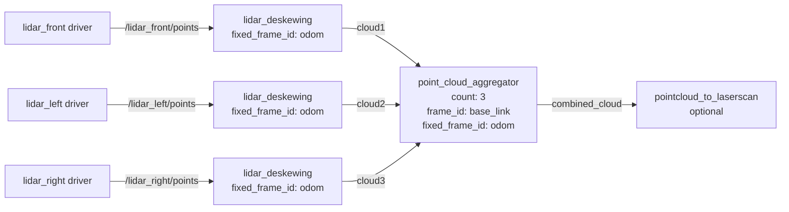

# point_cloud_aggregator

Merges one cloud from each of several sensors into a single cloud.

A robot with two or three lidars, or a ring of depth cameras, produces one cloud per sensor. This node waits for a matching set, transforms them all into a common frame and publishes a single cloud, so everything downstream sees the robot's full field of view as one measurement.

The sensors do not have to fire together: the clouds are matched by nearest stamp, and setting `fixed_frame_id` compensates for the robot having moved between them. See [Sensors that do not fire together](#sensors-that-do-not-fire-together).

It combines **several sensors into one frame**. To combine **one sensor over many frames**, use [point_cloud_assembler](point_cloud_assembler.md).

## Usage

```bash
ros2 run rtabmap_util point_cloud_aggregator --ros-args \
  -p count:=3 -p frame_id:=base_link -p fixed_frame_id:=odom \
  -r cloud1:=/lidar_front/points/deskewed \
  -r cloud2:=/lidar_left/points/deskewed \
  -r cloud3:=/lidar_right/points/deskewed
```

```python
ComposableNode(
    package='rtabmap_util',
    plugin='rtabmap_util::PointCloudAggregator',
    name='point_cloud_aggregator',
    parameters=[{'count': 3, 'frame_id': 'base_link', 'fixed_frame_id': 'odom'}],
    remappings=[('cloud1', '/lidar_front/points/deskewed'),
                ('cloud2', '/lidar_left/points/deskewed'),
                ('cloud3', '/lidar_right/points/deskewed')])
```

With 2D or 3D lidars, feed the aggregator **deskewed** clouds: run a [lidar_deskewing](lidar_deskewing.md) node per sensor first, which is where the `/deskewed` topics above come from. For a 2D lidar publishing `LaserScan` that node is needed regardless — this one only takes `PointCloud2`, and `lidar_deskewing` converts to one as it deskews.

The two nodes correct different motions and you generally want both. Deskewing removes the distortion *within* each sweep, point by point, because a spinning lidar measures each point from a slightly different pose. `fixed_frame_id` here places whole clouds relative to each other, because the sensors did not fire at the same instant. Merging raw sweeps only merges their distortions.

One deskewing node per sensor, then this node, and optionally back to a `LaserScan`. Every stage that compensates motion needs the same fixed frame:



## Subscribed Topics

| Topic | Type | Description |
|---|---|---|
| `cloud1` … `cloud4` | [`sensor_msgs/msg/PointCloud2`](https://docs.ros.org/en/jazzy/p/sensor_msgs/msg/PointCloud2.html) | Only the first `count` are subscribed. |

## Published Topics

| Topic | Type | Description |
|---|---|---|
| `combined_cloud` | [`sensor_msgs/msg/PointCloud2`](https://docs.ros.org/en/jazzy/p/sensor_msgs/msg/PointCloud2.html) | In `frame_id`, or in `cloud1`'s frame if `frame_id` is empty. Stamped with `cloud1`. |

Nothing is computed unless `combined_cloud` has a subscriber.

## Required Transforms

| Transform | Description |
|---|---|
| target frame → each cloud's frame | Where each sensor sits. The target is `frame_id`, or `cloud1`'s frame when that is empty. |
| `fixed_frame_id` → each cloud's frame, at each stamp | Only when `fixed_frame_id` is set. See [Sensors that do not fire together](#sensors-that-do-not-fire-together). |

## Parameters

| Parameter | Type | Default | Description |
|---|---|---|---|
| `count` | `int` | `2` | How many clouds to combine, 2 to 4. Determines how many `cloudN` topics are subscribed. |
| `frame_id` | `string` | `""` | Frame to express the combined cloud in. Empty uses `cloud1`'s frame, which is the cheapest option since that cloud then needs no transform, but see [Converting back to a LaserScan](#converting-back-to-a-laserscan). |
| `fixed_frame_id` | `string` | `""` | Frame to compensate motion against, usually `odom`. See below. |
| `approx_sync` | `bool` | `true` | Match the clouds by nearest stamp. Set false when the sensors are hardware-triggered and share exact stamps. |
| `approx_sync_max_interval` | `double` | `0.0` | Reject sets spanning more than this many seconds. `0` disables. A good guard against silently merging stale data. |
| `wait_for_transform` | `double` | `0.1` | Seconds to wait for a transform before dropping the set. |
| `xyz_output` | `bool` | `false` | Strip everything but XYZ from the output. Useful when the inputs disagree on their extra fields. |
| `topic_queue_size` | `int` | `1` | Queue depth of each input subscription. |
| `sync_queue_size` | `int` | `10` | Queue depth of the synchronizer. |
| `qos` | `int` | `0` | Reliability of the cloud subscriptions: `0` system default, `1` reliable, `2` best effort. |

## Converting back to a LaserScan

Some consumers still want a 2D `LaserScan` — `slam_toolbox`, `amcl`, or a costmap layer configured for one. [`pointcloud_to_laserscan`](https://docs.ros.org/en/jazzy/p/pointcloud_to_laserscan/) flattens the combined cloud into one:

```python
Node(
    package='pointcloud_to_laserscan', executable='pointcloud_to_laserscan_node',
    parameters=[{'target_frame': 'base_link', 'min_height': -0.1, 'max_height': 0.5}],
    remappings=[('cloud_in', '/combined_cloud')])
```

**Set `frame_id` to the robot center when you do this.** A `LaserScan` is a set of ranges measured outward from one origin, so the conversion is only meaningful about a point the consumer thinks of as the robot. Leaving `frame_id` empty puts the combined cloud in `cloud1`'s frame — a sensor bolted somewhere on the edge of the robot — and every range then comes out measured from that corner. With three lidars merged, the result is a scan centerd on whichever one happened to be `cloud1`.

One case where you should *not* combine first: if the clouds are only going into a nav2 costmap, give nav2 each sensor as its own observation source instead. A costmap clears free space by ray tracing outward from where the observation was made, and it takes that origin from the cloud's own frame. Merge everything into one cloud at `base_link` and every point looks as though it were seen from the robot center, so space gets cleared along lines no sensor ever looked down — including straight through whatever the other sensors can see.

## Sensors that do not fire together

With `approx_sync` the clouds carry different stamps, and on a moving robot each was captured from a different pose. Merging them by their static mounting transforms alone smears the result.

Setting `fixed_frame_id` fixes that: the node asks TF where each sensor was at its own stamp, relative to that fixed frame, and places each cloud accordingly. Two lidars 30 ms apart on a robot turning at 1 rad/s are nearly 2° apart — clearly visible as a doubled wall.

Leave it empty only when the sensors are genuinely synchronized, or when the robot is stationary.

## Diagnostics

The node publishes to `/diagnostics` and warns if no combined cloud has been produced for a while — usually a sign that one of the `cloudN` topics is silent, or that the stamps are too far apart to sync.
