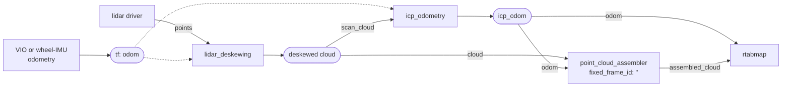
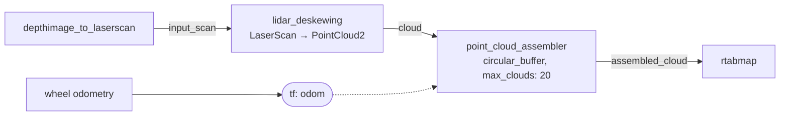

# point_cloud_assembler

Accumulates the clouds of one sensor over time into a denser cloud.

A single sweep is sparse, or narrow, or both. This node keeps the recent ones, places each where the sensor was when it was captured, and publishes the union.

That is used for two quite different things. With a **narrow field of view** — a depth camera reduced to a fake scan, say — accumulating a second's worth of sweeps as the robot moves is what makes the sensor usable for SLAM at all. With a 3D lidar it is about **enriching what already works**: each node gets a denser, less occluded cloud, which registers better and puts many more points in the database, so an offline export later has the resolution to be worth having.

It combines **one sensor over many frames**. To combine **several sensors into one frame**, use [point_cloud_aggregator](point_cloud_aggregator.md) — or, if you want them merely accumulated rather than matched into sets, remap them all onto this node's `cloud` topic. Nothing stops several publishers sharing it, and each cloud is placed by its own stamp and frame like any other; the publish trigger then covers them together — `max_clouds` counts across all the sensors, and a given `assembling_time` gathers correspondingly more clouds.

## Usage

Assemble 10 sweeps, using TF for the poses:

```bash
ros2 run rtabmap_util point_cloud_assembler --ros-args \
  -r cloud:=/velodyne_points/deskewed \
  -p max_clouds:=10 -p fixed_frame_id:=odom -p voxel_size:=0.05
```

```python
ComposableNode(
    package='rtabmap_util',
    plugin='rtabmap_util::PointCloudAssembler',
    name='point_cloud_assembler',
    parameters=[{'max_clouds': 10, 'fixed_frame_id': 'odom', 'voxel_size': 0.05}],
    remappings=[('cloud', '/velodyne_points/deskewed')])
```

With a lidar, feed it **deskewed** clouds from a [lidar_deskewing](lidar_deskewing.md) node rather than the driver's raw output: accumulating skewed sweeps accumulates their distortion too. For a 2D lidar publishing `LaserScan` that node is needed regardless — this one only takes `PointCloud2`, and `lidar_deskewing` converts to one as it deskews.

### Denser clouds for SLAM, and keeping every point

From [`lidar3d_assemble.launch.py`](https://github.com/introlab/rtabmap_ros/blob/ros2/rtabmap_examples/launch/lidar3d_assemble.launch.py). Here the input is a real 3D lidar, and assembling buys both resolution and coverage: a node built from a second of sweeps is denser between the rings and sees around what a single sweep was occluded by, so it registers better.

It also decides how much of the lidar survives. RTAB-Map stores one cloud per node and updates at around 1 Hz, while the lidar and odometry run at 10 — and running the mapping node at 10 Hz is not practical. Nine sweeps in ten therefore never reach the database. The `assembling_time: 1.0` below hands each node the whole second instead, so **nothing is thrown away**: the database keeps every point the lidar returned, which is what makes this the approach for survey scanning and a full-resolution offline export.

```python
Node(
    package='rtabmap_util', executable='point_cloud_assembler',
    parameters=[{'assembling_time': 1.0,
                 'fixed_frame_id': ''}],      # '' selects the odom topic
    remappings=[('cloud', '/lidar/points/deskewed'),
                ('odom', 'icp_odom')]),
```

Dotted edges are TF, solid ones are topics. The external odometry supplies the frame the deskewing measures motion against, and the same frame is `icp_odometry`'s motion guess; the assembled cloud, not the raw sweep, is what `rtabmap` stores:



Note `fixed_frame_id: ''`. Clearing it switches the node from TF to the `odom` topic, pairing each cloud with the exact odometry message that goes with it rather than an interpolated TF lookup — see [Where the poses come from](#where-the-poses-come-from). Feeding the result to `rtabmap` as `scan_cloud` means the assembled cloud, not the raw sweep, is what gets stored.

### Widening a narrow field of view

From [`turtlebot3_rgbd_fake_scan.launch.py`](https://github.com/introlab/rtabmap_ros/blob/ros2/rtabmap_demos/launch/turtlebot3/turtlebot3_rgbd_fake_scan.launch.py). A depth camera sees perhaps 60° across, and [`depthimage_to_laserscan`](https://docs.ros.org/en/jazzy/p/depthimage_to_laserscan/) reduces that to a fake scan thinner still. One of those is too little to localize against; twenty of them, accumulated as the robot drives and turns, cover a useful arc.

```python
Node(
    package='rtabmap_util', executable='point_cloud_assembler',
    parameters=[{'max_clouds': 20,
                 'circular_buffer': True,
                 'linear_update': 0.3,
                 'angular_update': 0.5,
                 'voxel_size': 0.05,
                 'frame_id': 'base_link'}],
    remappings=[('cloud', '/camera/scan/deskewed')]),
```

Here the pose comes from the robot's wheel odometry through TF. Nothing is being deskewed — `lidar_deskewing` is in the chain purely because this node takes `PointCloud2` and `depthimage_to_laserscan` emits a `LaserScan`:



`circular_buffer` is what makes this work as a live input: the window rolls, so every incoming scan produces a full assembled cloud rather than one per twenty. `linear_update` and `angular_update` stop a stationary robot from filling the buffer with twenty copies of the same view, which would leave it with nothing but the current scan the moment it moved off again.

The cloud goes to `rtabmap` as `scan_cloud`, with `scan_cloud_is_2d` set since the points all came from one row of pixels.


## Subscribed Topics

| Topic | Type | Description |
|---|---|---|
| `cloud` | [`sensor_msgs/msg/PointCloud2`](https://docs.ros.org/en/jazzy/p/sensor_msgs/msg/PointCloud2.html) | The sweeps to accumulate. Ideally deskewed, see [Usage](#usage). |
| `odom` | [`nav_msgs/msg/Odometry`](https://docs.ros.org/en/jazzy/p/nav_msgs/msg/Odometry.html) | Only when `fixed_frame_id` is empty. See [Where the poses come from](#where-the-poses-come-from). |
| `odom_info` | [`rtabmap_msgs/msg/OdomInfo`](https://docs.ros.org/en/jazzy/p/rtabmap_msgs/msg/OdomInfo.html) | Only when `subscribe_odom_info` is true. |

## Published Topics

| Topic | Type | Description |
|---|---|---|
| `assembled_cloud` | [`sensor_msgs/msg/PointCloud2`](https://docs.ros.org/en/jazzy/p/sensor_msgs/msg/PointCloud2.html) | In `frame_id` if set, otherwise the frame of the newest cloud. Stamped with the newest cloud. |

Nothing is accumulated unless `assembled_cloud` has a subscriber.

## Required Transforms

| Transform | Description |
|---|---|
| `fixed_frame_id` → cloud frame, at each stamp | Only in TF mode, i.e. when `fixed_frame_id` is set. |
| `frame_id` → cloud frame | Only when `frame_id` is set. |

## Parameters

**What triggers a publish** — set exactly one of these

| Parameter | Type | Default | Description |
|---|---|---|---|
| `max_clouds` | `int` | `0` | Publish once this many clouds have been collected. |
| `assembling_time` | `double` | `0.0` | Publish once this many seconds have been collected. |

| Parameter | Type | Default | Description |
|---|---|---|---|
| `circular_buffer` | `bool` | `false` | Keep a rolling window instead of clearing after each publish, so a full assembled cloud is published for **every** input rather than one in `max_clouds`. Costs more, gives smooth output. |
| `skip_clouds` | `int` | `0` | Drop this many input clouds between the ones kept. |
| `linear_update` | `double` | `0.0` | Only accumulate a cloud if the sensor has moved this far, in meters, since the last one kept. `0` disables. |
| `angular_update` | `double` | `0.0` | Same for rotation, in radians. `0` disables. |

**Poses**

| Parameter | Type | Default | Description |
|---|---|---|---|
| `fixed_frame_id` | `string` | `"odom"` | Frame the sweeps are placed in, via TF. **Set it to `""` to use the `odom` topic instead.** |
| `frame_id` | `string` | `""` | Frame to express the output in. Empty uses the newest cloud's frame. |
| `wait_for_transform` | `double` | `0.1` | Seconds to wait for a transform before dropping a cloud. |
| `subscribe_odom_info` | `bool` | `false` | Keep only the clouds odometry marked as keyframes. Needs the `odom` topic mode, see [Following odometry's keyframes](#following-odometrys-keyframes). |

**Filtering**

| Parameter | Type | Default | Description |
|---|---|---|---|
| `range_min` | `double` | `0.0` | Drop points nearer than this to the sensor, in meters. Good for removing the robot itself. `0` disables. |
| `range_max` | `double` | `0.0` | Drop points further than this, in meters. `0` disables. |
| `voxel_size` | `double` | `0.0` | Downsample the assembled cloud to one point per voxel, in meters. `0` disables. Strongly recommended, otherwise the cloud grows linearly with `max_clouds`. |
| `noise_radius` | `double` | `0.0` | Radius outlier removal on the output, in meters. `0` disables. |
| `noise_min_neighbors` | `int` | `5` | Neighbors needed within `noise_radius`. |
| `remove_z` | `bool` | `false` | Flatten the output to 2D by zeroing z. |

**Plumbing**

| Parameter | Type | Default | Description |
|---|---|---|---|
| `topic_queue_size` | `int` | `1` | Queue depth of each input subscription. |
| `sync_queue_size` | `int` | `10` | Queue depth of the synchronizer, in odom-topic mode. |
| `qos` | `int` | `0` | Reliability of the cloud subscription. |
| `qos_odom` | `int` | value of `qos` | Reliability of the `odom` and `odom_info` subscriptions. |

## Where the poses come from

Each sweep has to be placed where the sensor was when it was captured, and there are two ways to get that pose:

- **TF** (default). `fixed_frame_id` is set, and the node looks the pose up per cloud. Simple, and it works with any odometry source.
- **The `odom` topic**. Set `fixed_frame_id` to `""` and the node synchronizes each cloud with an `Odometry` message instead. Use this when odometry is not published to TF, or when you need the pose that exactly matches the cloud rather than an interpolated one.

Because `fixed_frame_id` **defaults to `"odom"`**, the `odom` topic is not subscribed unless you clear it explicitly. Setting `subscribe_odom_info` alone is not enough.

## Following odometry's keyframes

With `subscribe_odom_info` the node also takes `odom_info` and keeps a cloud only when that message reports a keyframe was added; the ones in between are dropped.

This is a better-informed version of `linear_update` and `angular_update`. Those are fixed distances you have to guess at, whereas odometry decides a keyframe from how much of the current scan still matches the last one — `Odom/ScanKeyFrameThr` for ICP, `Odom/KeyFrameThr` for visual odometry. It therefore adapts to the scene, keeping more clouds where the geometry changes quickly and fewer down a featureless corridor, and the assembled cloud ends up built from exactly the frames odometry itself considered distinct.

It only has an effect in the `odom` topic mode. With `fixed_frame_id` set the node subscribes to the cloud on its own and never sees `odom_info`, so clear `fixed_frame_id` as well — see [Where the poses come from](#where-the-poses-come-from).

## Notes

Set `voxel_size`. Without it the assembled cloud is the plain union of every sweep, points and all, and both memory and downstream cost grow with `max_clouds`. A voxel size near the sensor's resolution costs almost no fidelity.

`circular_buffer` changes the output rate, not just the contents: without it you get one assembled cloud per `max_clouds` inputs, with it you get one per input.

## Diagnostics

The node publishes to `/diagnostics` and warns if no assembled cloud has been produced for a while — typically a missing transform or a silent input topic.
