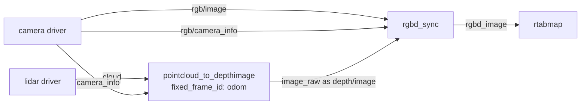

# pointcloud_to_depthimage

Projects a point cloud into a camera to make a depth image registered to it.

Given a cloud (from a 3D lidar or a ToF camera) and the `camera_info` of an RGB camera, this node projects the points into that camera and outputs the depth image it would have produced if it were an RGB-D sensor: same intrinsics, same size, pixel `(u,v)` of the depth image lining up with pixel `(u,v)` of the color image. The result plugs into anything that consumes depth images: RTAB-Map's RGB-D pipeline, [`depth_image_proc`](https://docs.ros.org/en/jazzy/p/depth_image_proc/), obstacle avoidance built for depth cameras.

Two typical setups:

* **Lidar + one or more RGB cameras.** The natural way to feed a lidar into an RGB-D SLAM setup: the lidar supplies the geometry, the cameras the appearance. Run one instance per camera, each subscribing to the same cloud but to that camera's `camera_info`; a 3D lidar usually covers all of them at once. The resulting RGB-D streams can then be combined with [rtabmap_sync](https://docs.ros.org/en/jazzy/p/rtabmap_sync/)'s `rgbd_sync`/`rgbdx_sync` and given to RTAB-Map through its `rgbd_cameras` parameter.
* **ToF camera + RGB camera, not synchronized.** Two separate sensors, each with its own clock and its own pose, so their frames line up neither in time nor in space. Projecting the ToF cloud into the RGB camera registers the depth to the color image, and setting `fixed_frame_id` to a high-rate odometry frame — VIO, or an IMU-driven odometry running well above the camera rate — compensates the motion between the two stamps at the same time. See [Motion compensation](#motion-compensation).

## Usage

```bash
ros2 run rtabmap_util pointcloud_to_depthimage --ros-args \
  -r cloud:=/velodyne_points \
  -r camera_info:=/camera/color/camera_info \
  -p fixed_frame_id:=odom -p decimation:=4 -p fill_holes_size:=2
```

```python
ComposableNode(
    package='rtabmap_util',
    plugin='rtabmap_util::PointCloudToDepthImage',
    name='pointcloud_to_depthimage',
    parameters=[{'fixed_frame_id': 'odom', 'decimation': 4, 'fill_holes_size': 2}],
    remappings=[('cloud', '/velodyne_points'),
                ('camera_info', '/camera/color/camera_info')])
```

The lidar supplies the geometry, the camera supplies the pose and the color, and the result joins an ordinary RGB-D pipeline:



## Subscribed Topics

| Topic | Type | Description |
|---|---|---|
| `cloud` | [`sensor_msgs/msg/PointCloud2`](https://docs.ros.org/en/jazzy/p/sensor_msgs/msg/PointCloud2.html) | The geometry to project. An empty cloud yields an all-zero image rather than nothing. |
| `camera_info` | [`sensor_msgs/msg/CameraInfo`](https://docs.ros.org/en/jazzy/p/sensor_msgs/msg/CameraInfo.html) | Defines the target camera: its intrinsics, its size, and through its `frame_id` its pose. Normally the RGB camera the depth image is being registered to. |

## Published Topics

| Topic | Type | Description |
|---|---|---|
| `image` | [`sensor_msgs/msg/Image`](https://docs.ros.org/en/jazzy/p/sensor_msgs/msg/Image.html) (`32FC1`) | Depth in **meters**, in the camera info's frame. |
| `image_raw` | [`sensor_msgs/msg/Image`](https://docs.ros.org/en/jazzy/p/sensor_msgs/msg/Image.html) (`16UC1`) | The same depth in **millimeters**. |
| `image/camera_info`, `image_raw/camera_info` | [`sensor_msgs/msg/CameraInfo`](https://docs.ros.org/en/jazzy/p/sensor_msgs/msg/CameraInfo.html) | The input calibration, rescaled if `decimation` is set. |
| `cloud_transformed` | [`sensor_msgs/msg/PointCloud2`](https://docs.ros.org/en/jazzy/p/sensor_msgs/msg/PointCloud2.html) | The input cloud in the camera frame. Debugging aid; only published when hole filling is on and something subscribes. |

Nothing is computed unless one of the two image topics has a subscriber.

## Required Transforms

| Transform | Description |
|---|---|
| cloud frame → camera frame | Where the cloud's sensor sits relative to the camera. |
| `fixed_frame_id` → cloud frame, at both stamps | Only when `fixed_frame_id` is set, which is how motion between the two stamps is measured. See [Motion compensation](#motion-compensation). |

## Parameters

| Parameter | Type | Default | Description |
|---|---|---|---|
| `fixed_frame_id` | `string` | `""` | Frame the sensor's motion is measured against, usually `odom`. **Required when `approx` is true.** See [Motion compensation](#motion-compensation). |
| `approx` | `bool` | `true` | Match cloud and camera info by nearest stamp. Set false when the two share exact stamps, in which case `fixed_frame_id` is unnecessary. |
| `wait_for_transform` | `double` | `0.1` | Seconds to wait for a transform before dropping the frame. |
| `decimation` | `int` | `1` | Render at 1/`decimation` of the camera info's resolution. The published camera info is scaled to match. Must divide both the width and the height exactly, otherwise it is ignored with an error and the image comes out full size. See [Hole filling](#hole-filling). |
| `fill_holes_size` | `int` | `0` | Radius, in pixels, for filling gaps between projected points. `0` disables. See [Hole filling](#hole-filling). |
| `fill_holes_error` | `double` | `0.1` | Largest depth difference, in meters, across which a hole may be filled. |
| `fill_iterations` | `int` | `1` | How many times to repeat the filling pass. |
| `upscale` | `bool` | `false` | Interpolate the depth image back to full resolution after rendering. Only has an effect when `decimation` is greater than 1, and only needed when the consumer requires full resolution. See [Hole filling](#hole-filling). |
| `upscale_depth_error_ratio` | `double` | `0.02` | Relative depth difference tolerated across a block when upscaling. Above it the block is left empty rather than interpolated across an edge. |
| `topic_queue_size` | `int` | `10` | Queue depth of each input subscription. |
| `sync_queue_size` | `int` | `10` | Queue depth of the synchronizer. |
| `qos` | `int` | `0` | Reliability of the cloud subscription. |
| `qos_camera_info` | `int` | value of `qos` | Reliability of the camera info subscription. |

## Motion compensation

The cloud's sensor and the camera almost never fire at the same instant, and on a moving robot that offset matters: projecting a cloud captured 40 ms earlier into the camera's current pose puts everything in the wrong place.

When `fixed_frame_id` is set, the node asks TF how the cloud's frame moved between the two stamps and folds that displacement into the projection, so the cloud is placed where the camera was **at its own stamp**. Driving forward at 1 m/s with a 40 ms offset moves everything 4 cm — enough to matter at close range.

The lookup is only as good as the frame it measures against: TF interpolates between the samples it has, so the source publishing `fixed_frame_id` should run well above the sensor rate. A VIO or wheel odometry at 100+ Hz gives a meaningful displacement over a 40 ms gap; a 1 Hz SLAM output does not.

Without `fixed_frame_id` the stamp difference is silently ignored, which is why the node logs a fatal error if `approx` is true and no fixed frame is given. If the transform cannot be found the frame is dropped rather than projected wrongly.

## Hole filling

A lidar cloud is far sparser than a camera image, so a direct projection is mostly gaps: individual pixels with depth, surrounded by zeros.

**Start with `decimation`.** Rendering at a coarser resolution puts more points in each pixel, so the wide gaps between lidar rings largely disappear instead of having to be filled in afterwards. `decimation: 4` is a reasonable starting point for a 3D lidar against a full-resolution camera. The published camera info is scaled to match, so consumers that read it keep working at the smaller size.

**Then close what is left with `fill_holes_size`.** It spreads each point over a small neighborhood, but only across depth differences smaller than `fill_holes_error`, so it fills a surface without bridging the gap between a foreground object and the wall behind it. Start at `2` and raise it only if the image is still speckled; too large and thin structures get fattened.

`upscale` is for the specific case where the consumer needs the depth image back at the camera's full resolution — pairing it pixel-for-pixel with the full-size color image, for instance. It interpolates each decimated block bilinearly from its corners, and only where all four have depth and agree to within `upscale_depth_error_ratio`, so it stops at depth discontinuities rather than stretching a foreground object onto the wall behind it. Leave it off otherwise: it restores resolution the lidar never measured, at full-resolution cost.

## Notes

The output is dense in *layout* but sparse in *content*: pixels with no return are zero, the ROS convention for no reading. Consumers that assume every pixel is valid will need to handle that.
