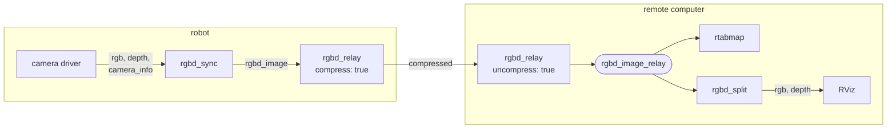
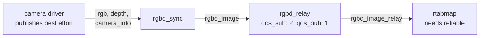

# rgbd_relay

Republishes an [`rtabmap_msgs/msg/RGBDImage`](https://docs.ros.org/en/jazzy/p/rtabmap_msgs/msg/RGBDImage.html), optionally compressing or decompressing it on the way through.

An `RGBDImage` can carry its images raw or compressed. This node converts between the two so that the expensive form crosses the network only where it has to: compress before a wifi link, decompress on the other side.

With both `compress` and `uncompress` left false the message is forwarded untouched, which makes the node a plain relay — useful to give a topic a second name, or to bridge two incompatible QoS profiles with `qos_sub` and `qos_pub`. See [Bridging QoS profiles](#bridging-qos-profiles).

## Usage

Compress before sending over a slow link:

```bash
ros2 run rtabmap_util rgbd_relay --ros-args \
  -r rgbd_image:=/camera/rgbd_image \
  -p compress:=true
```

```python
ComposableNode(
    package='rtabmap_util',
    plugin='rtabmap_util::RGBDRelay',
    name='rgbd_relay',
    parameters=[{'compress': True}],
    remappings=[('rgbd_image', '/camera/rgbd_image')])
```


A relay at each end of the link, so only the compressed form crosses it. Once it is raw again it feeds the SLAM node directly, and [rgbd_split](rgbd_split.md) unpacks it into the plain `Image` topics RViz can display:



## Subscribed Topics

| Topic | Type | Description |
|---|---|---|
| `rgbd_image` | [`rtabmap_msgs/msg/RGBDImage`](https://docs.ros.org/en/jazzy/p/rtabmap_msgs/msg/RGBDImage.html) | Queue depth `queue_sub`, 5 by default. |

## Published Topics

| Topic | Type | Description |
|---|---|---|
| `rgbd_image_relay` | [`rtabmap_msgs/msg/RGBDImage`](https://docs.ros.org/en/jazzy/p/rtabmap_msgs/msg/RGBDImage.html) | Queue depth `queue_pub`, 1 by default. Published only when someone is subscribed. |

## Parameters

| Parameter | Type | Default | Description |
|---|---|---|---|
| `compress` | `bool` | `false` | Fill the compressed fields of the output. Color becomes JPEG; depth becomes PNG, or JPEG when the message carries a stereo pair rather than depth. Fields already compressed on input are passed through as-is. |
| `uncompress` | `bool` | `false` | Fill the raw fields of the output by decoding the compressed ones. Fields already raw on input are passed through as-is. |
| `qos` | `int` | `0` | Reliability of both sides: `0` system default, `1` reliable, `2` best effort. |
| `qos_sub` | `int` | value of `qos` | Reliability of the `rgbd_image` subscription alone. |
| `qos_pub` | `int` | value of `qos` | Reliability of the `rgbd_image_relay` publisher alone. |
| `queue_sub` | `int` | `5` | Queue depth of the `rgbd_image` subscription. Must be at least 1. |
| `queue_pub` | `int` | `1` | Queue depth of the `rgbd_image_relay` publisher. Must be at least 1. |

## Bridging QoS profiles

A subscriber that asks for **reliable** will not connect to a publisher offering **best effort** — the request cannot be satisfied, so the two silently never match. A best-effort subscriber, on the other hand, connects to either.

That is a real problem when a camera driver publishes best effort and the consumer insists on reliable. Set the two sides of the relay separately and it forwards across the gap:

```bash
ros2 run rtabmap_util rgbd_relay --ros-args \
  -r rgbd_image:=/camera/rgbd_image \
  -p qos_sub:=2 \
  -p qos_pub:=1
```



Both parameters default to `qos`, so setting `qos` alone configures both sides at once.

Reliability is all that is bridged — durability is left at the default, so a transient-local publisher is not converted. The queue depths are separate too, through `queue_sub` and `queue_pub`.

## Notes

Setting neither `compress` nor `uncompress` forwards the message unchanged and skips all image handling — the cheapest path by a wide margin.

Setting both is allowed and produces a message carrying each image twice, raw and compressed. That is rarely what you want.

Depth is compressed as **PNG**, a stereo right image as **JPEG**.
