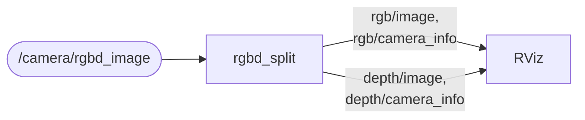

# rgbd_split

Splits an [`rtabmap_msgs/msg/RGBDImage`](https://docs.ros.org/en/jazzy/p/rtabmap_msgs/msg/RGBDImage.html) back into the standard ROS image topics.

`RGBDImage` bundles color, depth and both camera infos into one message so they arrive together, which is what RTAB-Map wants. Everything else in the ROS ecosystem — RViz, `image_view`, [`depth_image_proc`](https://docs.ros.org/en/jazzy/p/depth_image_proc/) — expects separate `Image` and `CameraInfo` topics. This node unpacks the bundle for them.

It is the inverse of [rtabmap_sync](https://docs.ros.org/en/jazzy/p/rtabmap_sync/)'s `rgbd_sync`, and of its `stereo_sync` when `stereo` is set — those two are what produce an `RGBDImage` in the first place.

## Contents

- [Usage](#usage)
- [Subscribed Topics](#subscribed-topics)
- [Published Topics](#published-topics)
- [Parameters](#parameters)
- [Stereo messages](#stereo-messages)
- [Compressed images](#compressed-images)
- [Notes](#notes)

## Usage

```bash
ros2 run rtabmap_util rgbd_split --ros-args -r rgbd_image:=/camera/rgbd_image
```

```python
ComposableNode(
    package='rtabmap_util',
    plugin='rtabmap_util::RGBDSplit',
    name='rgbd_split',
    remappings=[('rgbd_image', '/camera/rgbd_image')])
```

Unpacking a bundle for RViz:



## Subscribed Topics

| Topic | Type | Description |
|---|---|---|
| `rgbd_image` | [`rtabmap_msgs/msg/RGBDImage`](https://docs.ros.org/en/jazzy/p/rtabmap_msgs/msg/RGBDImage.html) | Queue depth `queue_sub`, 5 by default. Raw or compressed images are both accepted. |

## Published Topics

The output topics are named after the **resolved** input topic, so remapping `rgbd_image` moves the outputs with it. With `rgbd_image` remapped to `/camera/rgbd_image` they are `/camera/rgbd_image/rgb/image` and so on. Setting `stereo: true` renames the two halves `left` and `right`, see [Stereo messages](#stereo-messages).

| Topic | Type | Description |
|---|---|---|
| `<rgbd_image>/rgb/image` | [`sensor_msgs/msg/Image`](https://docs.ros.org/en/jazzy/p/sensor_msgs/msg/Image.html) | The color image, decompressed if needed. |
| `<rgbd_image>/rgb/camera_info` | [`sensor_msgs/msg/CameraInfo`](https://docs.ros.org/en/jazzy/p/sensor_msgs/msg/CameraInfo.html) | |
| `<rgbd_image>/depth/image` | [`sensor_msgs/msg/Image`](https://docs.ros.org/en/jazzy/p/sensor_msgs/msg/Image.html) | The depth image, or the right image of a stereo pair. |
| `<rgbd_image>/depth/camera_info` | [`sensor_msgs/msg/CameraInfo`](https://docs.ros.org/en/jazzy/p/sensor_msgs/msg/CameraInfo.html) | For a stereo pair this is the right camera, and its `P(0,3)` carries the baseline. |
| `<rgbd_image>/rgb/image/compressed` | [`sensor_msgs/msg/CompressedImage`](https://docs.ros.org/en/jazzy/p/sensor_msgs/msg/CompressedImage.html) | The color image in [`compressed_image_transport`](https://github.com/ros-perception/image_transport_plugins)'s format, published by the node itself unless `compressed_passthrough` is false. Same for `<rgbd_image>/right/image/compressed` with `stereo: true`. See [Compressed images](#compressed-images). |
| `<rgbd_image>/depth/image/compressedDepth` | [`sensor_msgs/msg/CompressedImage`](https://docs.ros.org/en/jazzy/p/sensor_msgs/msg/CompressedImage.html) | The depth image in [`compressed_depth_image_transport`](https://github.com/ros-perception/image_transport_plugins)'s format, published by the node itself unless `compressed_passthrough` is false. See [Compressed images](#compressed-images). |

Each half is only unpacked if something is subscribed to it, so subscribing to color alone does not pay for depth decompression.

## Parameters

| Parameter | Type | Default | Description |
|---|---|---|---|
| `qos` | `int` | `0` | Reliability of both sides: `0` system default, `1` reliable, `2` best effort. |
| `qos_sub` | `int` | value of `qos` | Reliability of the `rgbd_image` subscription alone. |
| `qos_pub` | `int` | value of `qos` | Reliability of the four output publishers alone. |
| `queue_sub` | `int` | `5` | Queue depth of the `rgbd_image` subscription. Must be at least 1. |
| `queue_pub` | `int` | `1` | Queue depth of every publisher. Must be at least 1. |
| `stereo` | `bool` | `false` | Name the outputs `left`/`right` instead of `rgb`/`depth`. See [Stereo messages](#stereo-messages). |
| `compressed_passthrough` | `bool` | `true` | Publish the `compressed` (color, left and right images) and `compressedDepth` (depth) topics from the compressed images of the input without decompressing them, in place of the `compressed` and `compressedDepth` image_transport plugins. See [Compressed images](#compressed-images). |
| `<color topic>.compressed.format` | `string` | `"jpeg"` | `jpeg` or `png`. With `compressed_passthrough`, used only when an image (color, left or right) has to be compressed. `<color topic>` is the color (or left) topic with `.` instead of `/`, e.g. `rgbd_image.rgb.image`. |
| `<depth topic>.compressedDepth.format` | `string` | `"png"` | `png` or `rvl` (Jazzy and later). With `compressed_passthrough`, used only when the depth has to be compressed. `<depth topic>` is the depth topic with `.` instead of `/`, e.g. `rgbd_image.depth.image`. |
| `<depth topic>.compressedDepth.depth_max` | `double` | `10.0` | Same, maximum depth (m) of a 32FC1 depth image. |
| `<depth topic>.compressedDepth.depth_quantization` | `double` | `100.0` | Same, depth quantization of a 32FC1 depth image. |

## Stereo messages

The node handles **stereo** `RGBDImage` messages as well as RGB-D ones. In a stereo message the "depth" slot holds the right image, and the second camera info carries the baseline; the depth topics then carry the right camera, correctly typed as `mono8` or `bgr8` rather than mislabeled as depth.

That works, but the topic names lie. Set `stereo: true` and the outputs are named for what they hold:

| `stereo` | Output topics |
|---|---|
| `false` (default) | `<rgbd_image>/rgb/image`, `<rgbd_image>/rgb/camera_info`, `<rgbd_image>/depth/image`, `<rgbd_image>/depth/camera_info` |
| `true` | `<rgbd_image>/left/image`, `<rgbd_image>/left/camera_info`, `<rgbd_image>/right/image`, `<rgbd_image>/right/camera_info` |

```bash
ros2 run rtabmap_util rgbd_split --ros-args \
  -r rgbd_image:=/camera/rgbd_image \
  -p stereo:=true
```

Only the names change — the message contents and the order of the two halves are the same either way, so the `rgb` slot always becomes the left image. The two namings are exclusive: with `stereo: true` nothing is published on `rgb`/`depth`.

The node checks the setting against what actually arrives, going by the encoding of the second half: `16UC1`, `32FC1` and `mono16` are depth, anything else is an image. If the two disagree it logs a warning **once** and keeps forwarding — a mismatch makes the topic name misleading, not the data wrong, so it is never worth dropping a frame over.

## Compressed images

`rgb_compressed` of an `RGBDImage` holds a JPEG or PNG image, and so does `depth_compressed` for the right image of a stereo pair. With `compressed_passthrough` (the default), the node republishes them as they are on `<rgbd_image>/rgb/image/compressed` (and `<rgbd_image>/right/image/compressed`), readable with the `compressed` transport. Their format is set from the image header, with the encoding (e.g. `"bgr8; jpeg compressed bgr8"`), which producers before 0.24 did not set. Raw images, or images whose header cannot be read, are compressed with `<color topic>.compressed.format`.

`depth_compressed` of an `RGBDImage` holds depth in `compressed_depth_image_transport`'s format, or, from rtabmap_ros before 0.24 or with `depth_compression_format: "legacy"`, in rtabmap's own format (`png`, `rvl`, `png:<max>:<q>`, `rvl:<max>:<q>`), which image_transport plugins cannot read. The node republishes both on `<rgbd_image>/depth/image/compressedDepth`, readable with the `compressedDepth` transport:

```bash
ros2 run image_transport republish compressedDepth raw --ros-args \
  -r in/compressedDepth:=/camera/rgbd_image/depth/image/compressedDepth -r out:=/depth
```

With `compressed_passthrough` (the default), the depth is not decompressed when that can be avoided:

| Input depth | `compressedDepth` output |
|---|---|
| `compressed_depth_image_transport` format | Republished as is (RVL re-compressed as PNG before Jazzy). |
| rtabmap's legacy `png` (16UC1), `rvl`, `png:<max>:<q>`, `rvl:<max>:<q>` | Only the header is converted, the compressed payload is copied. Before Jazzy, `compressed_depth_image_transport` cannot decode RVL, so RVL payloads are re-compressed as PNG, losslessly. |
| Raw, or rtabmap's legacy `png` of 32FC1 depth (4 channels) | Compressed with the `<depth topic>.compressedDepth.*` parameters. |

To do this the node removes the `compressed` and `compressedDepth` plugins from `<topic>.enable_pub_plugins` of their topics and publishes on their topics itself. If you set `enable_pub_plugins` of a topic with the plugin in it, the plugin is kept and decompresses and re-compresses every frame on that topic, as with `compressed_passthrough: false`. The plugins' `jpeg_quality` and `png_level` parameters are not supported by the passthrough.

## Notes

If a message has no `frame_id` on one of its sub-messages, the node fills it in from the other one so the output is always usable by TF.
